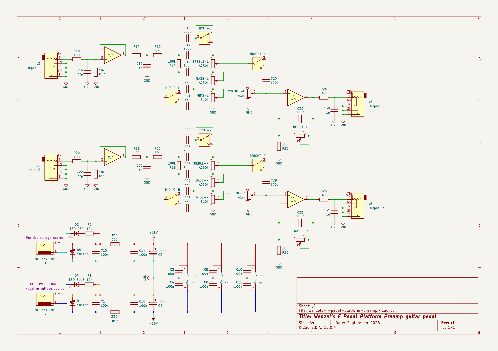

# Wenzel’s F Pedal Platform Preamp guitar pedal

TL072 opamps-based guitar preamp pedal intended to work as a pedal platform. It
does not overdrive, it’s only shaping the tone. Just replicating vintage passive
tone stack.

It’s all headroom, it’s better if your clean signal has some kind of compression
for peaks, maybe an overdrive pedal with just a touch of clipping.

This is a stereo/2-channel pedal. You would need only 2 TL072 chips or single
TL084.

## Characteristics

- Input impedance is ≈1MΩ.
- Output impedance is ≈47Ω.

## Power requirements

- 2x isolated 18V power supplies (±18V configuration, current is negligible)

  * Note that you can’t daisy-chain them since on of them references negative/-
    to ground while the other references positive/+ to ground.
    You can daisy-chain only with pedals that reference the same polarity lead
    to ground. Like if you have 2 of these devices, or similar power
    configuration, you can daisy-chain negative rail source with other negative
    rail source input of other pedal, and same for positive.
    Mind though that daisy-chaining provides extra ground paths and there is a
    potential for ground-loop noise issues.

## Latest revision schematic

## Releases (newest revisions are on the top)

- [r1 2026-08](release-2026-09-r1)
