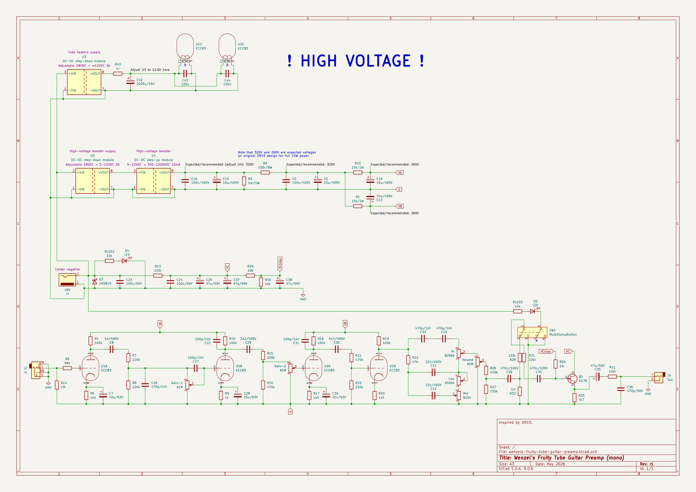
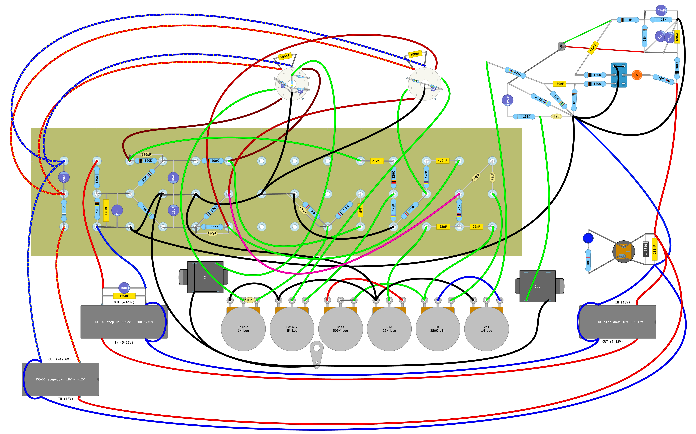

# Wenzel’s Fruity Tube Guitar Preamp

A simple guitar tube guitar preamplifier inspired by
[OR15](https://www.musiker-board.de/attachments/or15-pdf.916640/).

**WARNING! High-Voltage!** If you don’t know what you’re doing I strongly
recommend to stay away from building the project yourself. High voltage
can be lethal unless handled properly while following all safety precautions!

The design utilizes 2 of 12ax7/ECC2 tubes, 4 gain stages total. Then goes the
passive tone stack + volume control. After that there is a K170 JFET output
unity-gain buffer with a mute switch in front of it.

A1m dual pots are not easiest to find. So unlike in OR15 design I used 2
separate A1m pots. In order to preserve original OR15 gain behavior you just set
them both to the same value. But this design provides more tonal options, where
you can push more gain before or after.

## Power requirements

Power source: 18VDC, I would recommend >=1A. There are 2 of 12ax7/ECC83. Tube
heater for one 12ax7 consumes 300mA at 12.6V, two would be 600mA. But at cold
start during pre-heating they can consume even more. There are also DC-DC
boosters involved that are not 100% efficient. So 1A is a safe margin to handle
all that.

### Voltage sources required

- 18V for the JFET output buffer.
- 12.6V for the tube heaters.
- 320V for the tube plates.

### In my build

- 18V source is fed to the output JFET buffer stage.

- Adjustable DC-DC step-down provides conentional 12.6V for the tube heaters.

- Another adjustable DC-DC step-down provides voltage suitable for the
  high-voltage DC-DC step-up booster (5–12V in my case).

- Then the DC-DC step-up high-voltage booster provides 320V to feed the tube
  plates.

## Latest revision schematic and layout

r1

**Disclaimer:** This layout is BAD. Just a first iteration prototype.

## Releases (newest revisions are on the top)

- [r1 2026-05](release-2026-05-r1)
