# Wenzel’s Fruity Tube Guitar Preamp

Revision r1 (May 2026).

**WARNING!** The layout, as you can see, missing some stuff on the turret board.
I was fighting with oscillations and had to make a bunch of changes. This layout
is FAR from ideal, just a first prototype. It will get better in the future.

All DC wires are supposed to be tightly twisted, just couldn’t find a nice way
to show it in DIY-LC.

- [PDF schematic render](wenzels-fruity-tube-guitar-preamp-r1-schematic.pdf)
- [PNG schematic render](wenzels-fruity-tube-guitar-preamp-r1-schematic.png)
- [PDF layout render](wenzels-fruity-tube-guitar-preamp-r1-layout.pdf)
- [PNG layout render](wenzels-fruity-tube-guitar-preamp-r1-layout.png)

Special thanks to diyaudio.com users who gave me some advice on layout
improvements:

https://www.diyaudio.com/community/threads/a-preamp-section-clone-of-orange-or15-guitar-amplifier-and-oscillation-issues.439953/

## Schematic

## Layout

**Disclaimer:** This layout is FAR from perfect. It is just my first build
prototype where I tested it and make sure it works as expected. I faced a lot of
oscillation issues I had to fix. This is my first high-impedance high-gain tube
project where I learnt how important the right layout is. In the future I will
hopefully make it much prettier.

The JFET output buffer part only shows the connections, I actually used a
prototype board for it.

When fighting with oscillations (due to crappy layout) I used plenty of screened
shield-grounded wire. For all plate and grid wires, gain pots wires. And for all
jumper wires on the turret board.

## Photos

Assembled case photos.

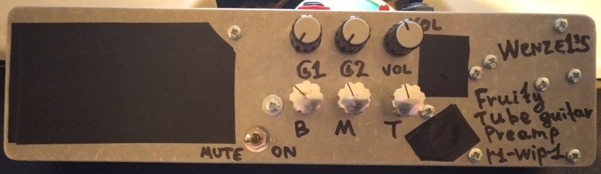

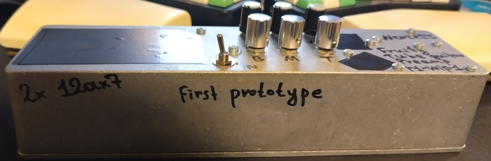

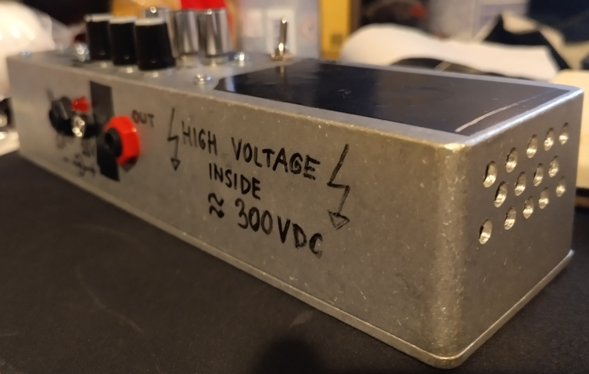

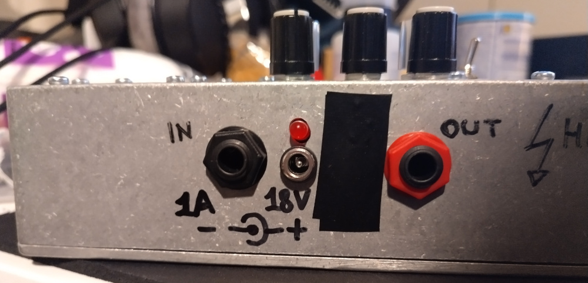

This prototype survived a bunch of changes, so I covered the holes from previous
iterations with a PVC tape.

### DIY turret board

When making initial prototype I didn’t have a turret board by hand.
So I came up with DIY solution using what I had. Aluminium bolts and nuts,
piece of cardboard and transistor isolation bushings for the bolts.
And of course a bunch of PVC isolation tape. **I DO NOT RECOMMEND** doing it
this way to anyone, cardboard can absorb moisture and become conductive,
it’s a high-voltage circuit, something can get shorted in a nasty way!
It’s just a first prototype.

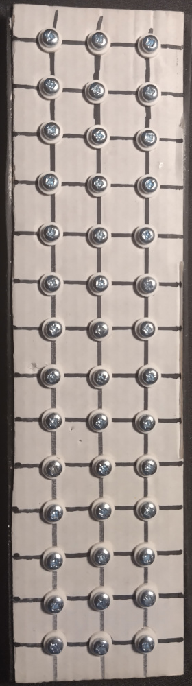
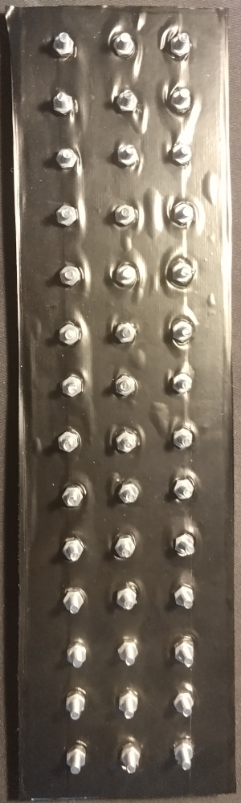
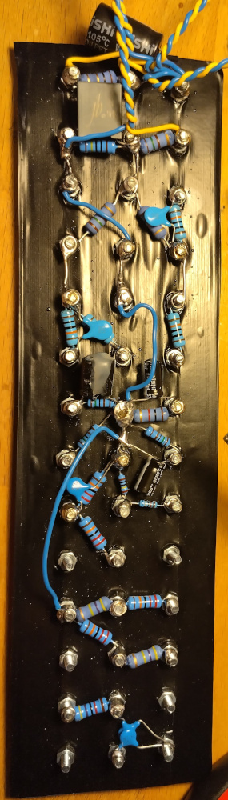

Note that populated version is changed since then.
Some components left unused as I moved cathode network right at the tube pins,
as well as first gain stage input resistors network.

### Inside the case

Note that the top-right high-voltage booster module turned out to be suck at
power. Yes, without the load it can give lots of voltage boost but as soon as
I connect it to the circuit the voltage radically drops. I had to push it to the
limits, I set the step-down module from 5V to 12V and then was able to squeeze
out of it only 210V after the 15k resistors (R1 & R22) versus recommended 260V
though the pedal still performs and sounds great at that voltage, still very
usable.

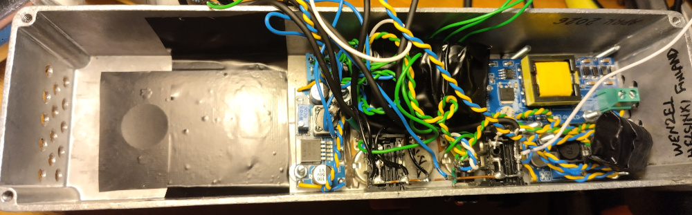

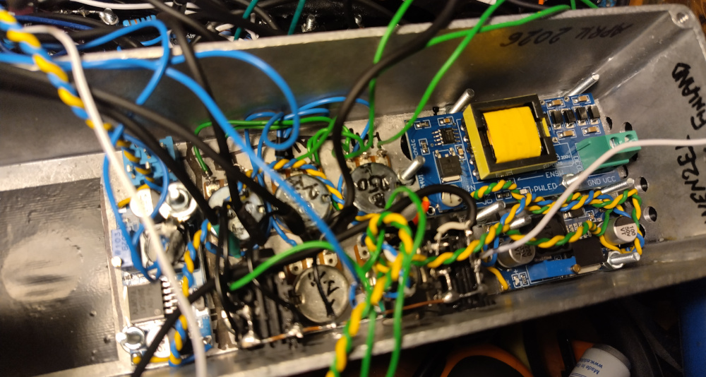

### Tube pins

When fighting with oscillations I had to move the cathode resistors and bypass
capacitors from the turret board right at the tube pins. As well as input grid
stopper 68k and 1m to ground. I also used lots of screened grounded wires.

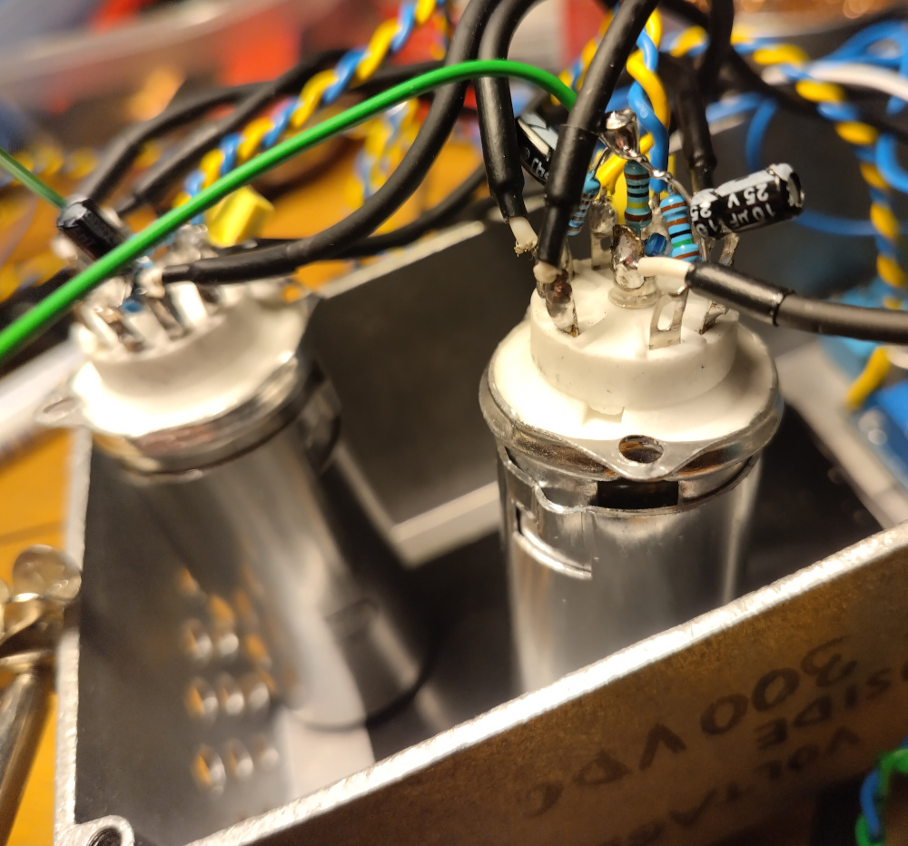

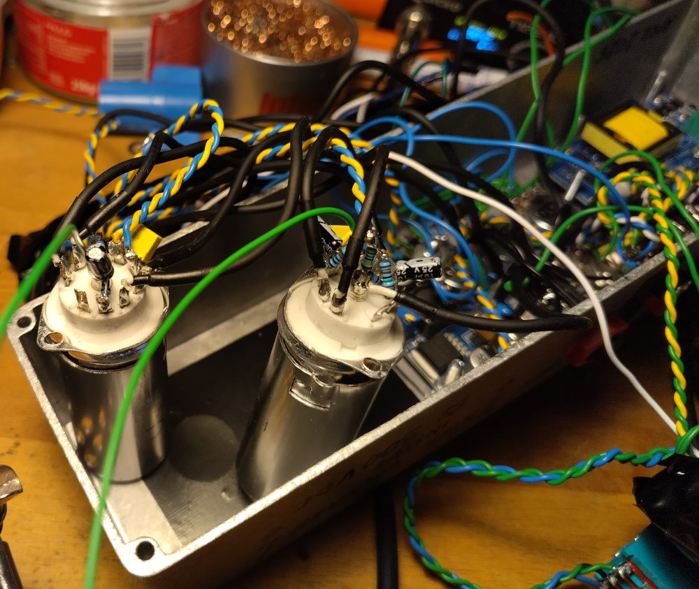

### Populated turret board

Note that this version is quite outdated. Some components I left unused after
some changes (like first gain stage input resistors network as well as all
cathode resistors and bypass capacitors). I also replaced many wires with
screened ones.

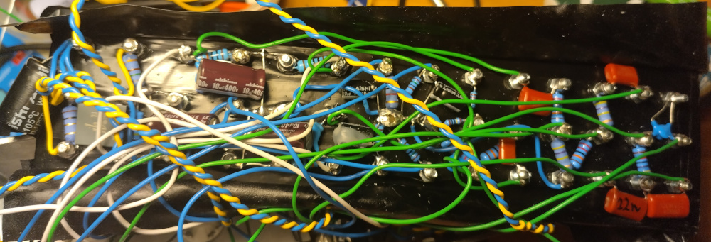

### JFET output buffer board

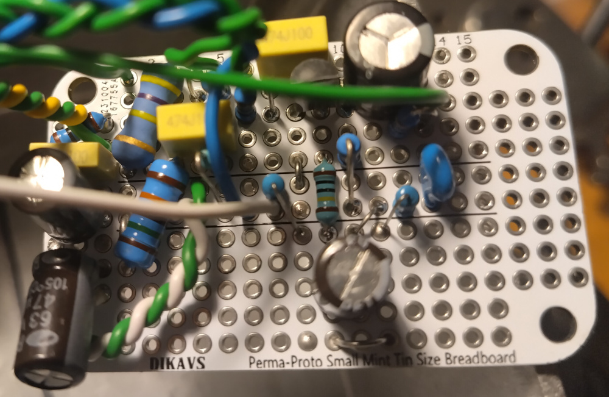

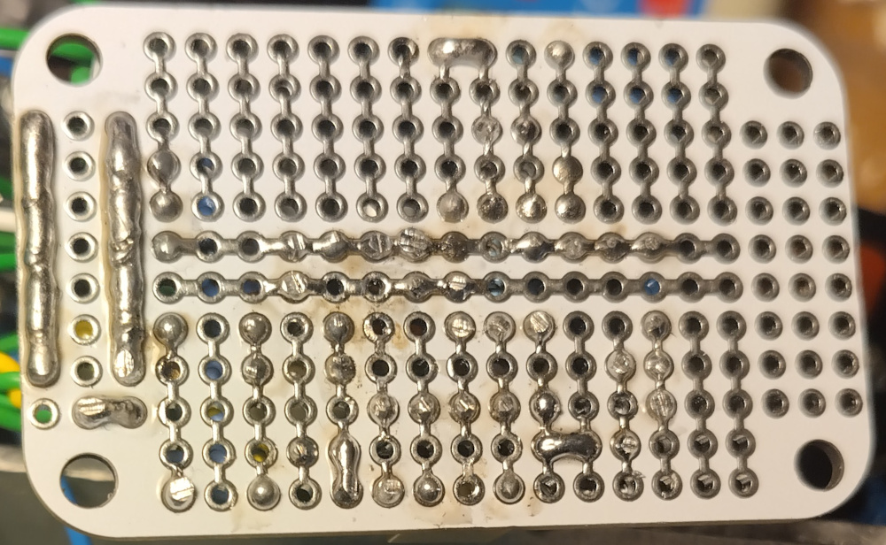
