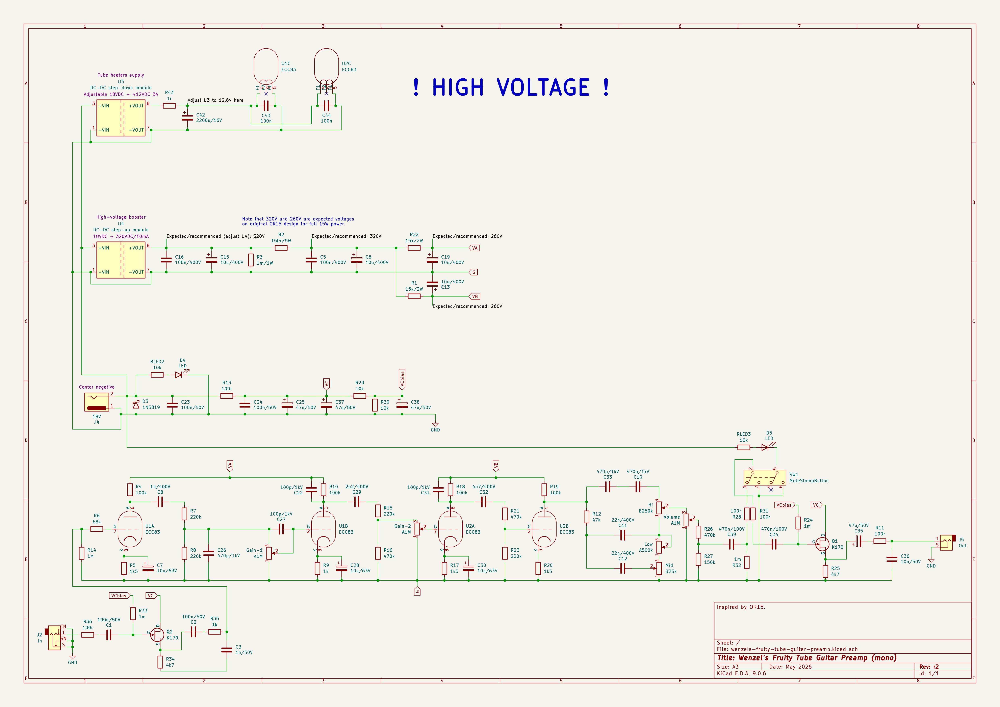
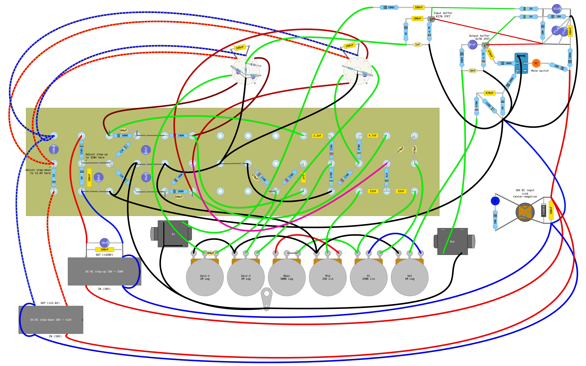
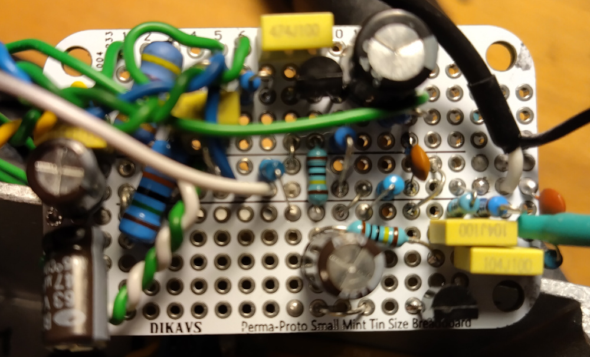
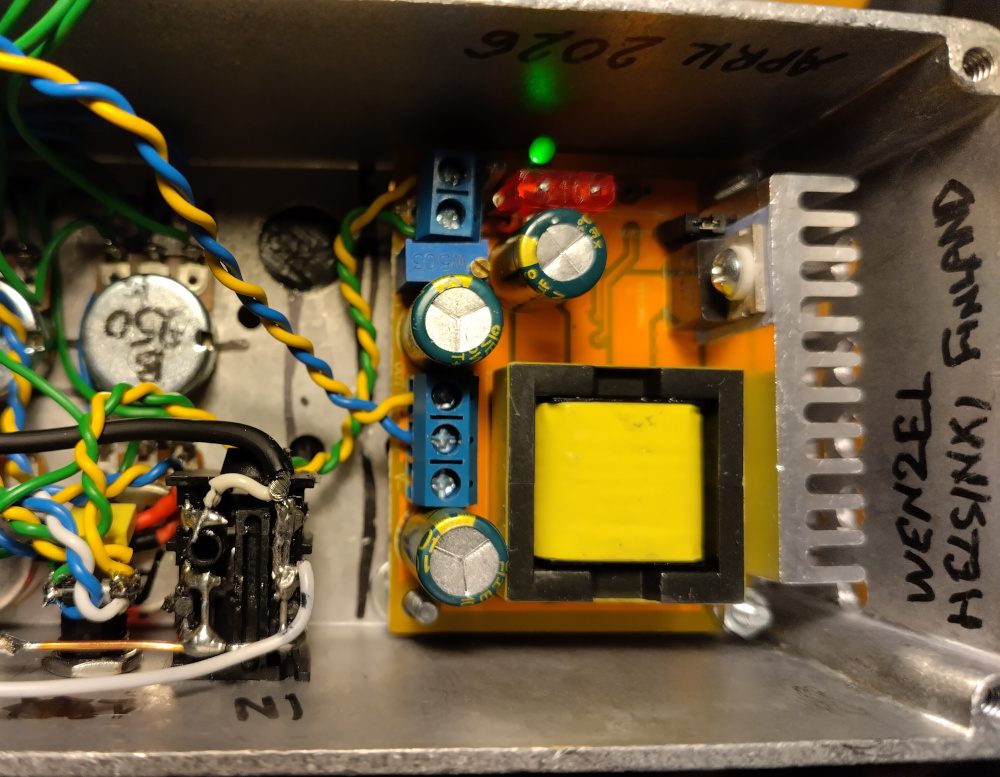

# Wenzel’s Fruity Tube Guitar Preamp

Revision r2 (May 2026).

- [PDF schematic render](wenzels-fruity-tube-guitar-preamp-r2-schematic.pdf)
- [PNG schematic render](wenzels-fruity-tube-guitar-preamp-r2-schematic.png)
- [PDF layout render](wenzels-fruity-tube-guitar-preamp-r2-layout.pdf)
- [PNG layout render](wenzels-fruity-tube-guitar-preamp-r2-layout.png)

Special thanks to diyaudio.com users who helped me to fix oscillation issues and
pick a better HV booster module:

https://www.diyaudio.com/community/threads/a-preamp-section-clone-of-orange-or15-guitar-amplifier-and-oscillation-issues.439953/

## Schematic

## Layout

## Difference (changelog) from previous release (revision r1)

1. Changed C36 (filters out RF) from 470p to 10n (more aggressive RF cutting,
   better stability expectations)

2. Added JFET input buffer in front of the tubes (similar configuration to the
   output buffer, should help with stability)

I used a better high-voltage DC-DC step-up booster for the tube plates that
takes 18V directly without a need to have a step-down in between. Set it to
≈320V and it stays stable under load, unlike the previous module which suffered
from drastic voltage drop and was pushed to its limits, and its transformer was
too hot to touch.

In my prototype build I replaced all signal wires (that were not screened wires
yet) with grounded screened wires. Also I wrapped JFET buffers board with
aluminium foil and grounded it. There is also grounded aluminium foil layer
under the turret board. This way I solved the oscillation issues completely.
100%/maxed gain with guitar straight in and no oscillation.

## Photos

JFET buffers board with added input buffer (right-bottom area):

New DC-DC step-up high-voltage booster module installed:

