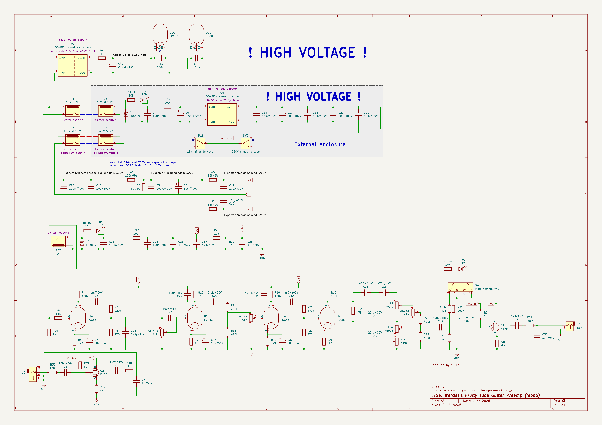
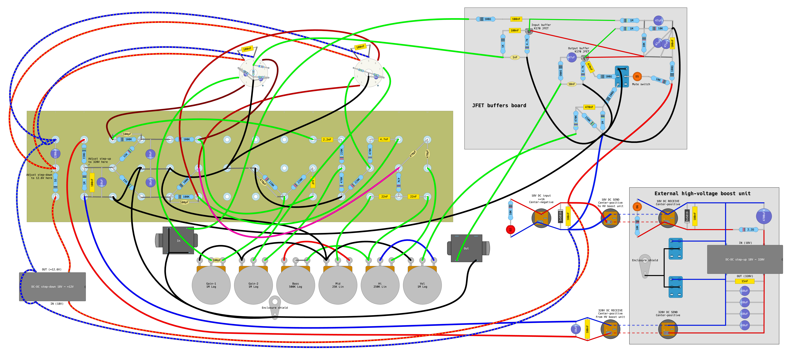
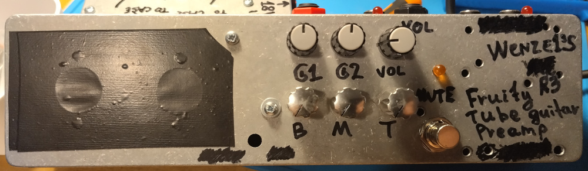
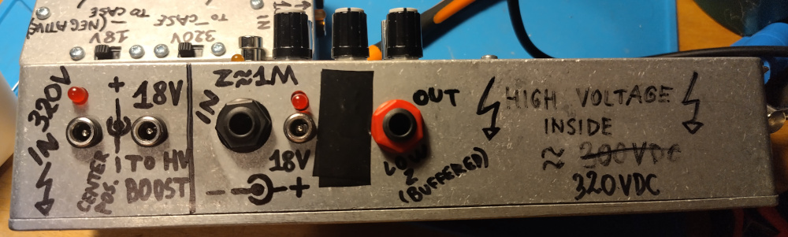
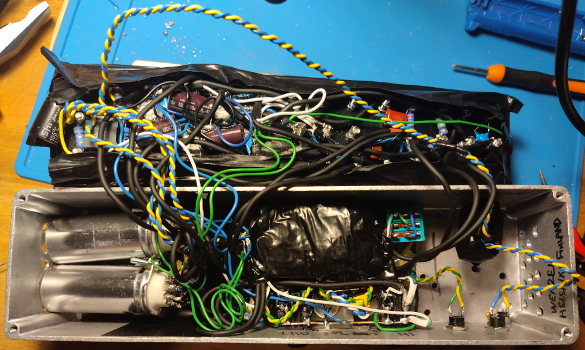
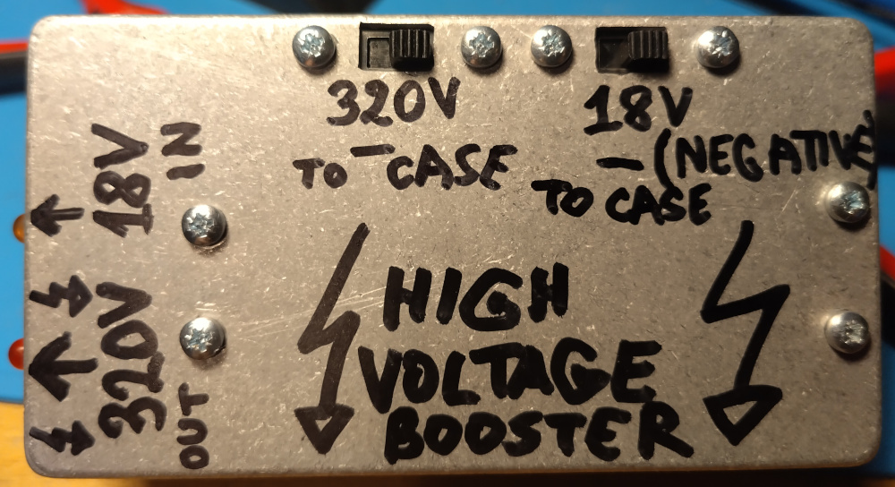
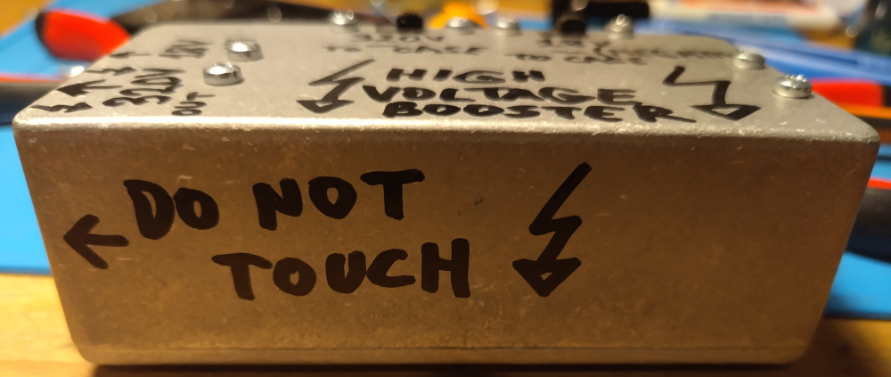
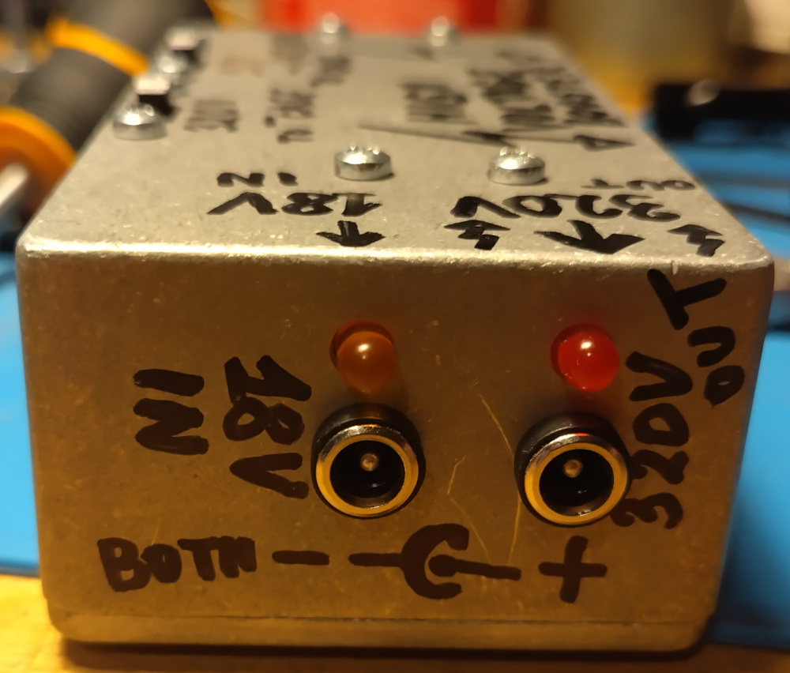
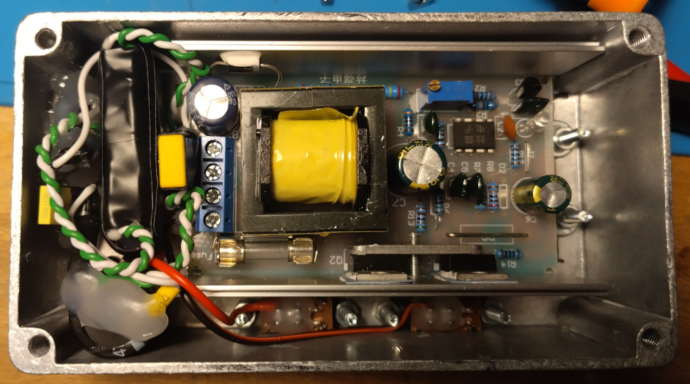

# Wenzel’s Fruity Tube Guitar Preamp

Revision r3 (June 2026).

**WARNING!** Current design implies that the high-voltage booster module is an
external unit with own enclosure, which receives 18V and sends 320V back. Those
320V high-voltage DC ports are **dangerous to touch!** So I would not recommend
to anyone to use current layout as-is. In the future I would rather take a
bigger enclosure where I could put the HV booster away from the rest of the
circuit to avoid any interference.

- [PDF schematic render](wenzels-fruity-tube-guitar-preamp-r3-schematic.pdf)
- [PNG schematic render](wenzels-fruity-tube-guitar-preamp-r3-schematic.png)
- [PDF layout render](wenzels-fruity-tube-guitar-preamp-r3-layout.pdf)
- [PNG layout render](wenzels-fruity-tube-guitar-preamp-r3-layout.png)

## Schematic

## Layout

## Difference (changelog) from previous release (revision r2)

I used a different DC-DC step-up high-voltage booster module since I had issues
with one I used for r2 version. The old one had a helicopter-like pulsating
noise injected, which was annoying at higher gain settings at loud rehearsal
volumes. I couldn’t get rid of it. But the other module was too big to put into
my enclosure. So I made a separate high-voltage booster unit that takes 18V DC
input and outputs 320V DC (**it is not safe to touch, this design is a
compromise!**). It supposed to be connected to the main preamp enclosure via a
couple of DC cables. That DC booster unit has a couple of switches to short
negative leads of 18V and/or 320V sources to the enclosure, to allow to ground
the enclosure while giving the option to avoid ground-loop noise issues.
There is also more extensive DC filtering inside that external DC boost module.

## Photos

Note that I originally had LEDs for the high-voltage lines using 100k resistor.
But that 100k resistor was getting too hot, wasting too much energy as heat.
So I removed those diodes, but the photos were taken before I did that.

### Assembled unit

### DC-DC high-voltage booster unit

