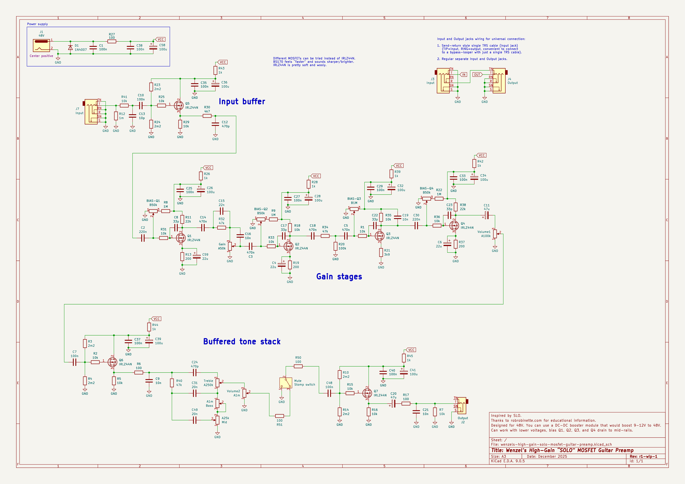

# Wenzel’s High-Gain “SOLO” MOSFET Guitar Preamp

**Work in Progress**.

Very high-gain 48V MOSFET-based guitar preamplifier inspired by SLO.

Thanks to robrobinette.com for educational information.

## Known issues

Oscillations, use a booster pedal in front to reduce them.
Set Gain very low (there would be still plenty of distortion)
and dim Volume1, use Volume2 as your master volume.
There is lots and lots of output.

## Biasing

Bias Q1, Q2, Q3, and Q4 drain to mid-rails. For 48V it’s going to be 24V.
But given the voltage drop with the series DC resistors the voltage would be
more like 45–46V, so aim for 22.5–23V bias.

## Latest revision schematic

r1-wip-1

