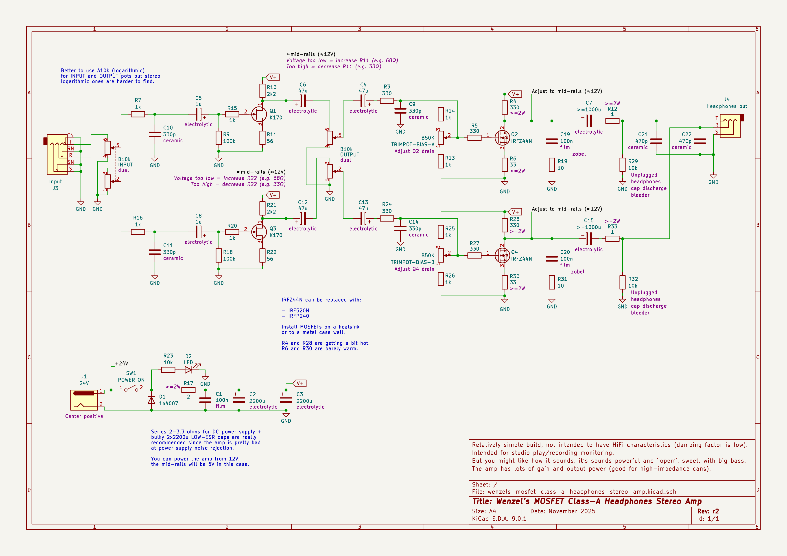
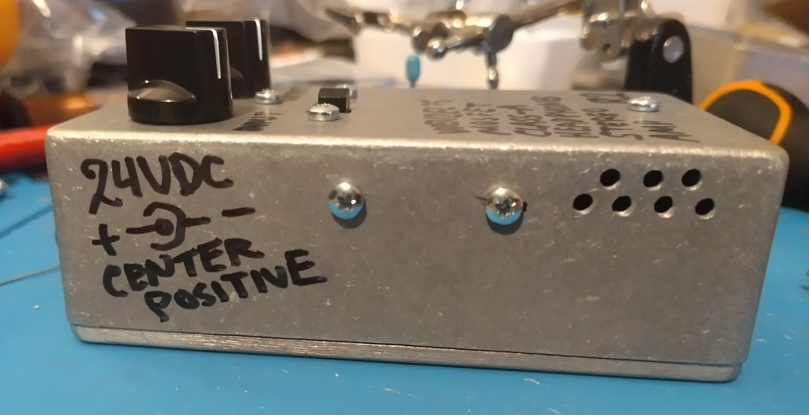
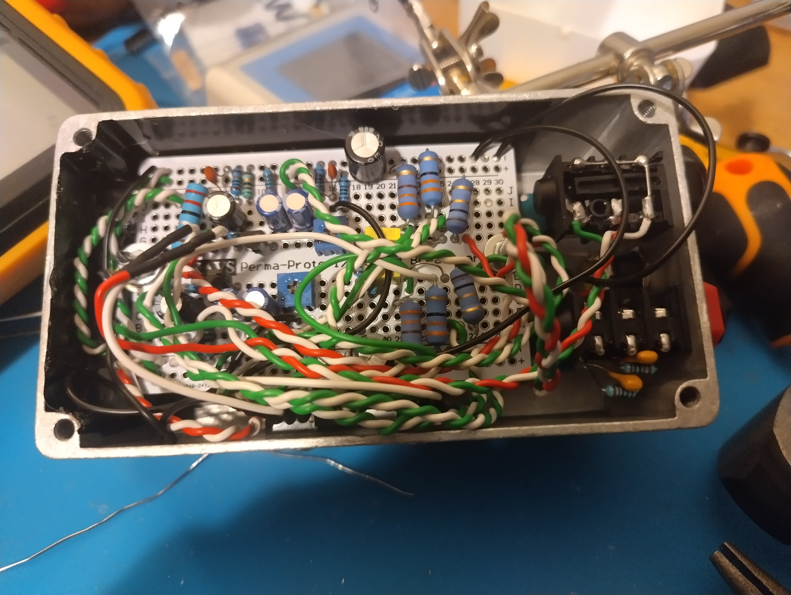
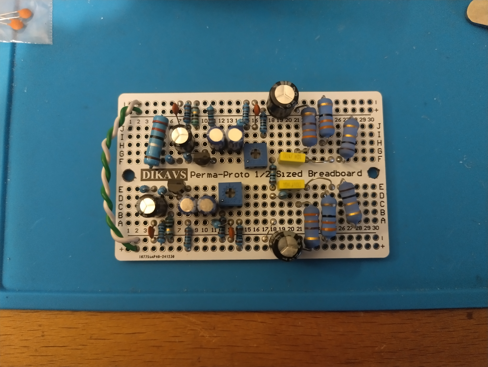

# Wenzel’s MOSFET Class-A Headphones Stereo Amp

Revision 2 (November 2025).

- [PDF schematic render](wenzels-mosfet-class-a-headphones-stereo-amp-r2.pdf)
- [PNG schematic render](wenzels-mosfet-class-a-headphones-stereo-amp-r2.png)

## Built photos

## Difference (changelog) from previous release (revision 1)

- Rename “VOLUME” knob to “INPUT”.

- Add “OUTPUT” extra volume attenuation knob after the JFET boost stage.
  It helps to fine-tune volume for hotter signals.
  The amplifier is pretty gainy, if the input signal is pretty hot the usable
  volume range with just one pot can be tiny, especially with a linear pot.

- Reduce R3 & R24 from 1kΩ to 330Ω

- Reduce output cap discharge bleeders R29 & R32 from 47kΩ to 10kΩ

- Put the R29 & R32 bleeders on the right side of output R12 & R33 which doesn’t
  really change anything in a meaningful way except making it obvious you can
  solder the R29 & R32 bleeders onto the output JACK directly to save some space
  on the PCB.

- Fix a wrong junction at the input jack
  (ring used to be shorted to ground, obviously a drawing mistake).
