# Wenzel’s ColorDiver Fuzz/Boost

Revision r1 (August 2026).

- [PDF schematic render](wenzels-colordiver-fuzz-boost-r1.pdf)
- [PNG schematic render](wenzels-colordiver-fuzz-boost-r1.png)

## Photos

This is a dual pedal, so there are two somewhat identical copies of the circuit
in it.

For this build I used an enclosure that was previously drilled for another
experimental project. There are vent holes left from it. I also sealed some
bigger holes with aluminium bolts and washers.

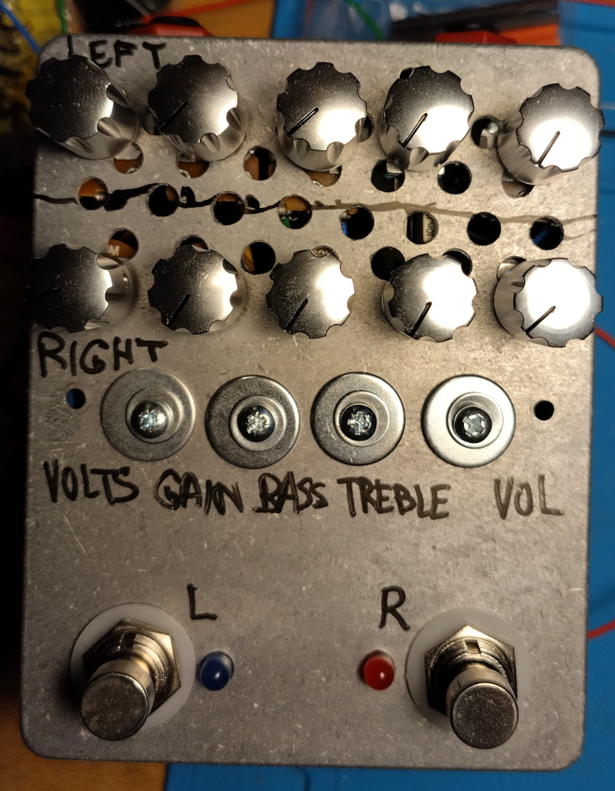

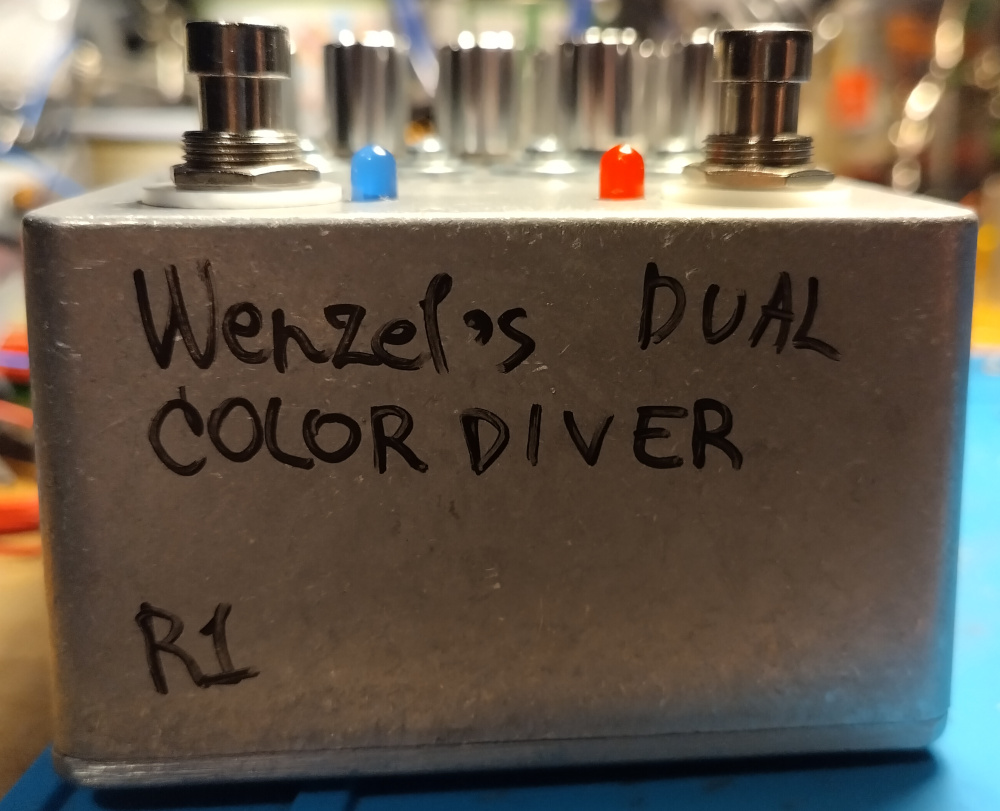

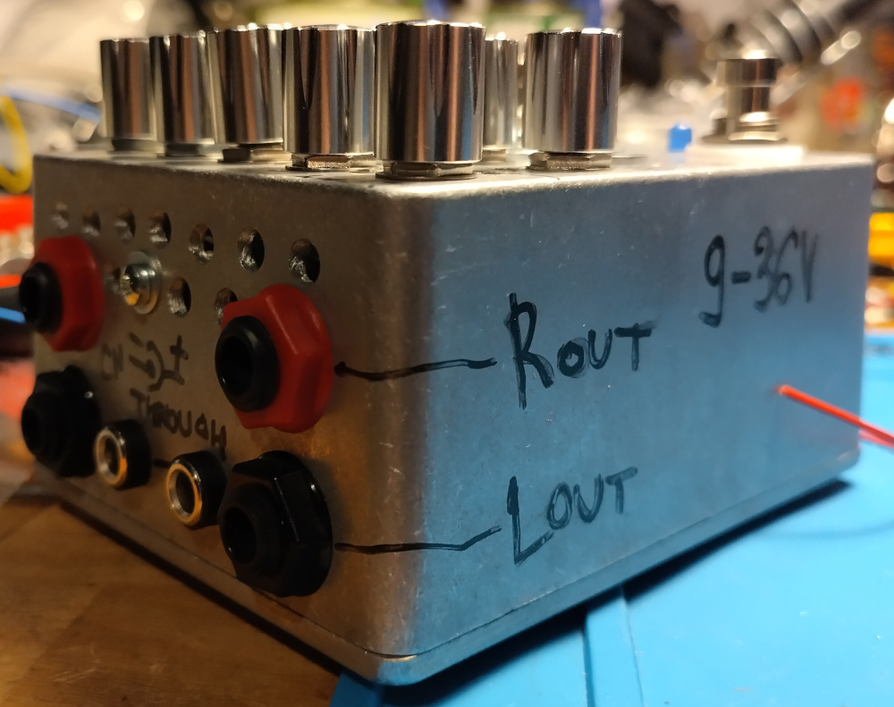

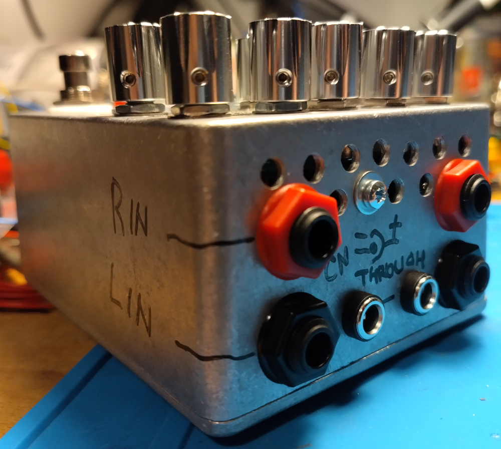

Notes about the board:

1. I didn’t have enough 10uF with the needed voltage rating so I used 15uF when
   I ran out of 10uF
2. I didn’t have 150k resistors so I used a pair of 300k in parallel
3. I didn’t have 82k resistors, I used some other values as series pair to get
   to 82k
4. I didn’t have 100uF with needed voltage rating, so there are 220uF instead of
   those (which is even better)

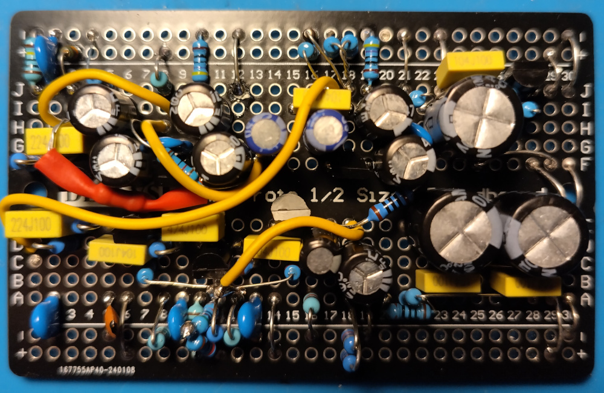

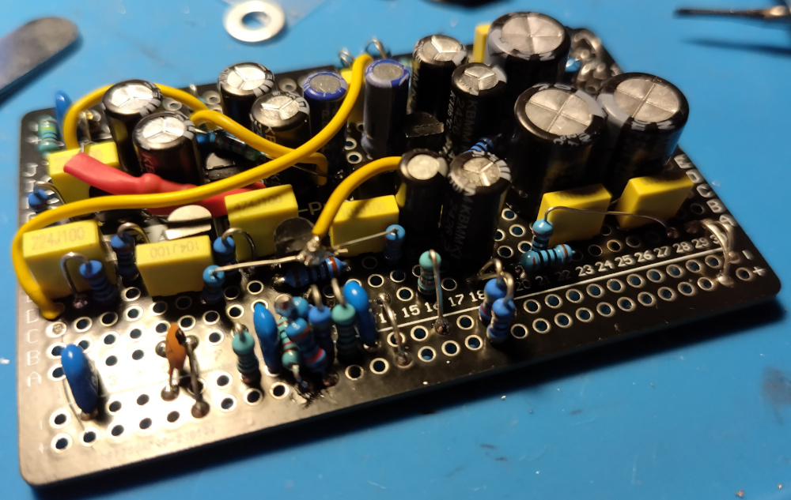

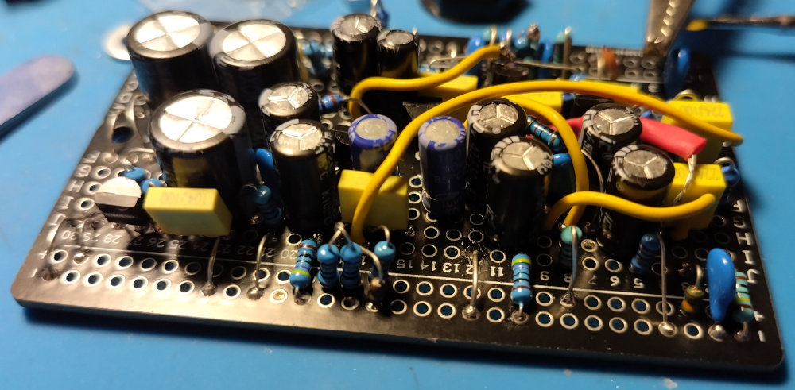

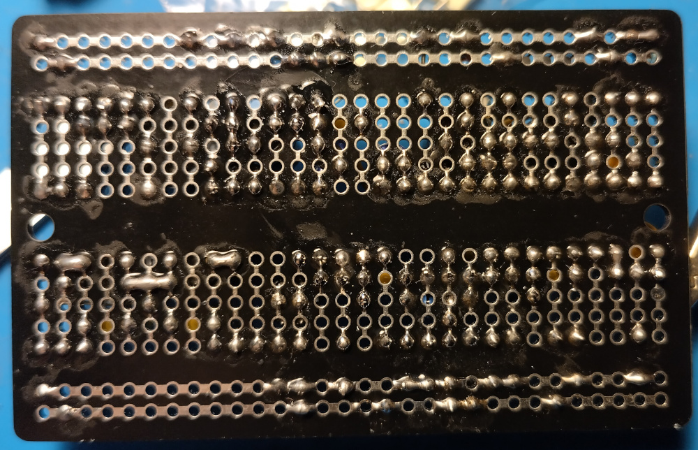

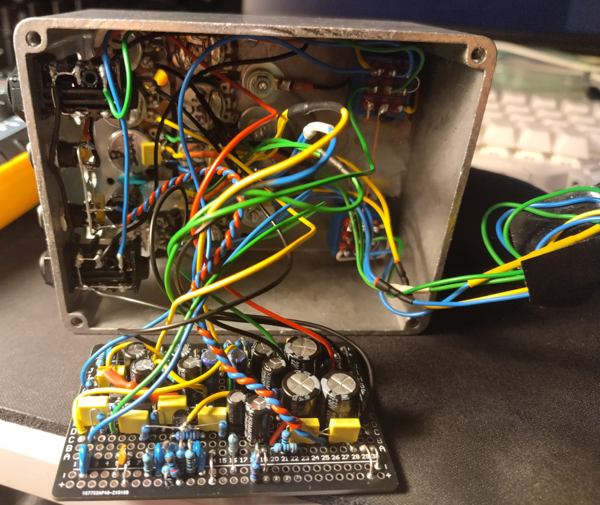

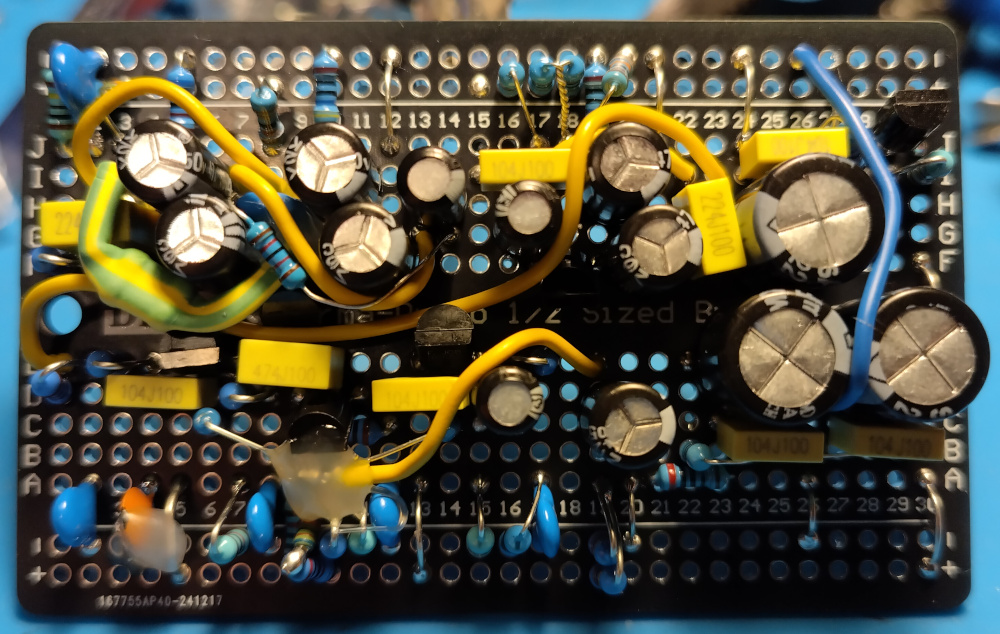

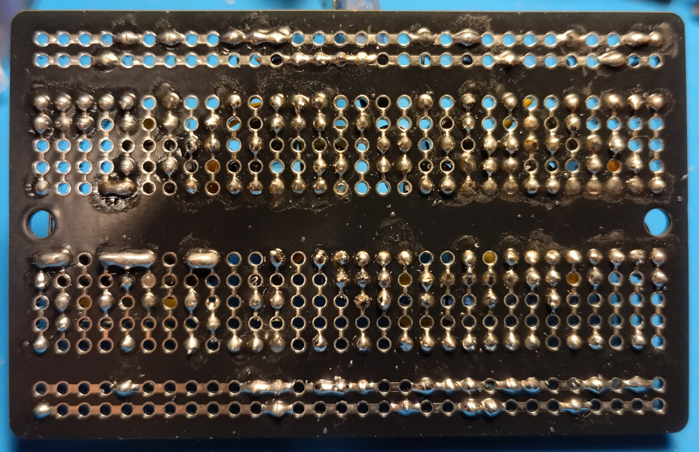

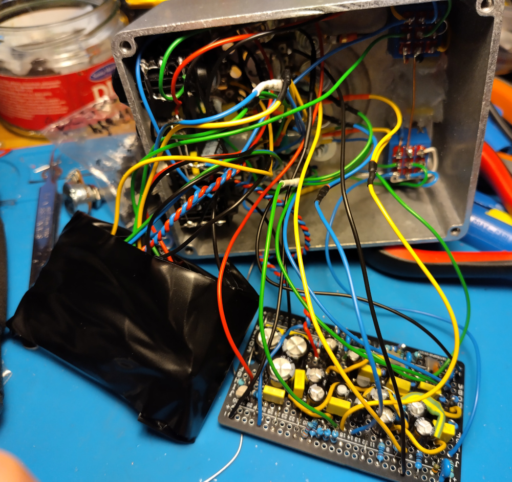

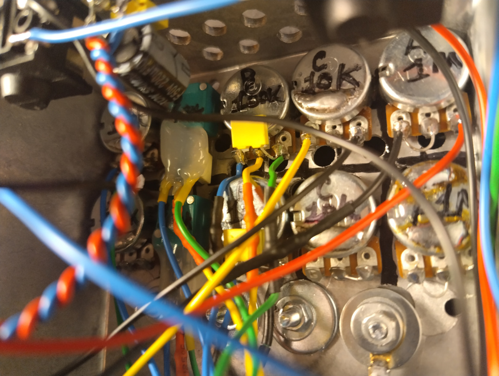

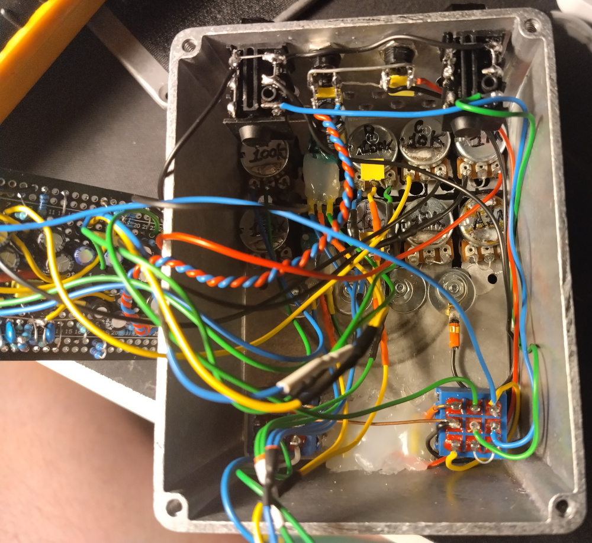

Note that I also had to later change the ground wiring a bit in order to reduce
noise.
