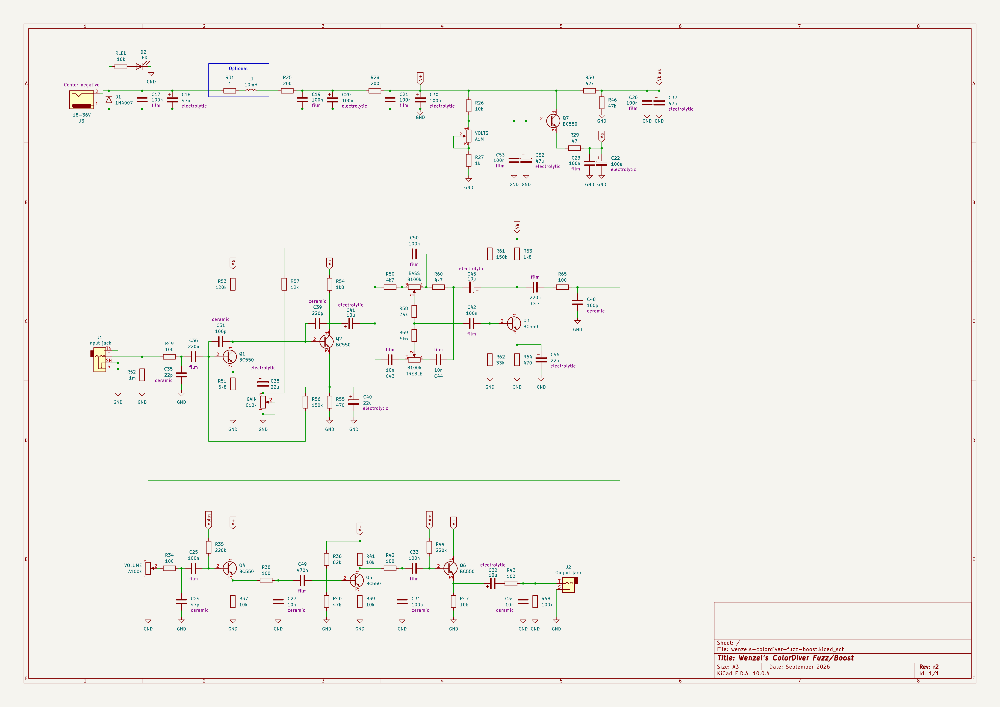

# Wenzel’s ColorDiver Fuzz/Boost

Revision r2 (September 2026).

- [PDF schematic render](wenzels-colordiver-fuzz-boost-r2.pdf)
- [PNG schematic render](wenzels-colordiver-fuzz-boost-r2.png)

## Difference (changelog) from previous release (revision r1)

1. Reverse-polarity protection diode 1n5819 is replaced with 1n4007
   (1n4007 is safer pick for 36V supply)
2. Added 100nF‖47uF filtering for Q8 base VOLTS voltage buffer
3. Added 100nF for the Vbias filtering
4. Added 100pF across Q1 collector and base (less noise at maximum gain)
