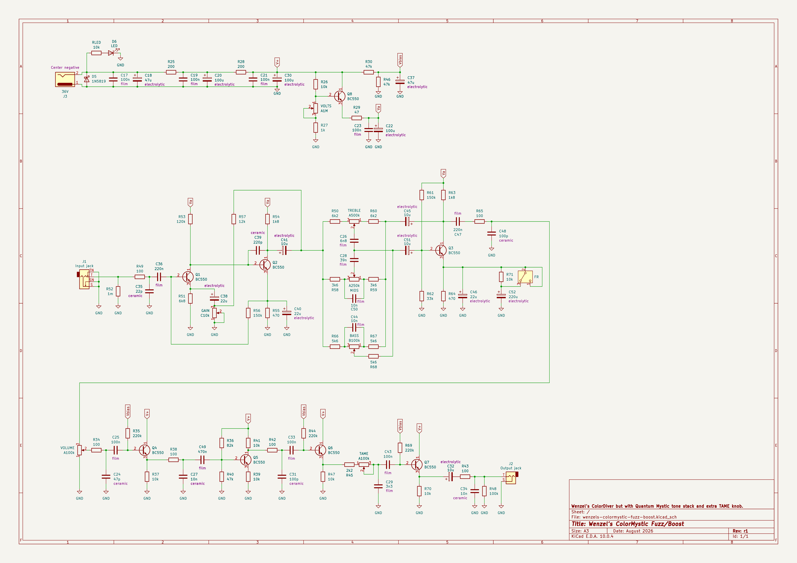

# Wenzel’s ColorMystic Fuzz/Boost

This is a Frankenstein circuit, an experimental merge of two of my favourite
guitar pedals. I took vintage Colorsound Overdriver (actually my own take called
[“Wenzel’s ColorDiver”](../wenzels-colordiver-fuzz-boost)) and replaced the
active bass-treble tone stack with BMT one from Black Arts Toneworks Quantum
Mystic. On top of that added a Proco Rat-style tone/filter control called TAME,
just to add an ability to shave off some highs to tame HF harshness if needed.

Check out [“Wenzel’s ColorDiver”](../wenzels-colordiver-fuzz-boost), this
circuit, apart from the tone stack and the TAME knob, is just a fork.

## Note about the tone stack

Original Quantum Mystic uses B250k linear pot for the MIDS control. I find that
the sweet spot sits in the tiny range from the minimum position and a little
more than minimum. I used A250k logarithmic pot so that the sweet spot is easier
to set, has more moving room. But it’s not a tonal change.

Also note that original Quantum Mystic uses an inverting opamp configuration
with negative feedback for the active tone stack while this design uses a single
transistor topology with negative feedback (original Overdriver gain stage). So
there could be some impedances interactions that potentially can affect the tone
stack behavior.

I added extra FR (“full-range”) switch that adds extra 220uF bypass for the Q3.
Original Overdriver has only 22uF but it might significantly reduce bass
response compared to the original Quantum Mystic. This 220uF moves it to
full-range territory, so in theory it should behave more like in Quantum Mystic.

## Latest revision schematic

## Releases (newest revisions are on the top)

- [r1 2026-08](release-2026-08-r1)
