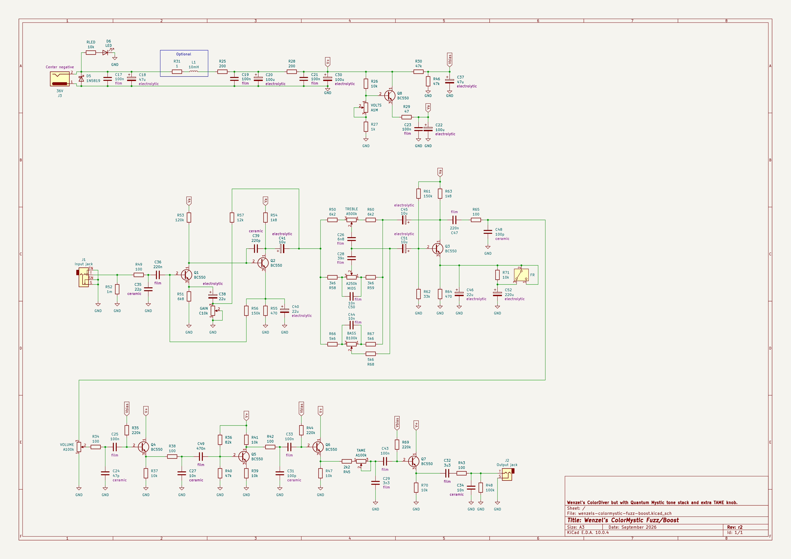
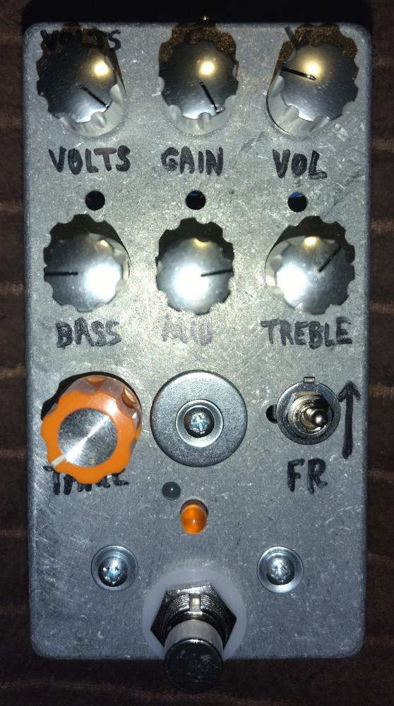
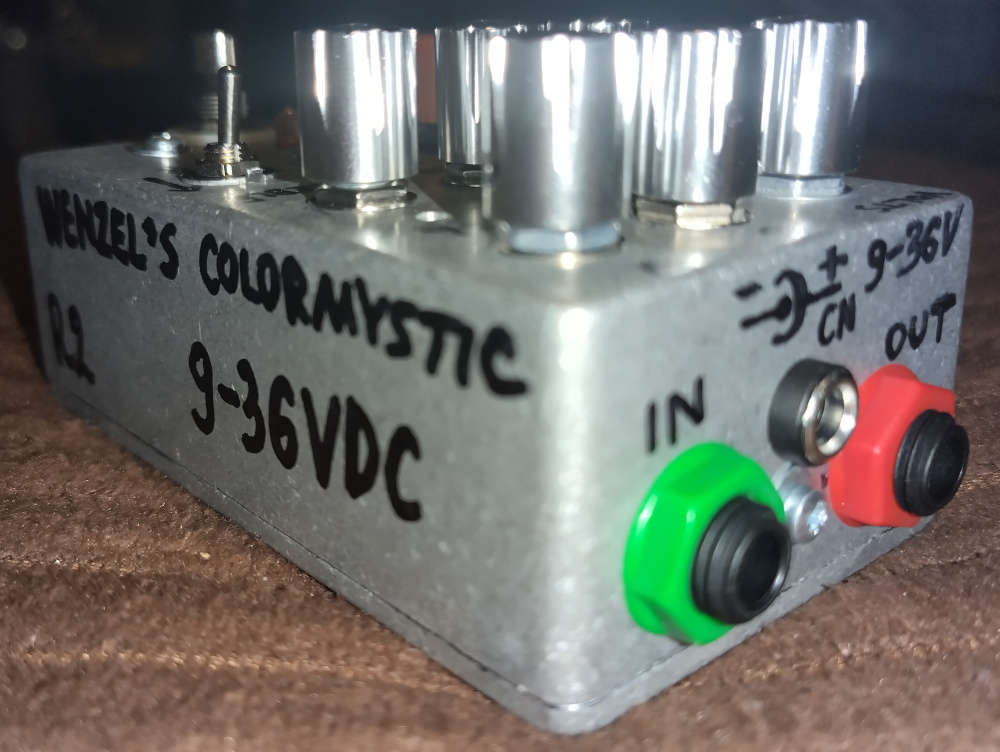
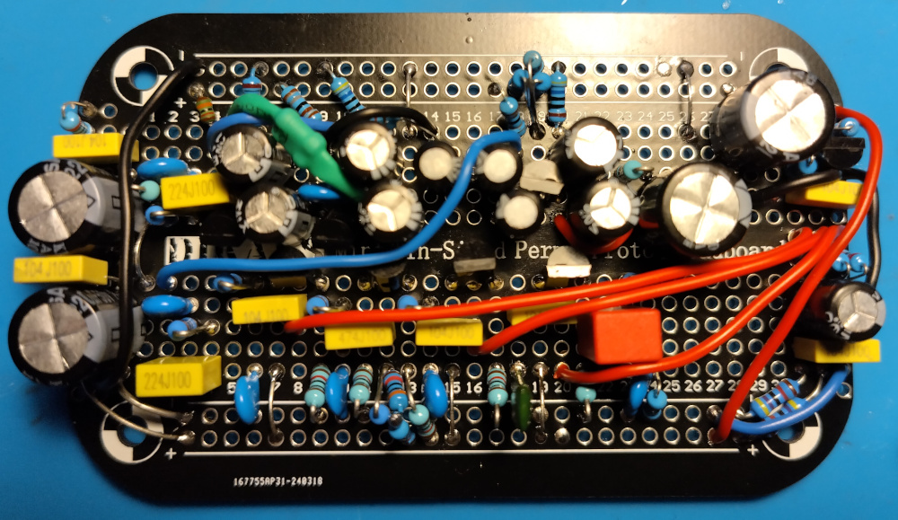
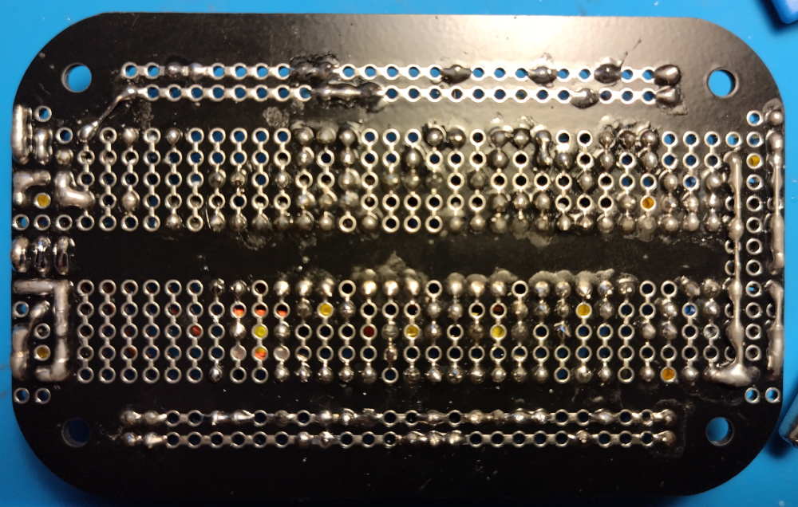
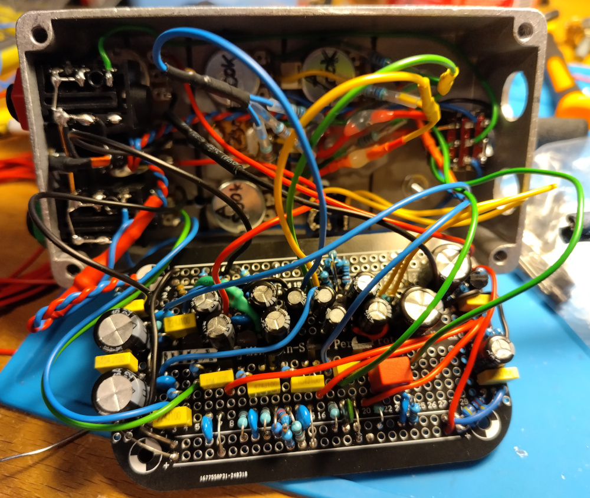

# Wenzel’s ColorMystic Fuzz/Boost

Revision r2 (September 2026).

- [PDF schematic render](wenzels-colormystic-fuzz-boost-r2.pdf)
- [PNG schematic render](wenzels-colormystic-fuzz-boost-r2.png)

## Difference (changelog) from previous release (revision r1)

1. Added optional series inductor (damped with 1Ω in front) for the supply
   filtering
2. Final output C32 is replaced from 10uF electrolytic to 3u3 film
   (even 1uF would do the job just fine)

## Photos

I used an enclosure that had drilled holes for some other project, I sealed some
of them with aluminium bolts and washers.

Notes about the board photo:

1. I used a series pair of 47uF for emitter bypassing to get close to 22uF
   (did not have 22uF caps with needed voltage rating)
2. I forgot to ground Q3 emitter bypass bottom end
   (track 22 on the top, I fixed it after making the photo)
3. I did not have 82k resistors, so there is a series pair of some other values
   to get there
4. I added extra 100nF for the Vbias by accident, which is not on the schematic,
   but it doesn’t hurt to have it
5. I used 220uF instead of 100uF for filtering section
   (did not have 100uF with needed voltage rating, 220uF is even better but it
   is taking more space)

