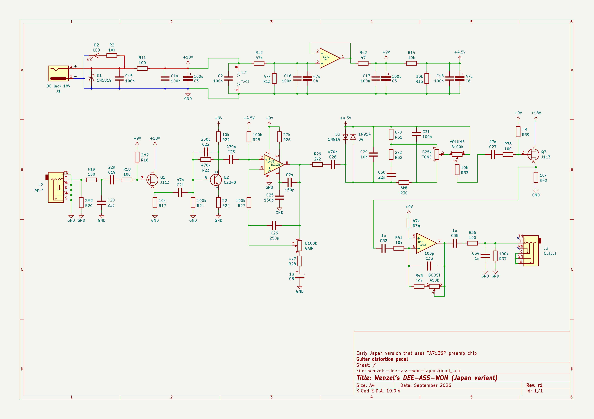
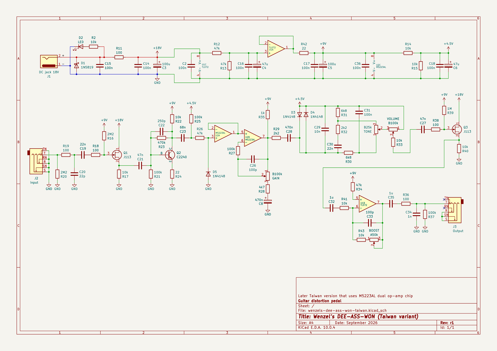

# Wenzel’s DEE-ASS-WON (guitar distortion pedal)

My take on old DS-1 pedal (both original Japanese TA7136-based variant and newer
Taiwan M5223AL era variant).

Please note that this not a one-to-one clone, it has extra features such as post
make-up boost stage, different buffers, true-bypass. I only tried to copy the
crucial distortion and tone character forming parts as close as possible,
including using original TA7136 and M5223AL chips.

## Characteristics

- Input impedance is ≈1M.
- Output impedance is ≈100Ω.

## Power requirements

It takes 18V and supplies it for the input buffer and output post-boost stage,
clean transparent headroom. But it derives 9V internally for the rest of the
circuit to stay faithful to the original distortion character.

## Latest revision schematic

Early Japan version that uses TA7136 preamp chip:

Later Taiwan version that uses M5223AL dual op-amp chip:

## Releases (newest revisions are on the top)

- [r1 2026-09](release-2026-09-r1)
