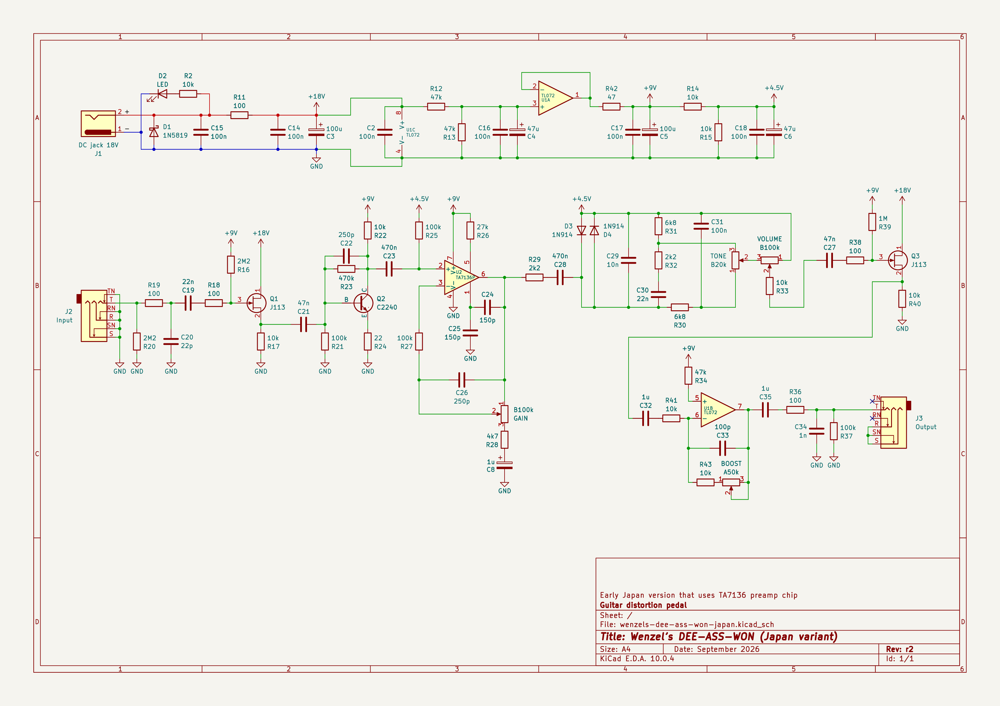
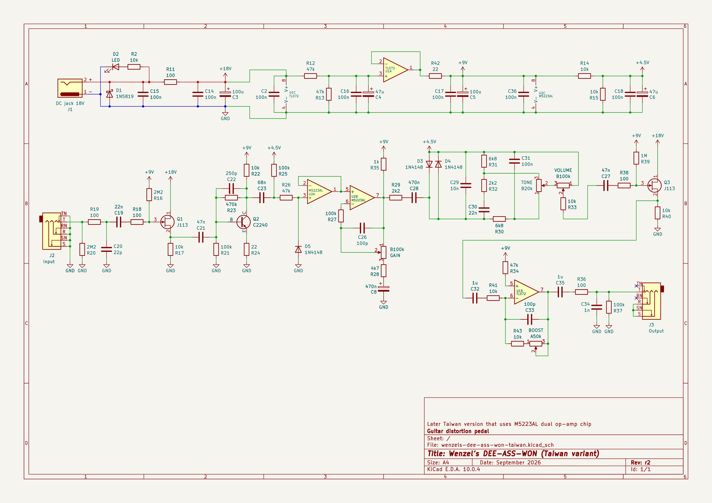

# Wenzel’s DEE-ASS-WON (guitar distortion pedal)

Revision r2 (September 2026).

## Wenzel’s DEE-ASS-WON (Japan variant)

- [PDF schematic render](wenzels-dee-ass-won-japan-r2.pdf)
- [PNG schematic render](wenzels-dee-ass-won-japan-r2.png)

## Wenzel’s DEE-ASS-WON (Taiwan variant)

- [PDF schematic render](wenzels-dee-ass-won-taiwan-r2.pdf)
- [PNG schematic render](wenzels-dee-ass-won-taiwan-r2.png)

## Difference (changelog) from previous release (revision r1)

Changed TONE pots from B25k to B20k. The original uses B20k. I thought B20k is
harder to find, but I actually had some in a box that seem to be relatively
recently produced. So they are not as rare as I thought they are.
