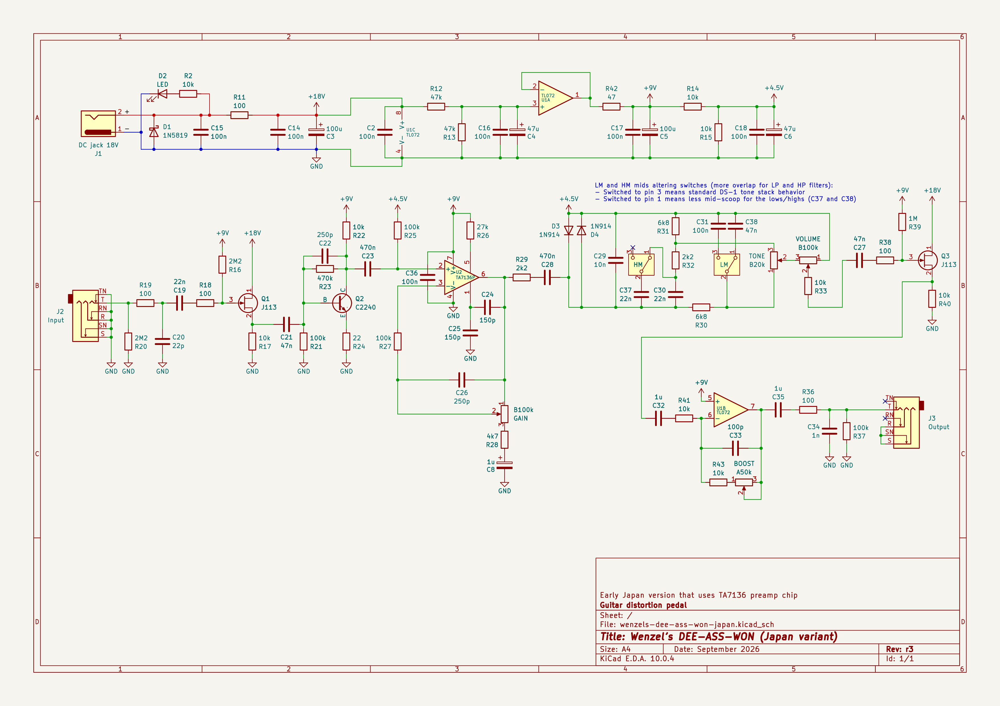
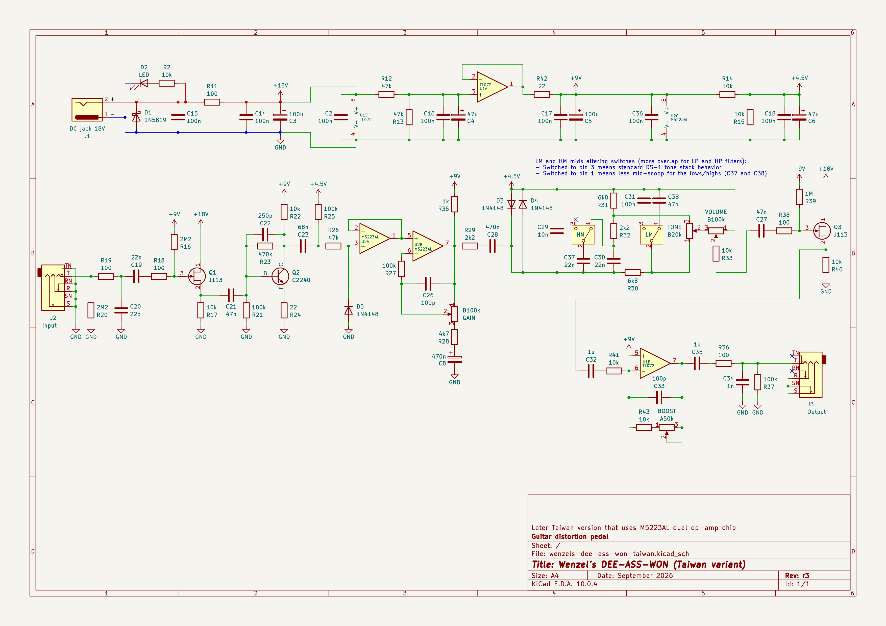

# Wenzel’s DEE-ASS-WON (guitar distortion pedal)

Revision r3 (September 2026).

## Wenzel’s DEE-ASS-WON (Japan variant)

- [PDF schematic render](wenzels-dee-ass-won-japan-r3.pdf)
- [PNG schematic render](wenzels-dee-ass-won-japan-r3.png)

## Wenzel’s DEE-ASS-WON (Taiwan variant)

- [PDF schematic render](wenzels-dee-ass-won-taiwan-r3.pdf)
- [PNG schematic render](wenzels-dee-ass-won-taiwan-r3.png)

## Difference (changelog) from previous release (revision r2)

- Fixed an error for the final post-boost stage
  (non-inverting should go straight to +9V, not through 47k)
- Added HM and LM switches for shifting filter frequencies in the tone stack
  for less mid-scooped tone
- Added 100n local bypass for the TA7136P in the Japan variant
