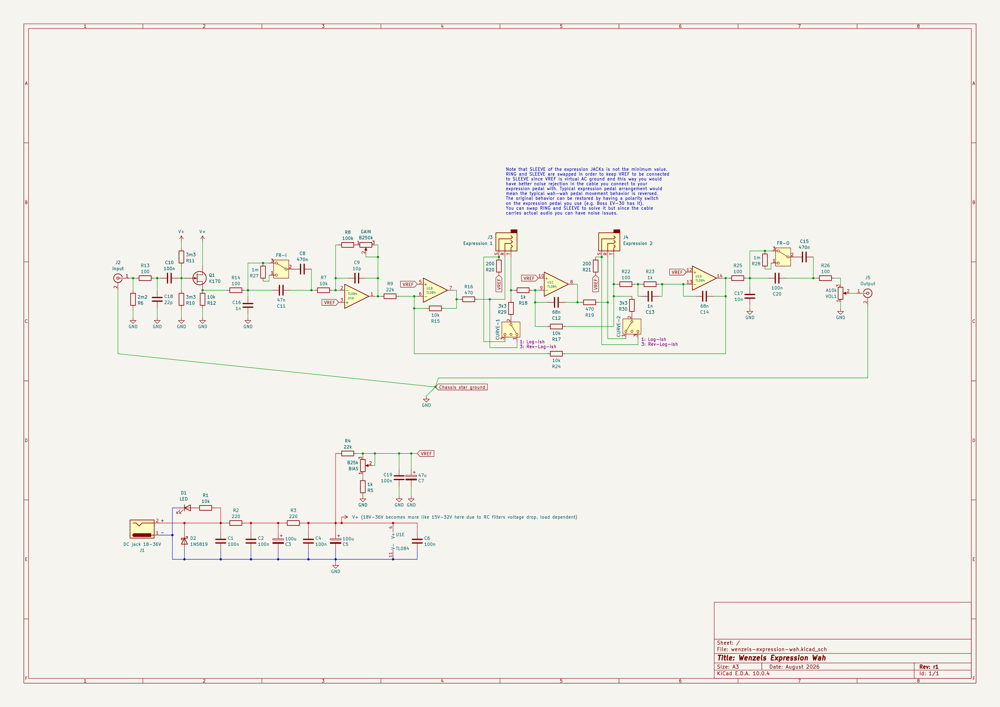

# Wenzel’s Expression Wah

This is a wah-wah guitar pedal but one that doesn’t require a rocking pedal
construction. Instead if accepts 2-channel expression pedal (2x TRS cables) with
expected 10k impedance (e.g. Boss EV-30). Since most expression pedals are
typically featuring a linear potentiometer this pedal has a feature to emulate a
logarithmic-ish curve (or reverse-logarithmic). Also it does not use any
inductors, it’s a simple op-amp based design.

This design is originally based on the schematic of PedalPCB “Parasite Wah”
(but it’s heavily modified):

- https://docs.pedalpcb.com/project/ParasiteWah.pdf
- https://www.musikding.de/Parasite-Wah-kit

Note that SLEEVE of the expression JACKs is not the minimum value.
RING and SLEEVE are swapped in order to keep VREF to be connected
to SLEEVE since VREF is virtual AC ground and this way you would
have better noise rejection in the cable you connect to your
expression pedal with. Typical expression pedal arrangement would
mean the typical wah-wah pedal movement behavior is reversed.
The original behavior can be restored by having a polarity switch
on the expression pedal you use (e.g. Boss EV-30 has it).
You can swap RING and SLEEVE to solve it but since the cable
carries actual audio you can have noise issues.

## Characteristics

- Input impedance is ≈1MΩ.
- Output impedance is ≈200Ω.

## Power requirements

- 18V–36V DC (100mA is plenty)

## Latest revision schematic

## Releases (newest revisions are on the top)

- [r1 2026-08](release-2026-08-r1)
