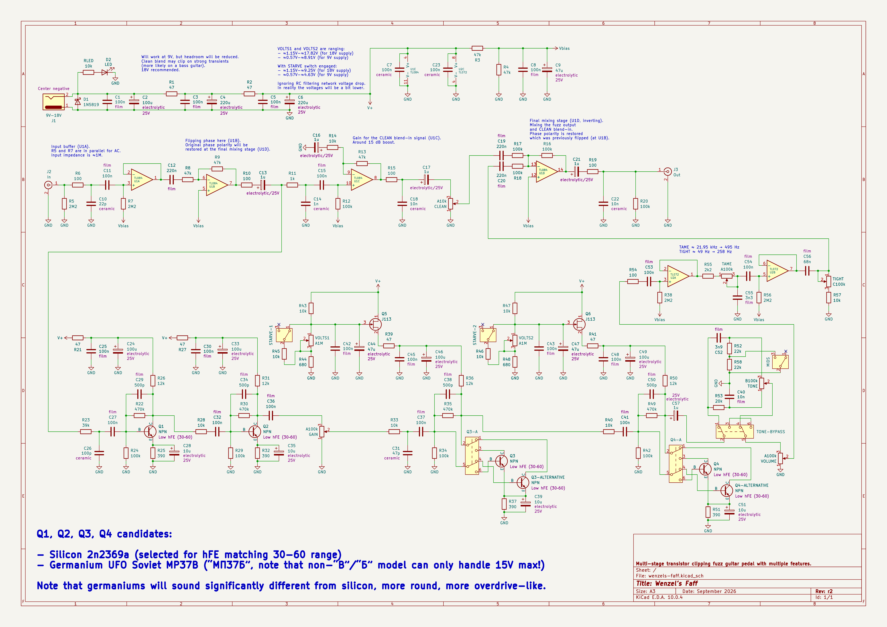

# Wenzel’s Faff

Revision r2 (September 2026).

- [PDF schematic render](wenzels-faff-r2.pdf)
- [PNG schematic render](wenzels-faff-r2.png)

## Difference (changelog) from previous release (revision r1)

- Added MIDS switch that doubles 22k for the high-pass filter in the tone stack
  when engaged, shifting the frequency down in order to get more overlap with
  the low-pass filter, thus the tone stack producing less mid-scoop, perceived
  as more mids, more broader frequency response.
- Added Q3 and Q4 transistors switches so that those can be switched between
  germanium or silicon ones, giving plenty of tonal options and allowing to
  combine silicon low-voltage gating with germanium rounder overdrive character.
