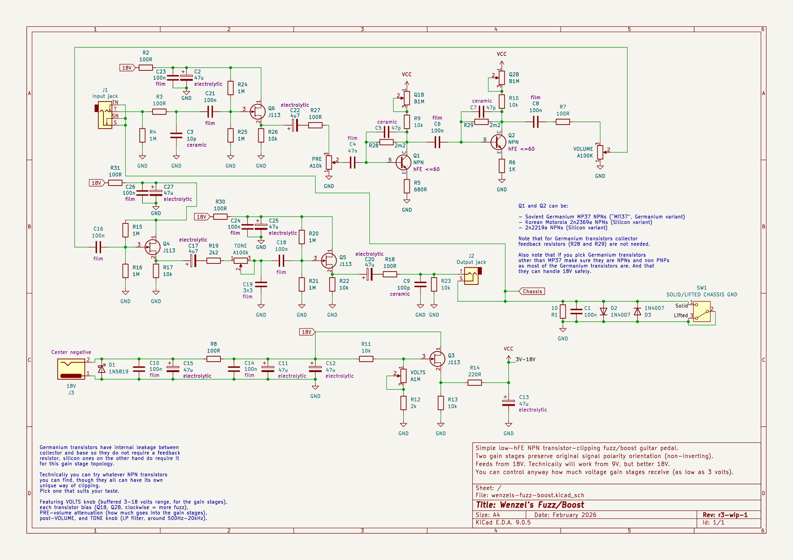

# Wenzel’s Fuzz/Boost

**WIP:** Work in progress…

Simple 2 gain stages NPN fuzz (either germanium or silicone) featuring an
adjustable “BIAS” knob for each gain stage, adjustable buffered source DC
voltage (“VOLTS” knob) for both gain stages, and a “TONE” knob which is a simple
rat-style low-pass filter to tame the high-frequencies. Also there are “PRE” and
post “VOLUME” attenuation knobs.

Before the input signal reaches the gain stages it is buffered to provide
predictable fuzz behavior regardless of where the pedal is placed in the signal
chain.

## Latest revision schematic

r3-wip-1

## Releases (newest revisions are on the top)

TODO
