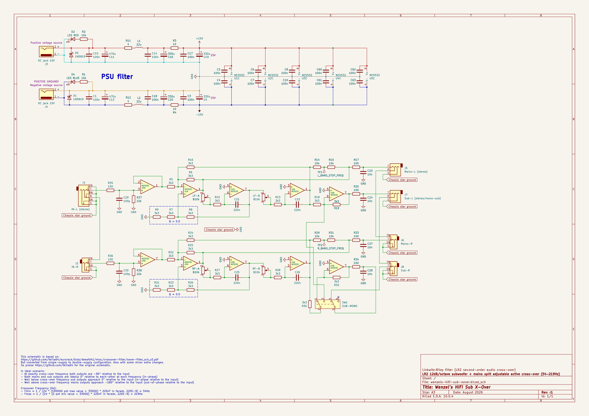
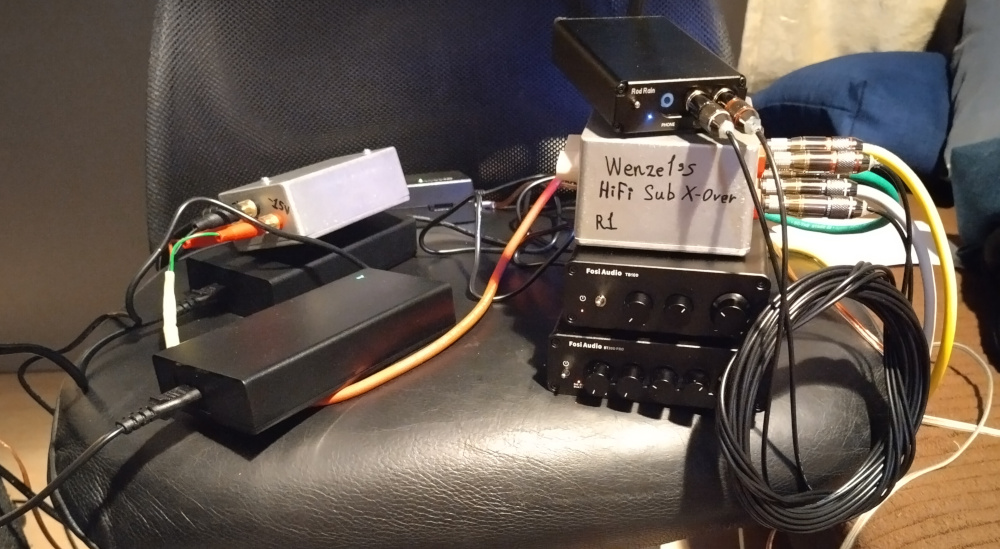
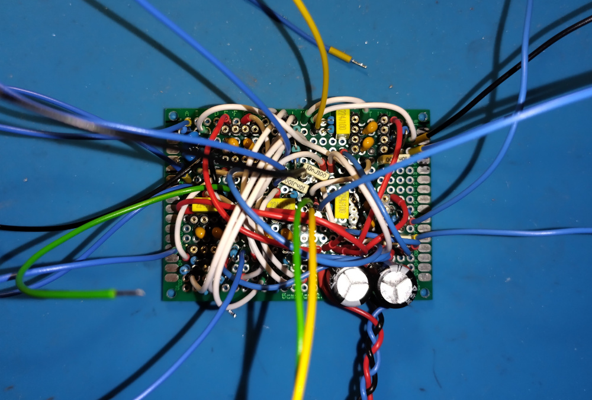
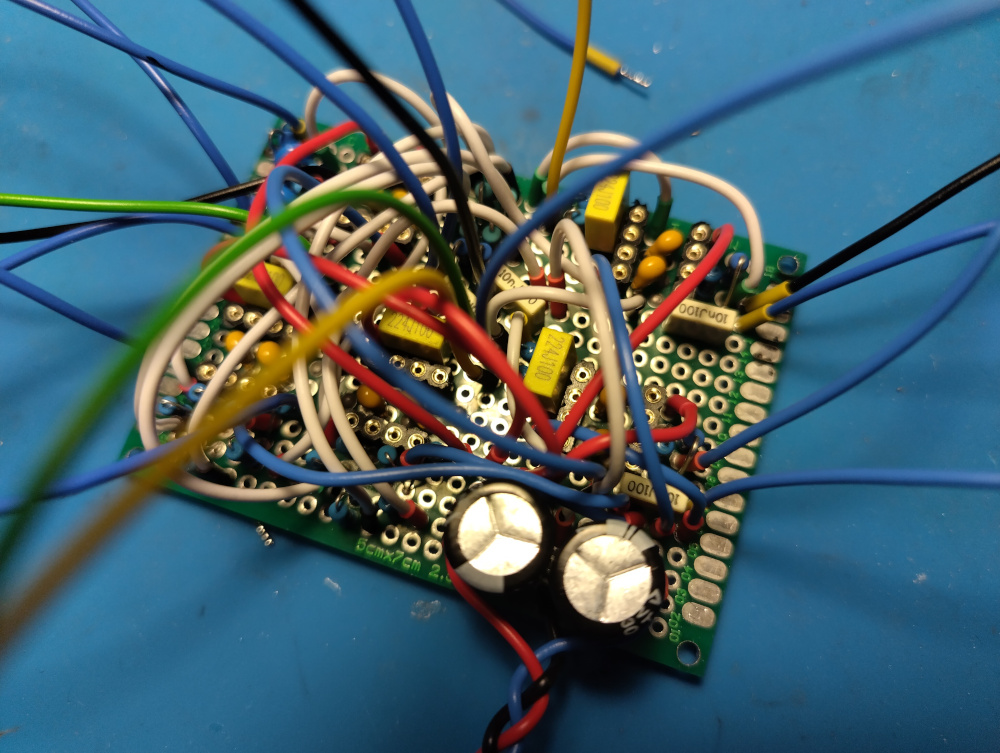
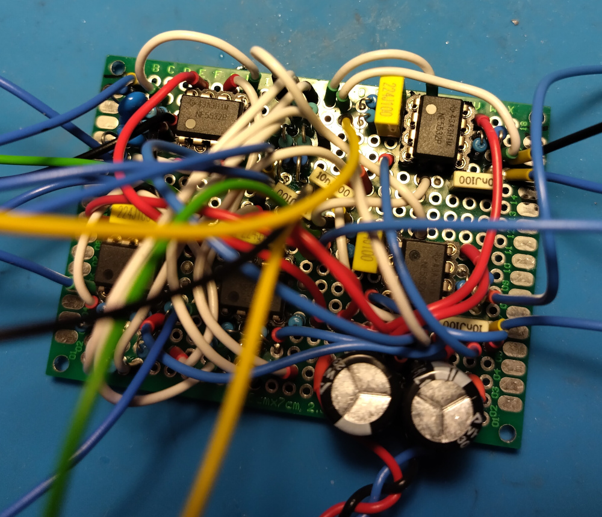
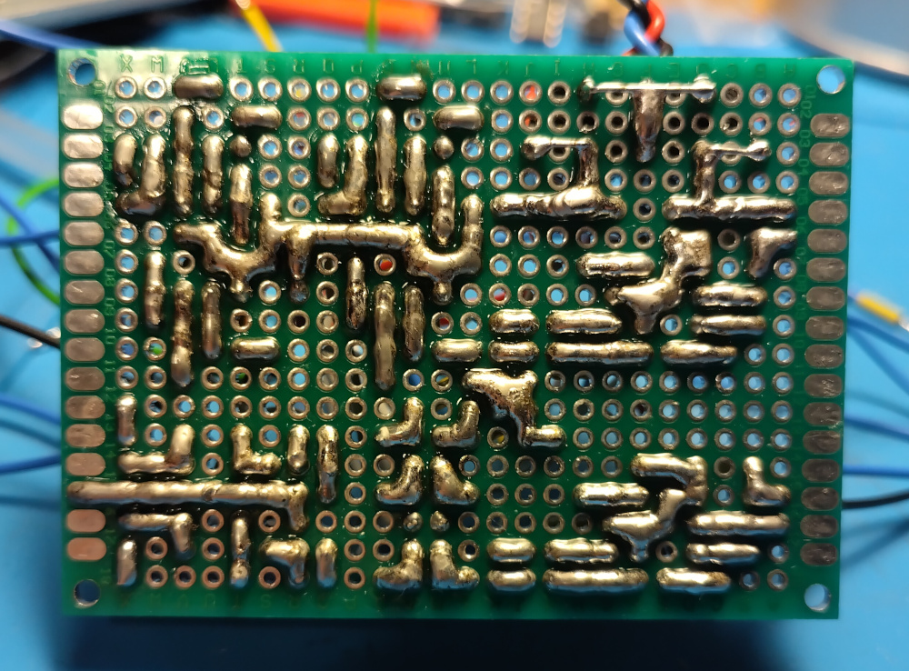
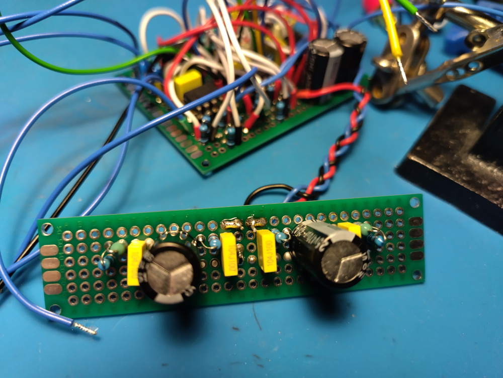
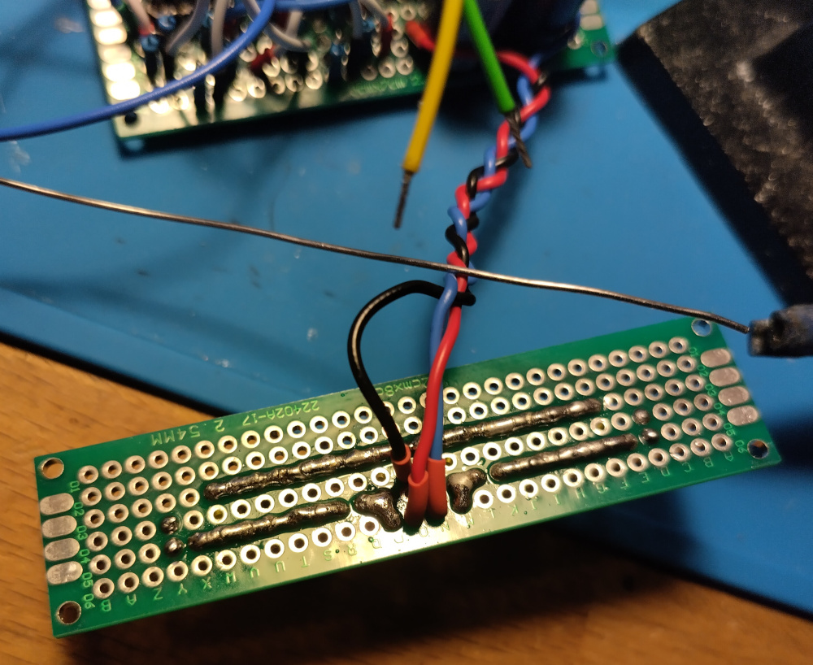

# Wenzel’s HiFi Sub X-Over

Revision r1 (August 2026).

- [PDF schematic render](wenzels-hifi-sub-xover-r1.pdf)
- [PNG schematic render](wenzels-hifi-sub-xover-r1.png)

## Photos

I didn’t take photos of everything, only some:

