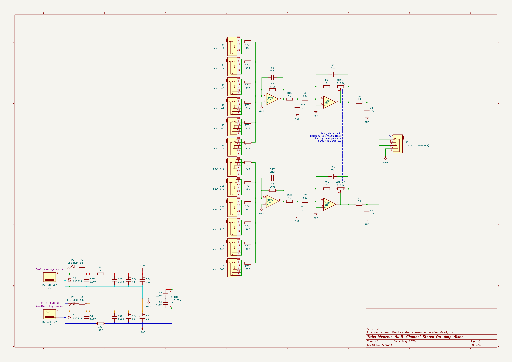

# Wenzel’s Multi-Channel Stereo Op-Amp Mixer

A simple op-amp-based 6-channel stereo mixer I designed for my pedalboard needs.

It features relatively high-impedance inputs (470k), which can be easily changed
to low-impedance if needed by replacing 470k input resistors with something like
10k as well as changing the feedback resistor (see R6 and R8) from 470k to 10k
(just use the same value).

For each stereo side it takes up to 6 inputs and merges them into one while
allowing to boost the signal up to around 24dB. Lots and lots of headroom
(36V total rail-to-rail supply).

## Characteristics

- For each input the input impedance is ≈470k.
- For the outputs the output impedance is ≈100Ω.
- The outputs can easily drive inputs with input impedance >=10k.
  * For lower impedances, down to 2k for example, distortion will slightly rise,
    (-0.42 dB), and headroom will be reduced, current capability is limited,
    but given ±18V supply it should be totally fine for a regular line-level
    signal.
- The gain ranges (depending on the pot position) from roughly unity-gain (0dB)
  and around 20dB.
  * Mind that this is a summing mixer, it sums all the channels, and since there
    are 6 of them even at unity gain it can be a lot, depending on what you have
    in those signals. This design does not support attenuation in order to stay
    simple, and because I personally didn’t need it.
- If you don’t need all 6 channels you can just remove the input JACK and the
  470k resistor for it. Or you can add an extra channel by adding an input JACK
  and a 470k resistor. Just make sure the 470k resistor is physically close to
  the op-amp input.

## Power requirements

- 2x isolated 18V power supplies (±18V configuration, current is negligible,
  14mA per rail maximum in absolute worst-case scenario, expect it to be <10mA
  per rail).

  * Note that you can’t daisy-chain them since on of them references negative/-
    to ground while the other references positive/+ to ground.
    You can daisy-chain only with pedals that reference the same polarity lead
    to ground. Like if you have 2 of these devices, or similar power
    configuration, you can daisy-chain negative rail source with other negative
    rail source input of other pedal, and same for positive.
    Mind though that daisy-chaining provides extra ground paths and there is a
    potential for ground-loop noise issues.

## Latest revision schematic

## Releases (newest revisions are on the top)

- [r1 2026-05](release-2026-05-r1)
