# Wenzel’s Multi-Channel Stereo Op-Amp Mixer

Revision r1 (May 2026).

- [PDF schematic render](wenzels-multi-channel-stereo-opamp-mixer-r1.pdf)
- [PNG schematic render](wenzels-multi-channel-stereo-opamp-mixer-r1.png)

## Photos

Output jack and GAIN pot:

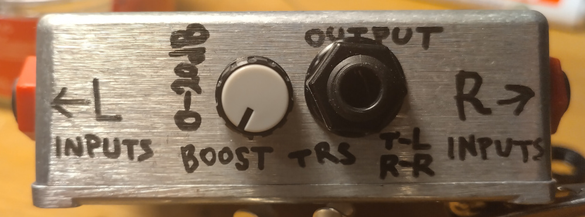

The spacing is as tight as possible (to fit all 6 inputs):

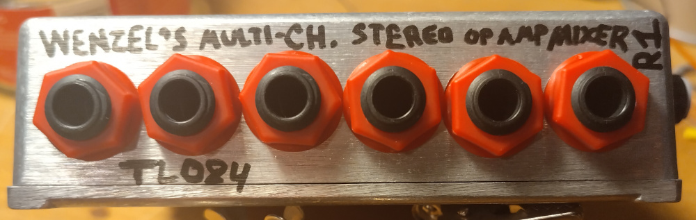

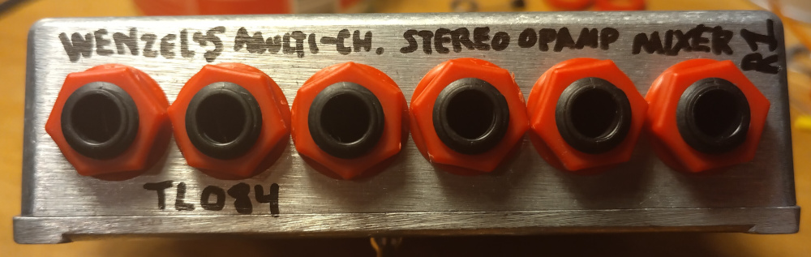

Positive and negative voltages source DC inputs:

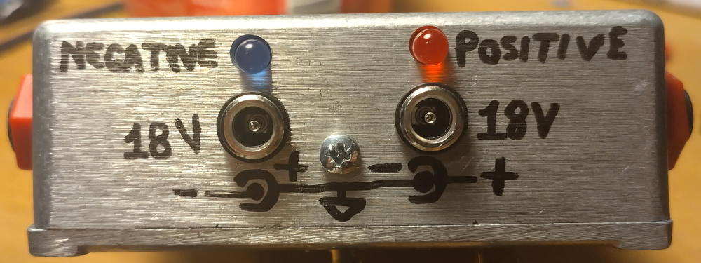

Everything is assembled and wired inside:

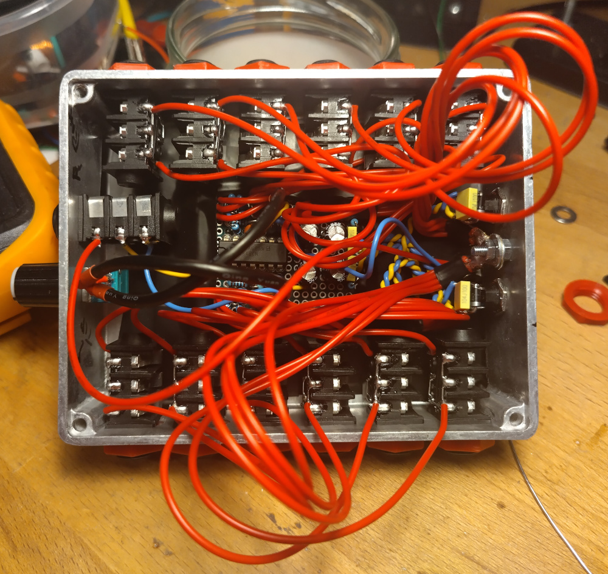

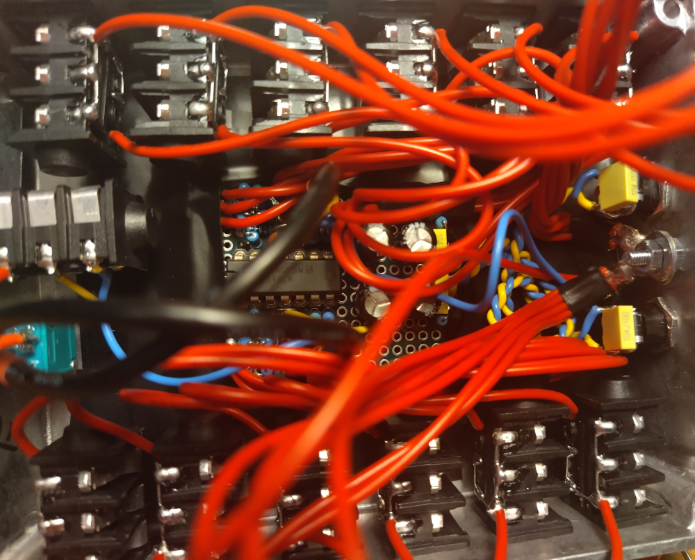

Inputs jacks prepared (ring is shorted to ground and tip is too when cable is
unplugged, no floating inputs):

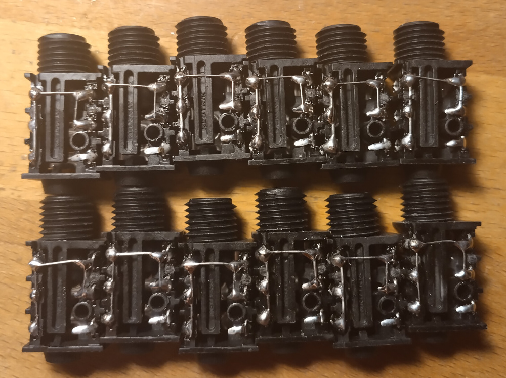

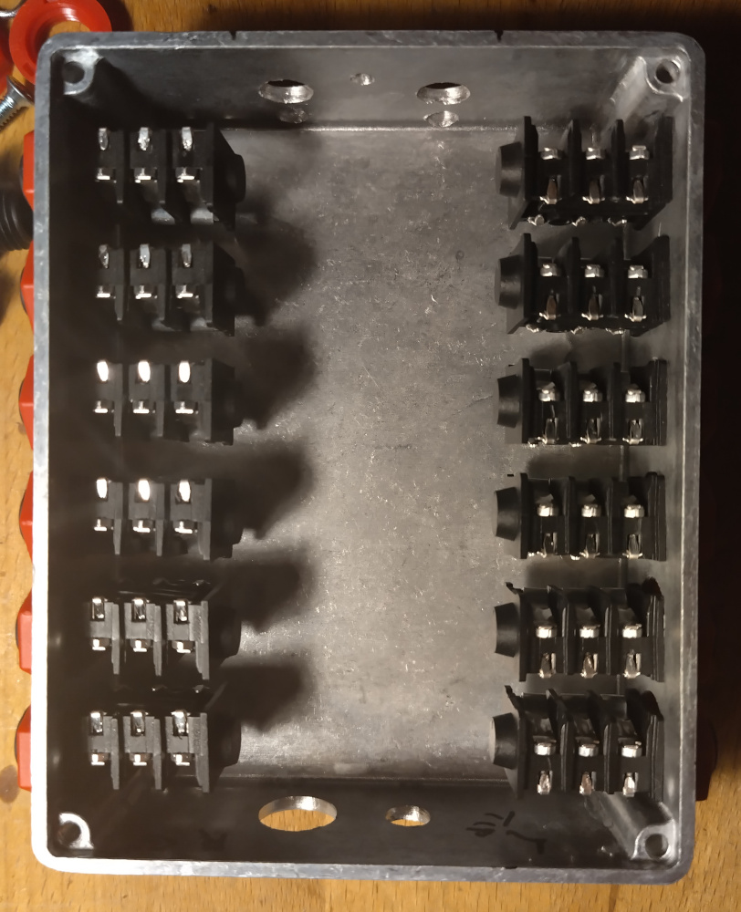

Populated board:

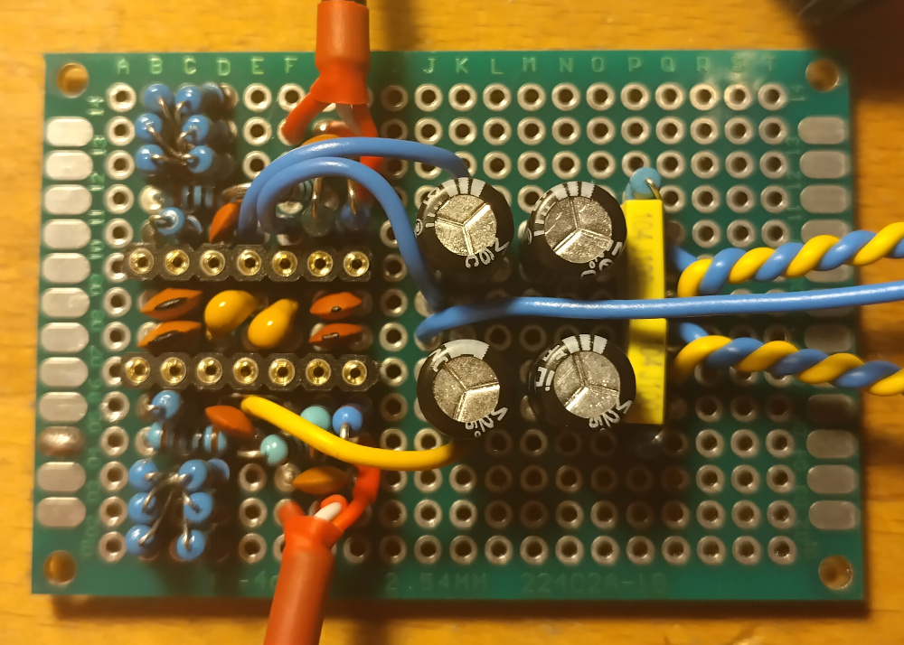

And with notes and markings:

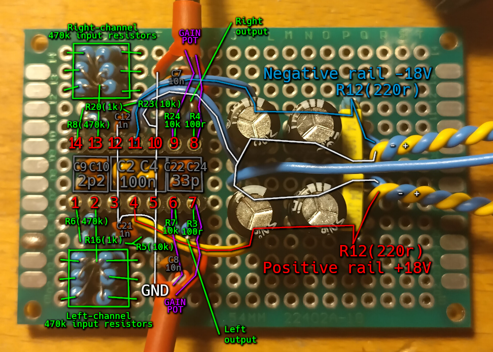

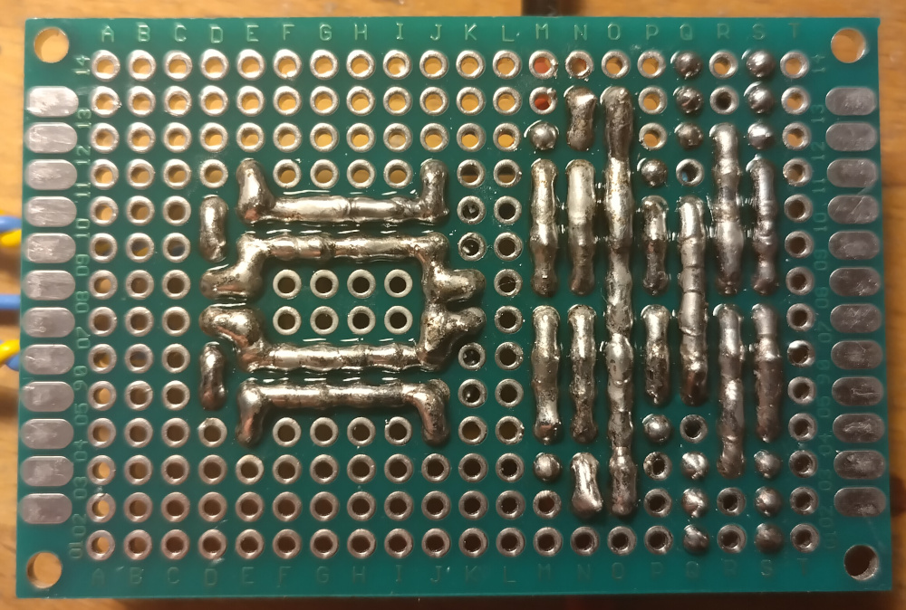

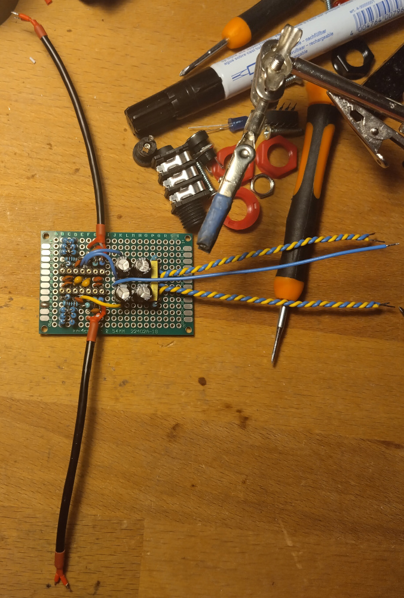

Used screened wire for the gain pot:

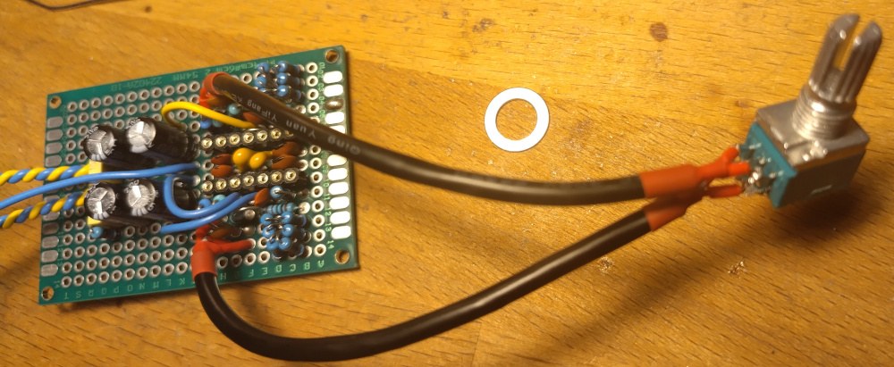

Everything is wired to the board:

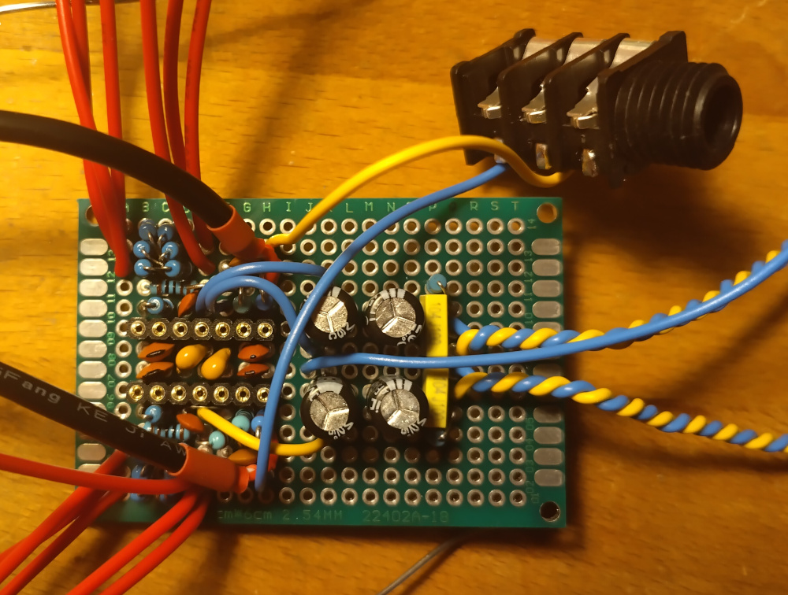

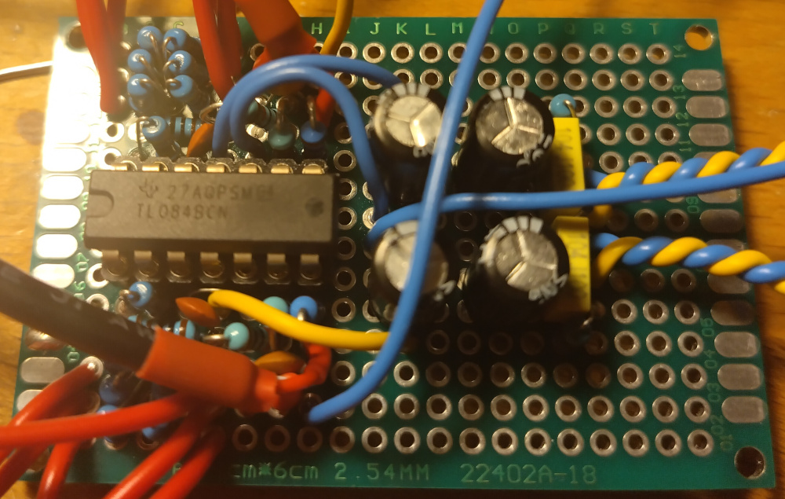
