# Wenzel’s Multi-Channel Stereo Op-Amp Splitter

Revision r1 (June 2026).

## Stereo 1-to-6 Channels Splitter

- [PDF schematic render](wenzels-multi-channel-stereo-opamp-splitter-r1.pdf)
- [PNG schematic render](wenzels-multi-channel-stereo-opamp-splitter-r1.png)

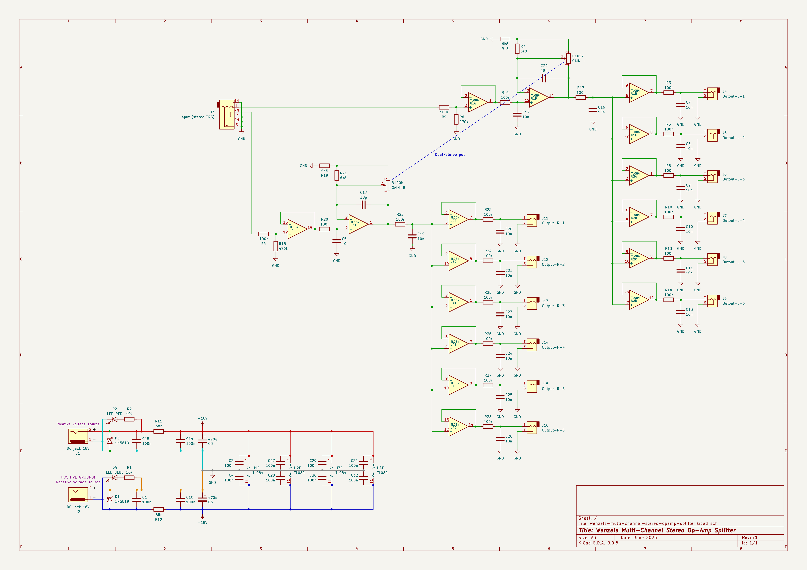

## Simple Mono Boost with 2 outputs

- [PDF schematic render](wenzels-multi-channel-stereo-opamp-splitter-mono-boost-r1.pdf)
- [PNG schematic render](wenzels-multi-channel-stereo-opamp-splitter-mono-boost-r1.png)

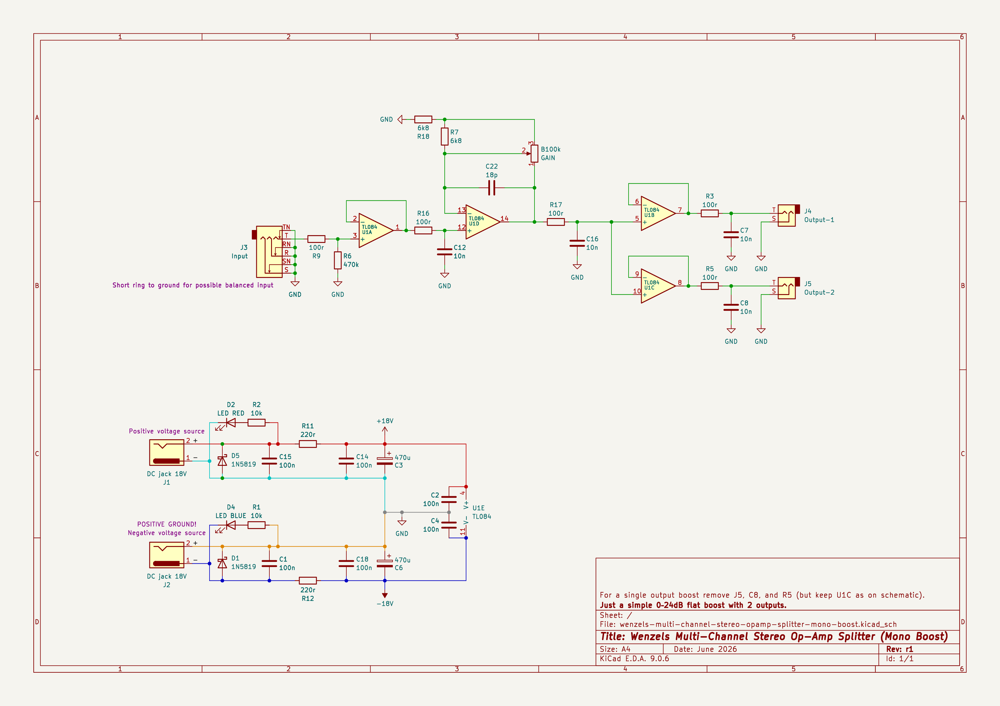

## Simple Mono Boost with 1 balanced output

- [PDF schematic render](wenzels-multi-channel-stereo-opamp-splitter-mono-boost-balanced-output-r1.pdf)
- [PNG schematic render](wenzels-multi-channel-stereo-opamp-splitter-mono-boost-balanced-output-r1.png)

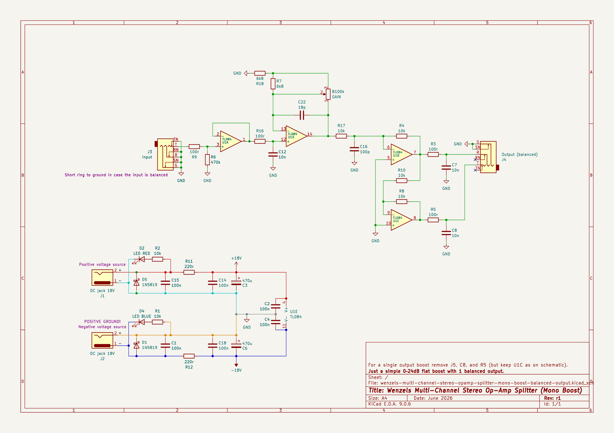

## Photos

Finished unit enclosure:

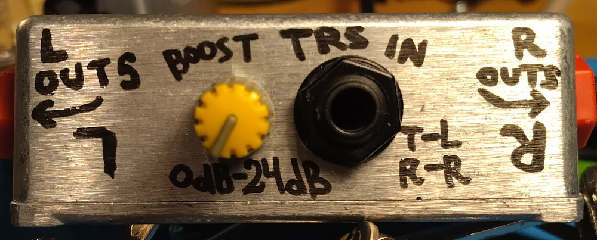

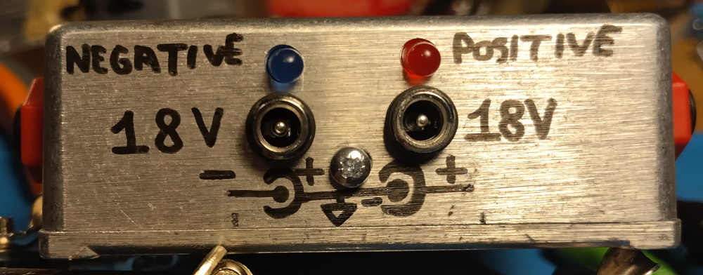

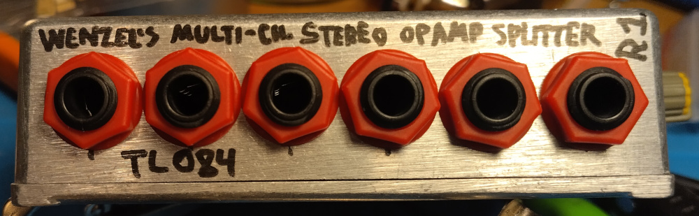

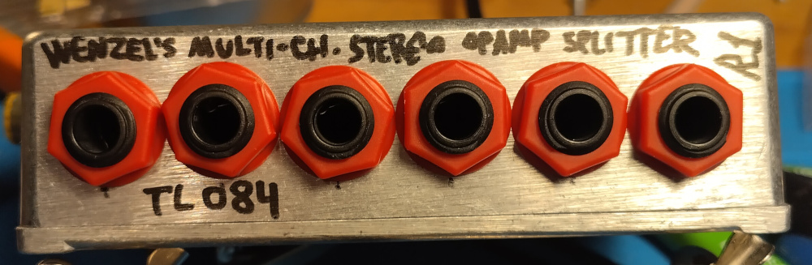

Assembled unit inside:

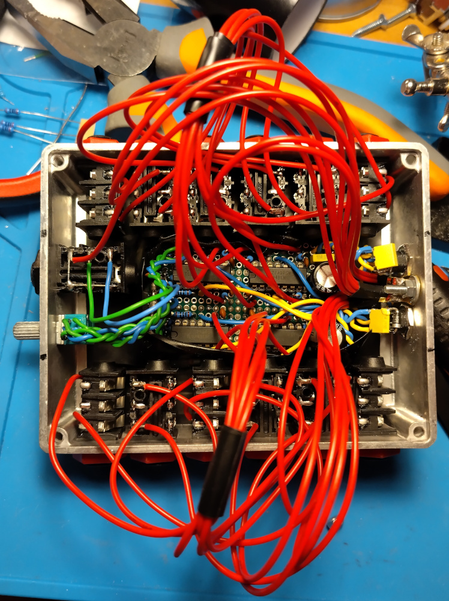

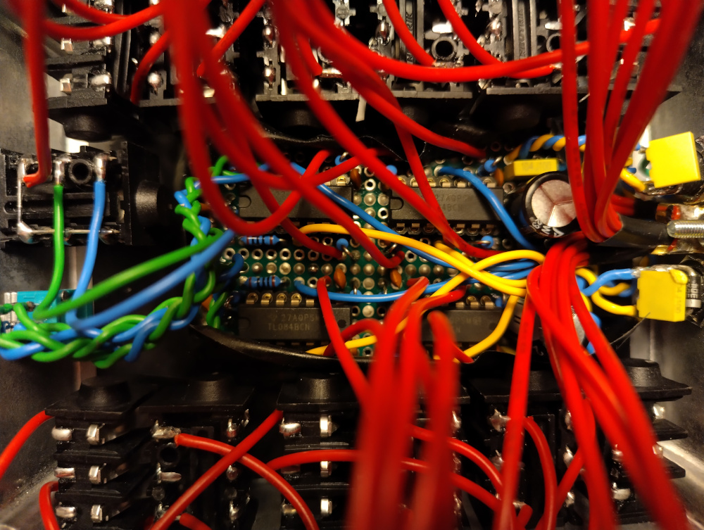

The board:

Yellow wires is positive voltage connected to IC Vcc+ inputs,
and blue wires is negative voltage connected to IC Vee- inputs.

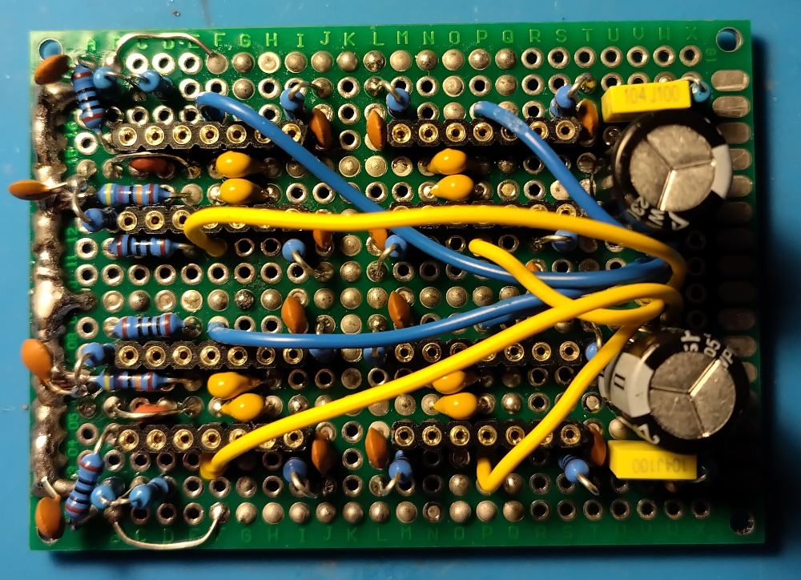

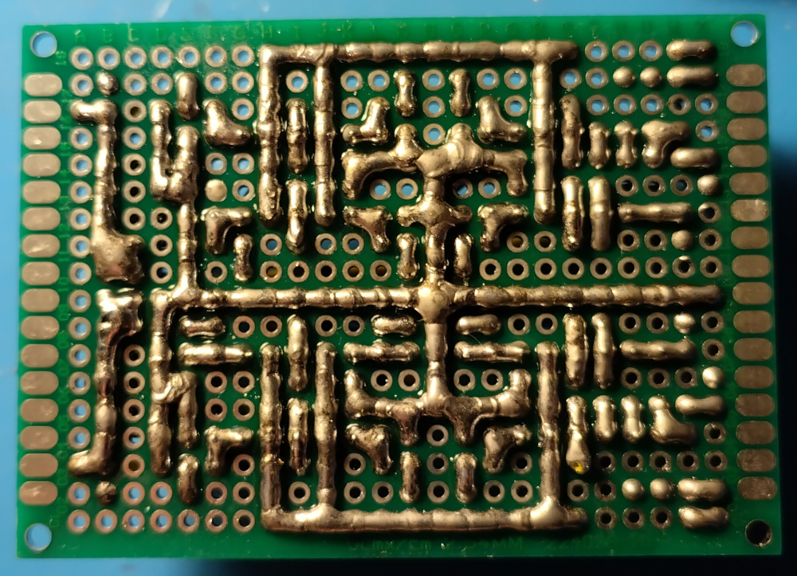

Note that 2 top op-amps is right-channel and 2 bottom op-amps is left-channel.
You can see on the schematic that for the left-channel and right-channel the A
and D op-amps (input buffer and boost stages) are swapped. It is for the
symmetry on the board.

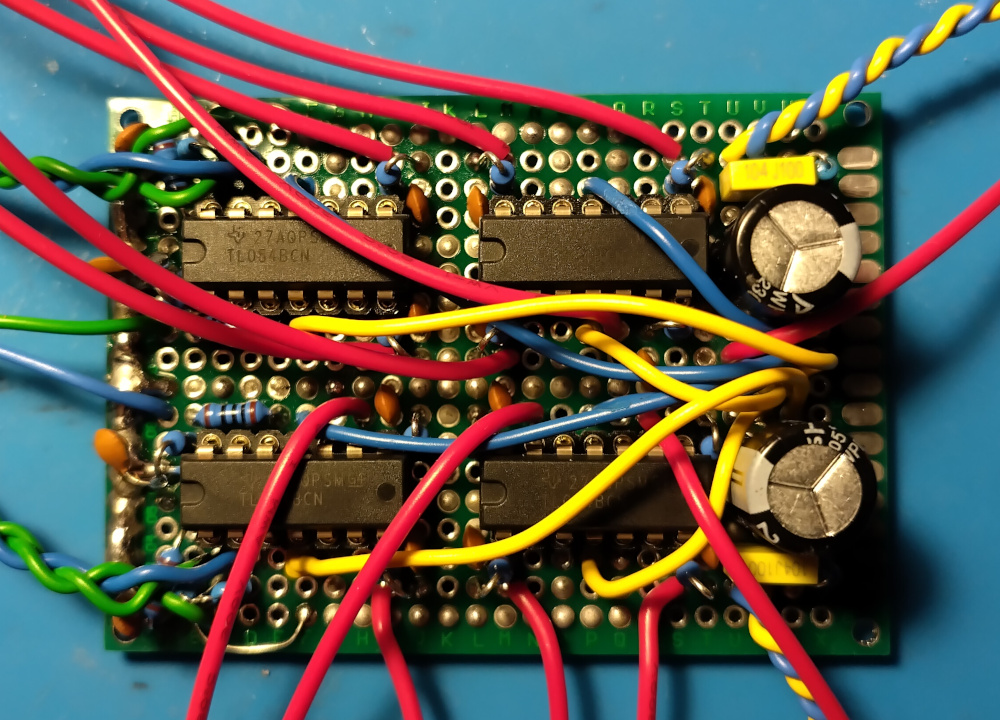

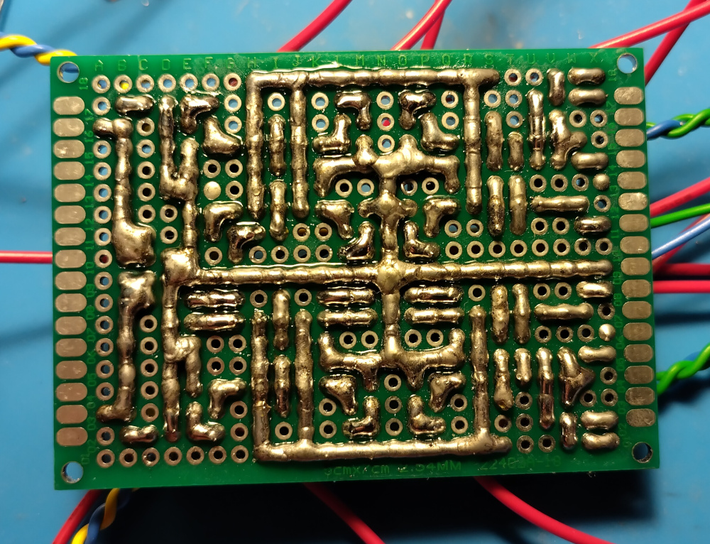

N.B. I barely remember there was some mistake with this board I had to fix.
I fixed it, but this photo might be a bit outdated and not reflect that.
So don’t just copy it 1-to-1 if you are going to build it yourself, use your
best judgement and verify every connection.
