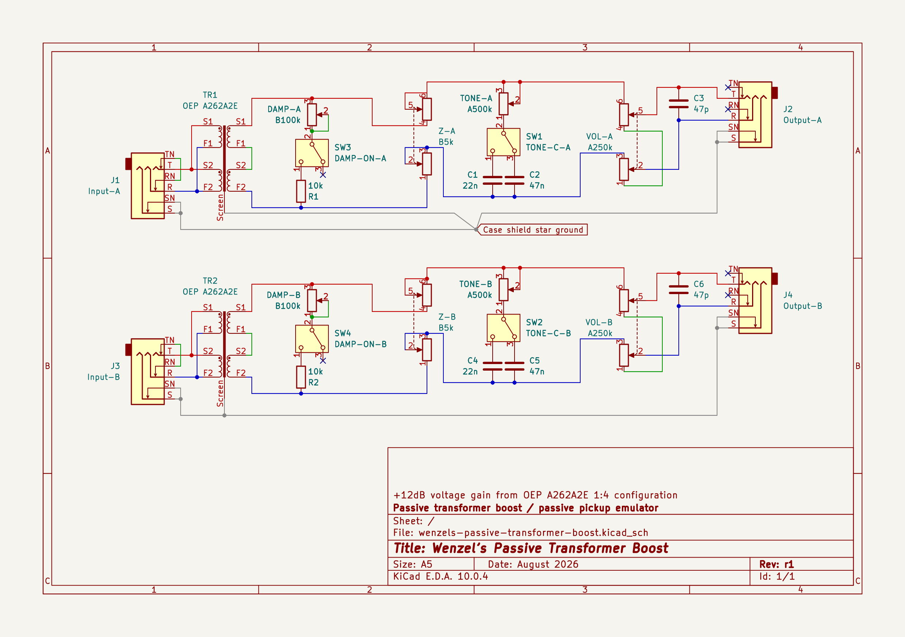

# Wenzel’s Passive Transformer Boost

Passive transformer boost / passive pickup emulator.

The OEP A262A2E transformer provides an ideal 1:4 voltage ratio, corresponding
to up to +12dB of voltage step-up. This is voltage gain only; being passive, the
transformer provides no power gain. The actual voltage increase depends on
source impedance and secondary loading.

A low-impedance buffered source is strongly recommended. Around 100Ω or less is
ideal for obtaining most of the available step-up and keeping the transformer
response predictable. Higher source impedance reduces the available voltage
step-up and interacts more strongly with the transformer and its load.

Rather than exactly reproducing a guitar pickup, the circuit creates a
pickup-like passive source after a buffered signal. The adjustable source
resistance and guitar-style Volume/Tone controls restore some of the source/load
interaction that is lost when a vintage fuzz or similar pedal is driven directly
from a buffer.

This is a completely passive device, no power needed. Though you can add a DC
input for powering LED-only, for indicating when the pedal is bypassed or on.

The schematic shows stereo (2-channel) configuration, with 2 copies of the
circuit, while only one connects the ground to the chassis (to avoid ground
loops). If you need only one channel (regular mono pedal) just ignore the second
copy of the circuit.

The circuitry is made so both inputs and outputs are balanced. If you are going
to add a proper bypass switch(es) you would need at least 4-pole (or 5-pole to
also add the LED switching) per channel. But if you don’t need it to be balanced
you can just short rings on both input and output to ground (instead of
connecting the cold wires to RINGs short transformer’s F1 and F2 primary leads
to ground, and bottom of the C3 and C6 to ground, those leads are marked blue on
the schematic). With unbalanced configuration 3-pole switch per channel is
enough, including LED switching.

## Features

- Guitar-style passive **Volume** and **Tone** controls
- **Z knob** — adds 0–10 kΩ differential series resistance, increasing the
  apparent source impedance
- **Damp knob** — adjustably loads the transformer secondary, controlling HF
  resonance and damping
- **Tone switch** — lifts the tone network for the brightest response
- **Damp switch** — lifts the additional transformer load for maximum
  transformer resonance/coloration

## Latest revision schematic

## Releases (newest revisions are on the top)

- [r1 2026-08](release-2026-08-r1)
