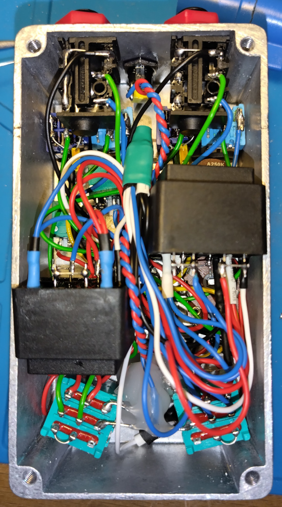
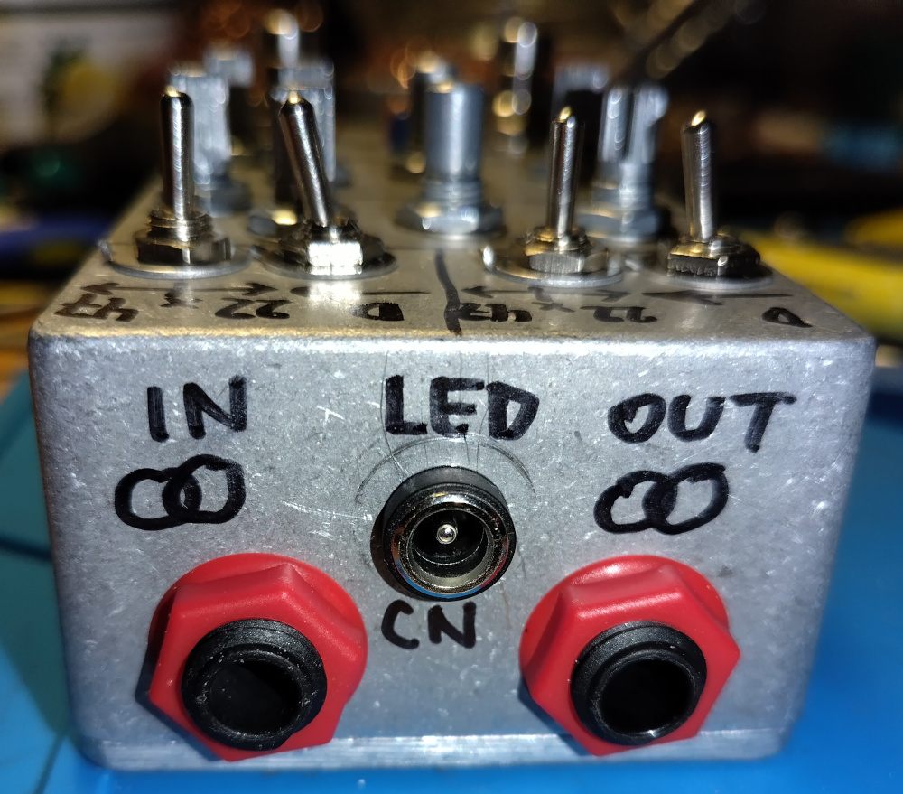
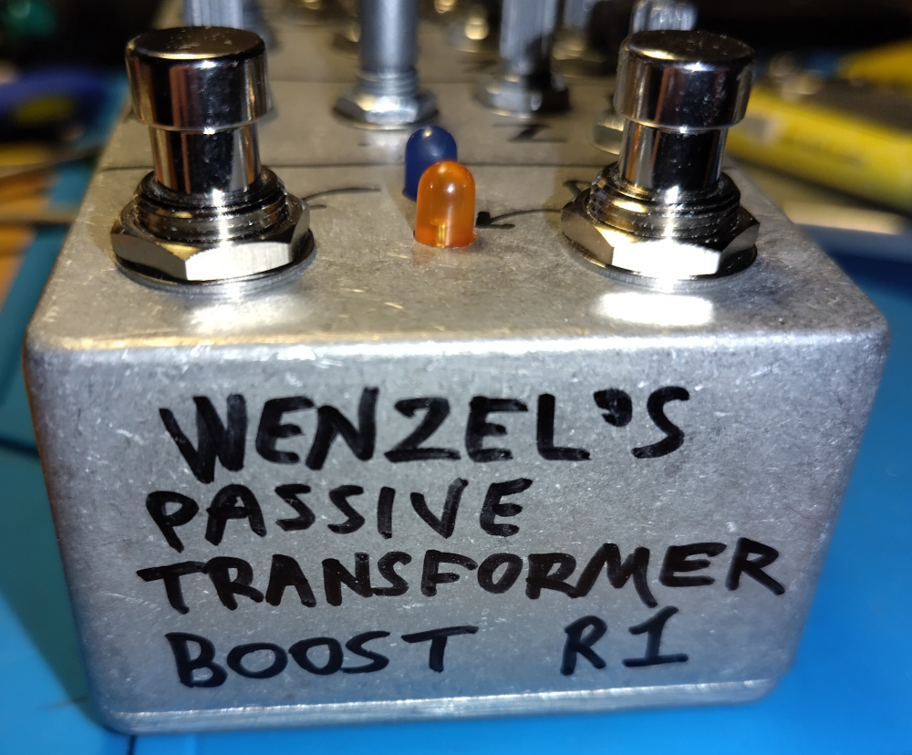
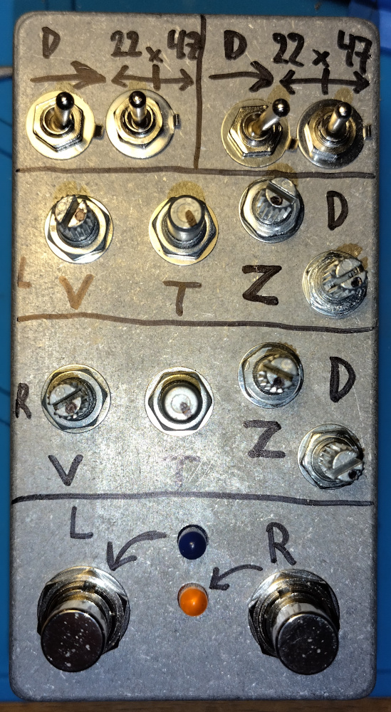
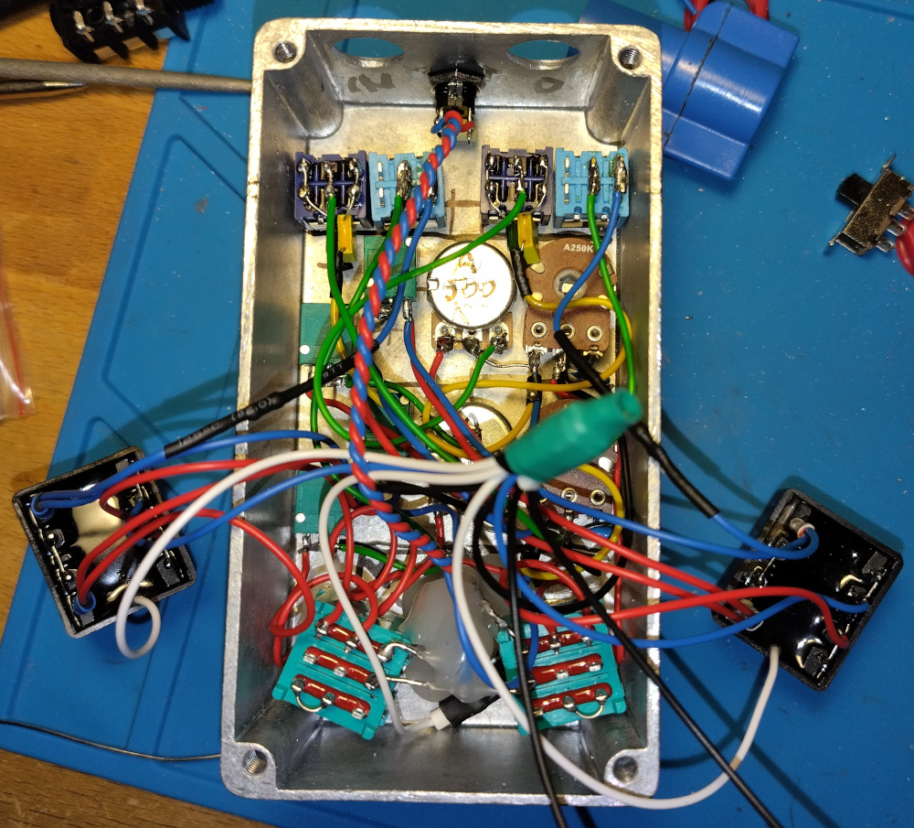
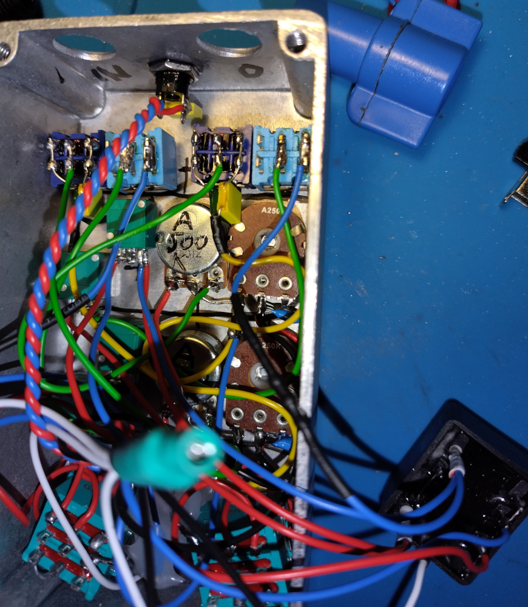

# Wenzel’s Passive Transformer Boost

Revision r1 (August 2026).

- [PDF schematic render](wenzels-passive-transformer-boost-r1.pdf)
- [PNG schematic render](wenzels-passive-transformer-boost-r1.png)

## Photos

I made a stereo pedal:

- 2x unbalanced channels (1x stereo TRS input and 1x stereo TRS output)
  (primary F1+F2 shorted to ground, and what was supposed to go to output jack
  RING also shorted to ground).

- Individual true bypass switches.

- DC input to only power bypass-switch LEDs
  (N.B. Note that if neither positive nor negative is referenced to ground you
  can have noise issues, I intended this DC to be daisy chained from some other
  pedal nearby, it’s not referenced to ground by design, so it won’t create
  extra ground paths when daisy-chained).

