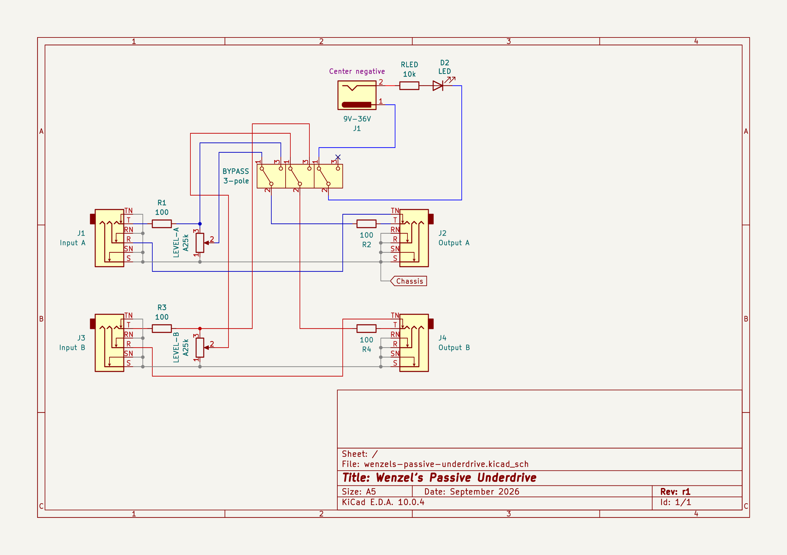
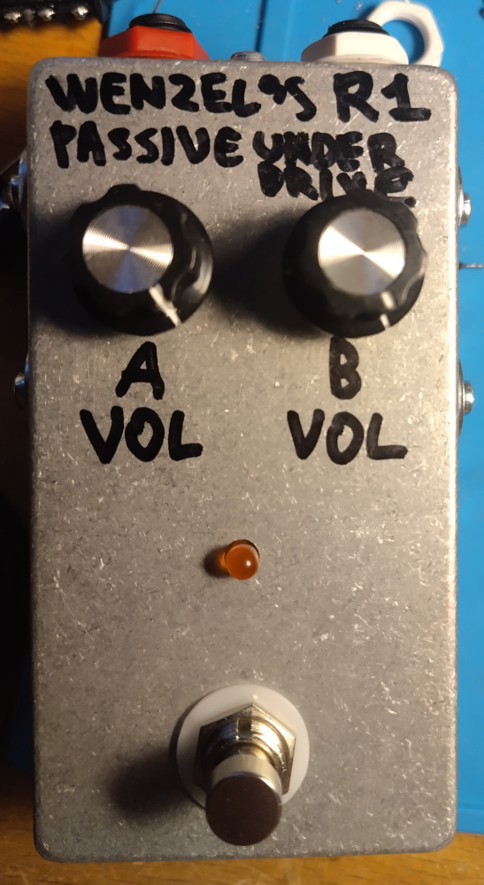
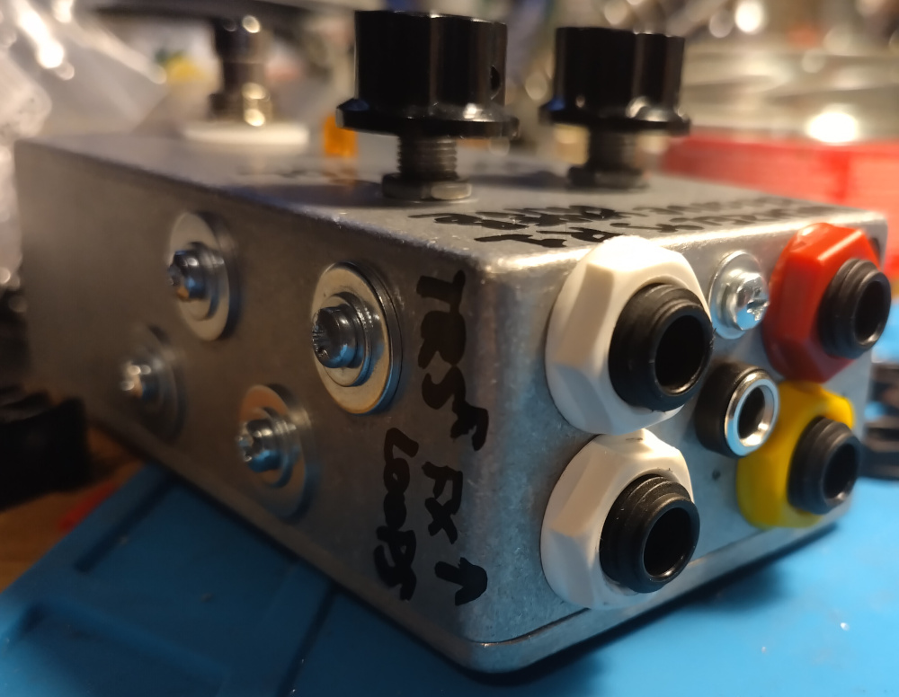
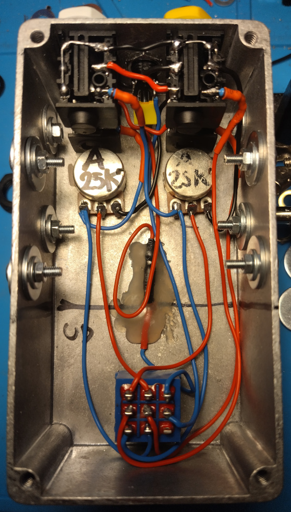

# Wenzel’s Passive Underdrive

Revision r1 (September 2026).

- [PDF schematic render](wenzels-passive-underdrive-r1.pdf)
- [PNG schematic render](wenzels-passive-underdrive-r1.png)

## Photos

I repurposed the enclosure from another project. That’s why you see bolts on the
sides that are sealing the holes.

