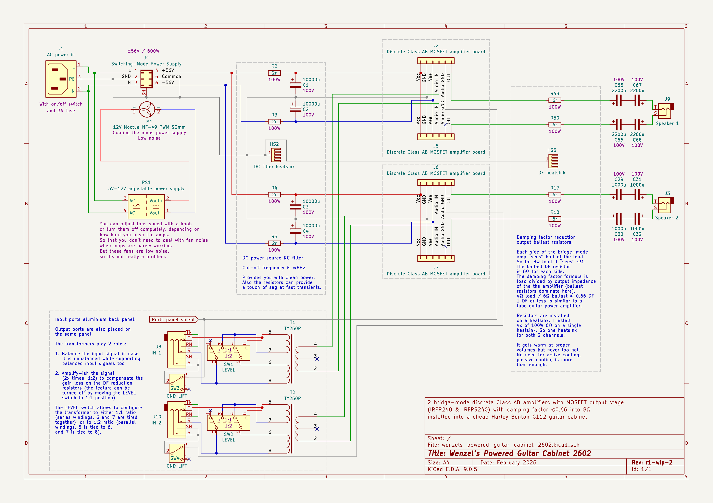
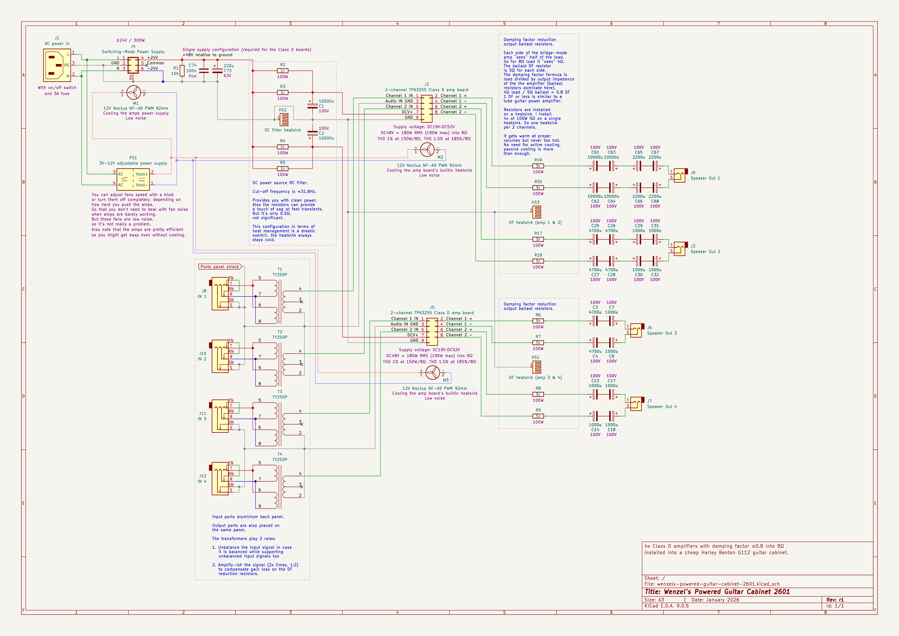

# Wenzel’s Powered Guitar Cabinets

My guitar cabinets with installed tweaked power amplifiers into them.

---

## Powered Guitar Cabinet 2602

**Work in progress! Prototyping stage.**

This build is providing 2x discrete Class AB channels with MOSFET output stage
(IRF240 & IRFP9240, 4x amplifier boards where each 2 are configured in
bridge-mode).

Compared to [2601](#2601) this build reduces damping factor even lower, down to
≈0.66 by rising the ballast resistors from 10Ω to 12Ω (relative to 8Ω speaker
load).

This build features power RC filter similar to [2601](#2601) but for dual supply
configuration and more aggressive one. The resistor is 2Ω instead of 0.5Ω, which
should also, in theory, make the amp more saggy.

As [2601](#2601) this build is also using input TY250P transformers, but instead
of unbalancing the potentially balanced signal it actually balances it, for the
anti-phase balanced pair to feed both inputs of the bridge-mode pair.
Also there was a LEVEL switch added for the input transformer allowing to switch
between 1:1 mode and 1:2.

There is also ground-lift switch added for each input port.

Also this build uses minimal amount of output capacitors instead of chaining
lots of them as in previous builds.

### Power calculation

At ±56W the amp provides 150W into 8Ω. The amp is configured in bridge mode,
where each board “sees” half of the load. Total load is 8Ω (speaker) + 12Ω (DF
reduction ballast) = 20Ω. One amp of the pair would see 10Ω total load (half),
and would deliver 120W into it, so together in bridge-mode the power delivered
to the total 20Ω load (DF reduction ballast + speaker) is 120W × 2 = 240W.
The portion of that power that is actually delivered to the speaker is 96W.

So 1 channel is 96W, plenty of headroom! Both channels 96W × 2 = 192W.

### Powering and cooling

This build uses different switching power supply board with more power (600W vs.
500W). It provides ±56VDC voltage.

The DF reduction ballast takes 144W of abuse, a lot, I might consider active
cooling for it. Even though I won’t use the amps at these levels, so it’s only
headroom for peaks. Cooling might be not strictly necessary, but considering
that it’s an increase comparing to [2510](#2510) and [2601](#2601) and it’s
already getting warm it might get actually hot. So active cooling is a good
idea.

### WIP schematic render (r1-wip-2)

---

## Powered Guitar Cabinet 2601

This is an experiment with Class-D and input transformers.
It’s a continuation of the [2510][#2510] cabinet.
So please read [2510][#2510] description as the context for this one
is heavily dependent on it.

For this project _Harley Benton G112_ cabinet was picked. It is cheap (<100€ at
the moment of writing), lightweight, built well enough for moderate abuse,
breathing wide open back (which I like for 1x12 configuration), sounds great,
doesn’t seem to have parasitic resonances (I guess MDF helps with that) comes
with a 100W stock speaker (which I don’t need), relatively easy to unbrand (I
like my cabs unbranded, for this one you need to peel off the glued on logo and
gently remove glue pieces from the spot, then it looks almost like it was never
there). Ideal candidate for DIY projects and/or as a custom speaker box.

This project features 2x identical 2-channel/stereo TPA3255 Class D amplifier
boards. Each amplifier is internally bridged, so I can’t use 2 of the channels
to bridge them together to compensate DF reduction ballast resistors loss.
But these boards are very powerful by themselves, delivering 180W into 8Ω load
and 250W into 4Ω load at 48VDC single supply voltage. So there is enough power
to work with.

Both of the 2-channel boards provide 4 individually amplified channels total.
This configuration allows for DRY-WET full stereo rig. Where each side of the
stereo is DRY and WET.

These Class D boards are efficient, compact and lightweight, so they make it
easy to have 4 individual channels while keeping heat management under control.
In fact even at loud volumes I think you can get away without active cooling.

In this project I tried to use TY-250P transformers (one for each channel) for 2
purposes:

1. To support both balanced and unbalanced signals

2. To amplify (-ish, exchange some current for voltage while rising impedance)
   the input signal to compensate the gain loss by the DF reduction ballast
   resistors (in fact this worked more than well, the amps are very loud, I even
   had to attenuate signal on my board, not boost it, while only using 2 of the
   channels)

In this build I used 10Ω DF reduction ballast for the 8Ω load, to get even lower
damping factor value (DF=0.8).

I also added a power supply RC filter. 0.5Ω + 10mF which sets cut-off frequency
for the low-pass filter at ≈31.8Hz. The resistors can also provide some level of
sag for fast-transients, but they can be compensated by huge capasitors. Just
theoretically, no actual tests were made.

The inputs are now ground-lifted via 10Ω resistors (it removes ground loop
switching noise from the power supply). There are ON-OFF-ON switches allowing to
connect the ground directly, disconnect it completely, or connect it via 10Ω
resistor. The latter is the recommended mode, it works for me in my setup.

### TODO/WIP stuff

I need 4x impedance transformers for the cabinet. Need to to order more custom
ones. For now I’m using [2510](#2510) transformers for just 2 channels.

### Changes I noticed in comparison to [2510](#2510)

One thing I noticed is that the amp feels softer/warmer/woolier, transients seem
to be a touch less sharp. I’m not sure where it comes from exactly. Could be
Class D vs Class AB, could be lowered damping factor value, could be a bit of
sag from the RC power filter, could be a bit of input transformer compression.

A bit less immediacy/connection to the player. Probably Class D thing, as for
guitar signal that amp class have this kind of “feel” thing.

The amp feels beefier, even with all the sublows cutting I do with EQ it feels
powerful and you can feel the ground shaking. Maybe lower damping factor allows
the resonant frequency (typically under 100Hz for a guitar speaker) to modulate
the signal even more.

### Power calculation

Into 8Ω the amp channel produces 180W at 48V supply voltage. Together with DF
reduction resistors (10Ω) it’s 18Ω, recalculating the power gives 80W of total
power. 35.6W delivered into the speaker (note that it is perceived loud because
of very low damping factor, it’s not typical 35 solid-state watts).

Also it’s just for one channel. If you amplify 4 speakers/cabs with all 4
channels in parallel you get 35.6W × 4 = 142.4W.

### Powering and cooling

For powering I use the same kind of switching supply board as for [2510](#2510)
but the voltage is ±24V. It’s just one I already had. These amplifier boards
need single supply, not dual supply. But you can just reference -24V to ground
and get single supply +48V at V+ so that is what I did.

As with [2510](#2510) I cool the power supply radiator with a fan. But since
overheating was a problem for [2510](#2510) only after an hour or more non-stop
playing at loud volumes you technically can get away without cooling the power
supply with these amps as Class D is significantly more efficient (for the same
volume less energy is required from the power supply).

I tested the amps a bit without cooling them at loud volumes, they get warm, not
sure if overheating can be a problem for them or maybe their builtin board
radiator is enough. But maybe you can be okay with passive cooling, definitely
okay with moderate volumes.

The new fans are very silent compared to ones installed into [2510](#2510).
So noise from the fans is not a concern for me.

So in total there are 3x of 12V Noctua NF-A9 PWM 92mm fans. One for the power
supply, and 2 for each of the amp boards to cool the amp board’s builtin
radiator.

### Pre-made boards

You can find pre-made boards by these search queries for example on Ebay:

1. Power supply board:
   _“500W HIFI Audio LLC Soft Switching PSU Board ± 24V For Power Amplifier PSU board”_

2. Power supply block for the cooling fans:
   _“Adjustable Power Supply Adapter AC To DC 3V 9V 12V 24V Universal Adapter EU/US Plug with Display Screen Voltage Regulated”_

3. Class D 2-channel amplifier board:
   _“2CH TPA3255 HiFi Amplifier Board 2x300W Stereo Class D Power Amplifier Module”_

### Latest revision schematic

### Releases (newest revisions are on the top)

- [2601 cabinet r1 2026-01](release-2601-cabinet-2026-01-r1)

---

## Powered Guitar Cabinet 2510

A pair of stereo Class AB boards configured as bridge-mode installed into a
_Blackstar HT-112 OC MK III Box_ cabinet.

The idea is to take conventional Class AB solid-state amplifiers designed for
general audio use, like home stereo, and tweak it post-factum without circuit
modifications (to avoid messing with amp stability and other stuff I’m not too
confident with) to make it perform/have characteristics more similar to a guitar
tube amplifier. Particularly to have very low damping factor value (so that the
speaker is very loose, and it “sings” with resonances even after amplifier stops
playing), creating more “open” and “tree-dimensional” sound, and as a
side-effect it actually sounds louder, as the speaker is less controlled by the
amp. In addition to that there is a use of output transformers for “feel” and
coloration (OT transformer is one of the crucial parts of a guitar tube power
amplifier).

Target damping factor is 1 or less. For example according to Ravi Rajani’s
measurements: https://youtu.be/TPz-oY0NBTY?t=266

1. Fender Deluxe Reverb Reissue DF=0.3/8Ω (Zout = 24)
2. Fender Vibroverb Reissue DF=1/8Ω (Zout = 8)

I expect the load presented to the amp output to always be 8Ω. Apart from “feel”
and coloration the custom [tector.it](https://tector.it/en_GB) impedance
transformers help with that allowing to transform 16Ω load into 8Ω. Or just 1:1
8Ω to 8Ω.

In order to achieve that target damping factor value I artificially increase
output impedance of the amplifier by adding ballast 100W power resistors.
Note though that those resistor become part of the load, so for DF=1 8Ω
resistance will dissipate half of the energy as heat, and only the other half is
delivered to the speaker. So mind that this system is very inefficient. The
resistors must be installed onto a heatsink. But the amount heat was never a
problem for me in my setup, the heatsink gets warm when blasting loud for some
time, but never too hot. So no active cooling required.

One problem with that technique is that you loose a lot of output power
delivered to the speaker and also lots of volume relative to the input signal
(amp gain). Since half of it is just dissipated as heat from the ballast
resistors. In order to get enough power out of this system I came up with the
bridge-mode configuration. So I take a pre-made stereo board, with 2 amplifier
channels, take balanced signal, sending positive to one amp, and negative to the
other (NOTE THAT IN THIS CONFIGURATION YOUR INPUT SIGNAL MUST BE TRULY
BALANCED!) and connecting one to half of the DF ballast, then to one side of the
speaker, and the other half of the DF ballast and the other speaker terminal is
connected to the other amplifier. So both amplifier channels work as one single
amplifier, but with doubled power. When one pushes the other pulls and
vise-versa. Each “sees” only half of the load (4Ω of the ballast and 4Ω of the
speaker, DF relation stays the same). And if you just take an inverting
unity-gain op-amp buffer (which I have on my pedalboard) and buffer the same
signal twice, you’ll get anti-phase balanced pair with same volume, and in this
bridge-mode amplifier you will restore (double) the final output volume/amp
gain, compensating the ballast resistors drop. So you would have the same gain
as it would be just one amplifier and no ballast resistors.
See the device I use for balancing the signals coming from by pedalboard:
[Wenzel’s Transparent Balancing Opamp Boost](../wenzels-transparent-balancing-opamp-boost).

I also use series output capacitors, which are totally optional, since the amps
are biased around 0V, it’s just AC. And because it’s just AC you need to make
your polarized electrolytic caps unpolarized by connecting a pair back-to-back,
either positive-to-positive, or negative-to-negative (does not matter which).
Mind the capacitance drop when connecting caps in series. Use cut-off frequency
calculator to make sure you preserve enough bass. These capacitors play 2
roles, one is coloration, adding a bit of non-linearity, a bit of
phase-shifting, making the solid state amp feel a bit less immediate, a bit
saggy. And also rolling off some ultra low frequencies. You can shape your low
end with those, and it’s actually important when using an OT transformer that
has only 50Hz corner frequency, as anything below would just saturate it. But in
my case I cut a lot with an equalizer outside of this powered cabinet anyway.

So in short:

1. Balanced input signal positive and negative portions are split between 2
   identical power amplifiers

2. Power amplifiers outputs go into ballast artificial DF reduction resistors
   (increasing output impedance)

3. Then into a bunch of series capacitors

4. Then each lead is connected to the transformer primary
   (basically to tip and sleeve of an output jack)

5. Then each lead of transformer secondary is connected to opposite speaker lead

Notes:

- Remember that you need to balance your input signal one way or another before
  plugging it in into the amplifier

- And also mind that this is just a power amplifier, not a complete guitar
  amplifier, you are expected to use a guitar preamplifier and tone shape it
  before the power amp

- In my case I use _Behringer FBQ3102HD Ultragraph Pro_ 31-band graphic EQ in
  order to clean up the low mids and _MXR 10 Band Equalizer Silver_ to
  aggresively tone-shape the preamp signal to achieve the desired sound

So the power amplifier setup is only part of the story.

My setup is featuring stereo amplification. So because each channel is
bridge-mode I have 4 amplifiers in total, where each 2 work as single
bridge-mode pair. Also I intentionally added differences between them:

1. They are different amplifier designs in general, both Class AB but one is
   IC-based board using a pair of TDA7294 chips with MOSFET output stage, and
   the other is discrete design using BJT NPN/PNP output pairs.

2. Capacitors have different values, and different total capacitance, the second
   channel has more aggressive low end roll-off.

There is a lot more difference in the chain. I take 2 different signals starting
from my guitar, one channel is bridge pickup and the other is neck, one channel
is delayed, slightly different pedals setup, preamps, eq, etc. All those small
differences accumulate into non-linearities of the stereo difference that
creates wider soundscape and helps to avoid static comb-filters.

I also added a couple of optional cab merging ports to the cabinet
that allow to merge loads in parallel or in series.

### Power calculation

Let’s take the TDA7294 amplifier as a reference. Both have similar power
characteristics with the given ±40V supply voltage. TDA7294 is advertised as
100W amplifier but 100W is just for peaks. Continuous RMS power is around 70W
into 8Ω (specified for ±35V @ 0.5% distortion, it’s current limited, so ±40
would probably not make huge difference here). Total load together with the DF
ballast is 16Ω (8Ω DF ballast + 8Ω speaker). But in bridge-mode each amp “sees”
only half, which is 8Ω, so each amp produces 70W in bridge mode, 140W total. But
DF ballast consumes half of the power, 70W of those 140W. Thus you end up with
your original 70W delivered to the speaker. But it’s actually perceived louder
because of very low damping factor.

So in my configuration it’s approximately 70W + 70W stereo pair.
I didn’t try my rig with the loudest drummer ever but it feels plenty enough.

### Powering and cooling

DF ballast resistors are easy, they only need passive cooling in my experience.
Just put 4x of 100W 4Ω resistors on a heatsink that is not to small.

For powering the amplifiers I use switching-mode 500W power supply. Class AB is
70% efficient at best, 50-60% is more realistic, also half of the output power
is dissipated on the DF ballast resistors. So you need enough juice from the
power supply which this power supply board can handle while staying lightweight
compared to a huge heavy transformer of comparable power handling.
You can find such board on Ebay for example by query like this one:
_“500W HIFI Audio LLC Soft Switching PSU Board ± 40V For Power Amplifier PSU board”_
The board is pretty efficient, but once with 2 amplifiers playing loud for an
hour or so it switched off in protection mode due to overheat. So I added active
cooling, just a fan blowing onto the heatsink.

The amplifiers produce significant amount of heat, passive heatsink would bee
too huge to keep them from overheating at proper volumes, so active cooling is
required. In my configuration I was just looking how to attach them to the wall
of the cabinet. So I joined 2 heatsinks of both amps together, and tighten them
towards each other with bolts and nuts. It’s very inefficient with heat
dissipation, but a couple of cooling fans are handling this well enough. One
blows on the side into the holes of that joint and the other blows from the top.
Works fine for me. Except the fans can be too loud at max power when you stop
playing. But those are cheap Chinese loud fans. Installing some low-noise fans
could significantly reduce parasitic noise.

The fans are rated 12V. They are powered by some cheap regulated adjustable
power supply that allows to go from 3V to 12V. So you if you are not playing to
loud you can drop the voltage so the fans producing less noise. I personally
rarely use them at full power, just finding a compromise of enough cooling and
not too much noise.

### Pre-made boards

You can find pre-made boards by these search queries for example on Ebay:

1. Power supply board:
   _“500W HIFI Audio LLC Soft Switching PSU Board ± 40V For Power Amplifier PSU board”_

2. Power supply block for the cooling fans:
   _“Adjustable Power Supply Adapter AC To DC 3V 9V 12V 24V Universal Adapter EU/US Plug with Display Screen Voltage Regulated”_

4. TDA7294 amplifier boards:
   _“Dual Channel TDA7294 Audio HIFI Power Amplifier Board DIY Parts Kit PCB 200W New”_

3. Discrete BJT amplifier boards:
   _“2pcs MX50 SE KTB817 KTD1047 15-100W Dual Class AB Amplifier Board Assembled AMP”_

### Latest revision schematic

### Releases (newest revisions are on the top)

- [2510 cabinet r1 2026-01](release-2510-cabinet-2026-01-r1)
