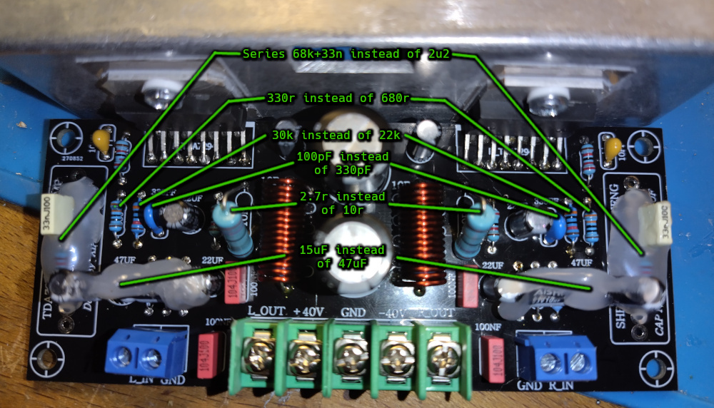
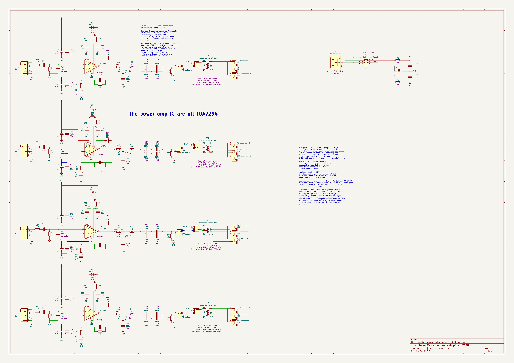
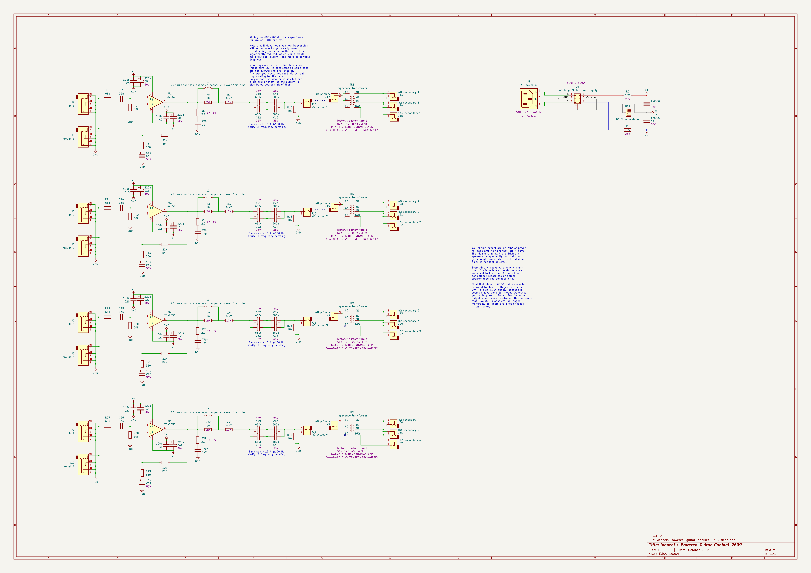
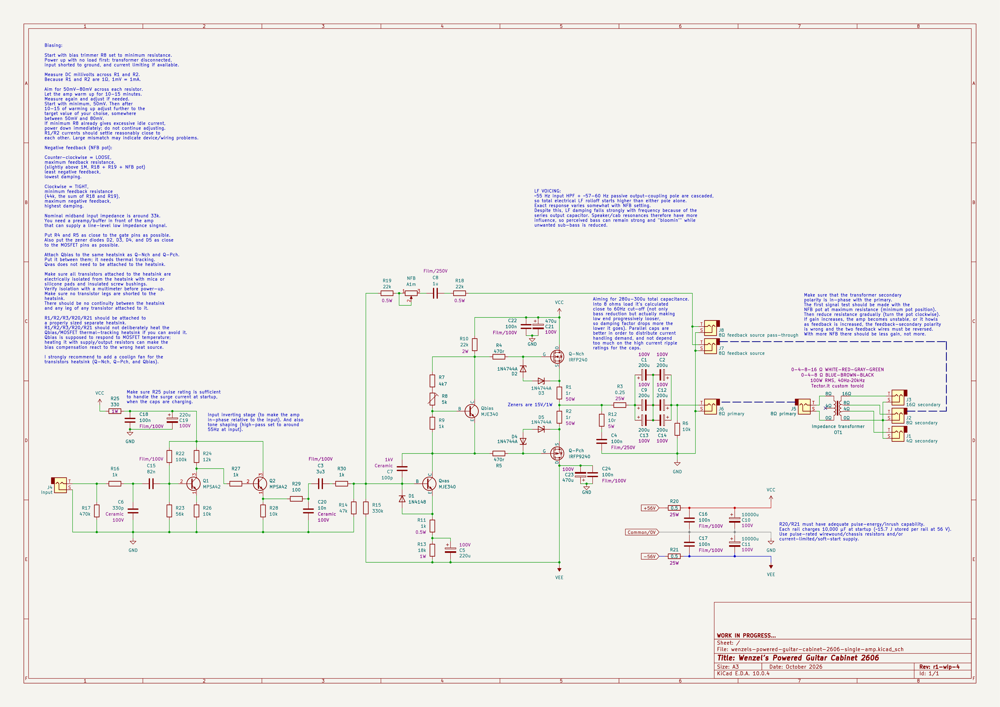
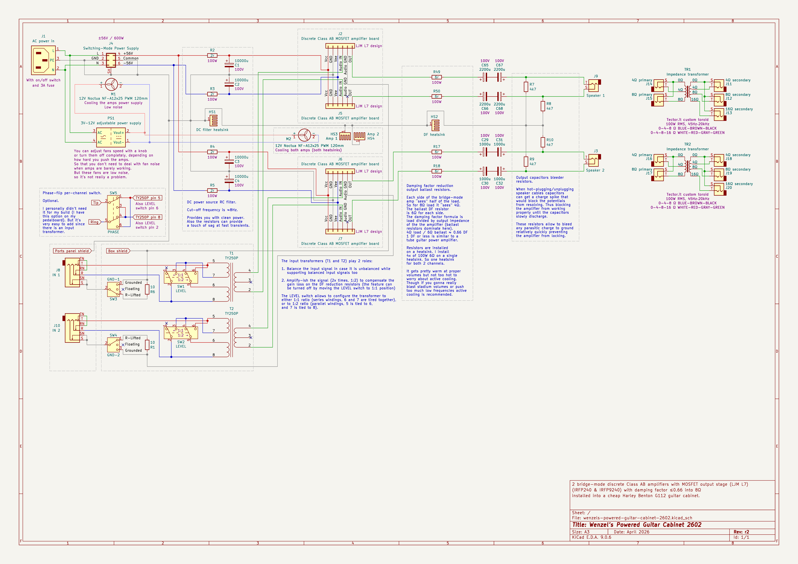
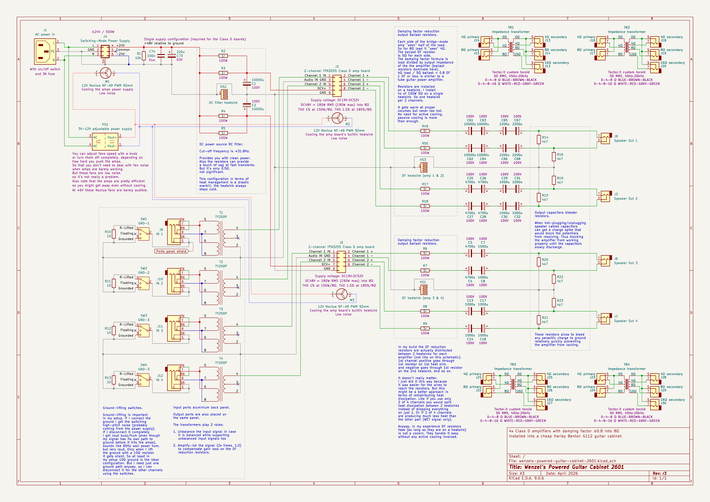

# Wenzel’s Powered Guitar Cabinets

My guitar cabinets with installed tweaked power amplifiers into them.

All amplifiers feature output impedance transformers in order to both keep the
load impedance the same as the amplifier “sees” it, so that the damping factor
values stays predictable, and also for the voicing and “feel” of a typical
transformer-coupled tube amplifier.

- [Guitar Power Amplifier 2610](#2610)

  An evolutionary continuation of [2609](#2609) build that uses much more
  powerful TDA7294 with MOSFET (DMOS) output stage chips instead of weaker
  TDA2050. More power, more headroom, but similar character and behavior.

- [Guitar Power Amplifier 2609](#2609)

  An experiment of a compact set of 4x low output power TDA2050-based Class AB
  amplifiers in one unit with an intention to drive 4 speakers independently.

- [Guitar Power Amplifier 2606](#2606)

  My own ground-up design of Class AB MOSFET discrete 100W-class power amplifier
  tuned specifically for guitar amplification.

- [Powered Guitar Cabinet 2602](#2602)

  2x Class AB MOSFET HiFi boards with tweaks.

- [Powered Guitar Cabinet 2601](#2601)

  4x Class D HiFi boards with tweaks.

- [Powered Guitar Cabinet 2510](#2510)

  2x Class AB HiFi boards with tweaks.

---

## Guitar Power Amplifier 2610

A set of 4x TDA7294-based power amplifiers with dual-supply configuration.
A continuation of [2609](#2609) preserving the character and behavior of it
but providing more power and headroom.

After building and testing it at proper volumes it seems to perform better than
[2609](#2609) in every way. It has more power, more headroom, it’s less noise,
more stable, less feedback-y at high gain. I just used a couple of HiFi boards
built around these chips and made the modifications derived from [2609](#2609)
design (input stage filtering, negative feedback adjustments, etc). I also
figured that I prefer more feeding one cab (e.g. 2x12 or 4x12) with one
amplifier channel instead of driving speakers independently. And with just
minimum ±24V single amp channel seem to have enough headroom to do it at proper
volumes and not clip at low-end chugs. With ±27V supply it will only get even
more powerful. Even heat management seems to be better compared to
[2609](#2609).

You can easily find the HiFi DIY kits by _“TDA7294 HiFi DIY kit”_ search query
either on Ebay or AliExpress for example. They are cheap, supplied with proper
quality parts, and widely available. Easy to modify to match this guitar
power amplifier schematic. You would have to omit some original components and
add custom ones. You would only need to add an extension board for the DC
filtering capacitors and output stage (output power resistors and output
capacitors), the rest will be covered by that HiFi DIY kit board. See the
[photos of the HiFi DIY kit board](release-2610-power-amplifier-2026-10-r1/photos/hifi-board)
that you can easily recognize when shopping for it. See what you have to change
on the original HiFi DIY kit board:

### Latest revision schematic

### Releases (newest revisions are on the top)

- [2610 power amplifier r1 2026-10](release-2610-power-amplifier-2026-10-r1)

---

## Guitar Power Amplifier 2609

A simple TDA2050-based set of 4 amplifiers with dual-supply configuration.
Each amplifier is not very powerful but the idea is that each amplifier would
drive its own speaker with good sensitivity rating. So total of 4 amplifiers
driving 4 speakers presented to the amp as 4Ω load with a help of impedance
matching transformer. That way there should be enough power, in theory.

The amp is tuned around output transformer 45–50Hz lower frequency. There is
multiple sub-lows cuts around that frequency. At amps input, in the negative
feedback (sub-lows have reduced gain) and in the output capacitors relative to
4Ω load. The output capacitors cut-off will also mean the damping factor is
reduced significantly for the sub-lows, which means there can be more
perceivable lows coming from the speaker and cab resonances, bass “bloom”,
and general lows looseness. The amps damping factor is also reduced both by the
output resistor relative to 4Ω load and also by reduced negative feedback of the
amplifier (the amp has lots of gain, to compensate extreme sensitivity the input
signal is also attenuated at amp’s input network).

All 4 amps are using shared RC filtered power rails. When all 4 pushing hard
there can be some sag/compression.

After building and properly testing the amplifier I can say it can work for the
job well at ±20V, as long as the speakers have good enough efficiency. With just
one amp driving a pair of speakers there can be headroom issues on low end
chugs, the amp can clip. But driving 2 speakers in parallel (implying 4 speakers
total stereo setup) it can work. Technically the amp can be powered with ±24V
for more headroom but it leaves very little margin for voltage spikes/power
supply imperfections for the TDA2050 chips which are rated only for ±25V
absolute maximum. However, if I want reliable stage volumes it might be just
working on the edge of its limits, not the most safe-to-go-with solution.

Compared to my previous builds it dissipates drastically less heat as it wastes
much less energy on huge output damping factor reduction resistors.

### Latest revision schematic

### Releases (newest revisions are on the top)

- [2609 power amplifier r1 2026-10](release-2609-power-amplifier-2026-10-r1)

---

## Guitar Power Amplifier 2606

**WORK IN PROGRESS…**

I’m in the process of designing my own discrete Class AB guitar power amplifier
from scratch. The goal is to have a progressively lower damping factor toward
lower frequencies, producing a bigger and looser low end with some bass
“bloom”, while remaining more controlled through the mids and highs. Even at
higher frequencies the damping factor is intentionally kept fairly low
(roughly below 10), much lower than in a typical HiFi power amplifier.

The design also uses a slightly saggy power supply with 0.5Ω resistance in
each rail, an output transformer, and intentionally simple circuitry. The aim
is not perfect linearity, but a stable and robust amplifier intended for
heavily distorted guitars. With ±56V rails and an 8Ω load, the design is
intended to operate in roughly the 100W class, depending on losses, transformer
behavior, supply sag, and clipping level.

The core output stage uses a complementary MOSFET push-pull pair, an MJE340
voltage amplification stage (VAS), and another MJE340 used as an adjustable
VBE multiplier / bias spreader for the MOSFETs. A few additional measures are
used for stability and robustness, but the circuit intentionally avoids
becoming a conventional HiFi amplifier. Things such as a differential input
stage, current mirror, and bypass capacitor across the VBE multiplier are
deliberately omitted.

The amplifier has intentionally modest open-loop / forward gain. It is still
easy to drive to full power from a normal line-level source.

Compared with my previous builds, this version adds global negative feedback
taken from the secondary side of the output transformer, similar in principle
to many transformer-coupled tube amplifiers. A potentiometer controls the
amount of global feedback, with the feedback-path resistance ranging from
approximately 44kΩ at maximum feedback to approximately 1MΩ + 44kΩ at minimum
feedback.

The amplifier also has two MPSA42 stages in front of the main amplifier. These
are not strictly required for the power amplifier itself, but they provide a
low-impedance drive source, add one inversion so that the complete amplifier is
nominally non-inverting relative to the input, and allow a predictable input
high-pass filter around 55Hz.

That ~55Hz filter is only one part of the low-frequency shaping. The series
output-coupling capacitors introduce another LF pole around 57–60Hz, so the
complete electrical response rolls off more steeply than either pole alone.
At the same time, the output capacitor causes the effective source impedance
to rise as frequency falls, reducing speaker damping in the bass. Speaker and
cabinet resonances can therefore become more pronounced, so the perceived low
end can remain large and resonant even while unwanted sub-bass is attenuated.

See the notes on the schematic for biasing, feedback polarity, thermal
management, grounding, and other construction details.

### WIP schematic

---

## Powered Guitar Cabinet 2602

This build is providing 2x discrete Class AB channels with MOSFET output stage
(IRF240 & IRFP9240, 4x amplifier boards where each 2 are configured in
bridge-mode).

The build is utilizing pre-built
[LJM L7](https://www.diyaudio.com/community/threads/l7-mosfet-diy-amp-kit-by-ljm.345114/)
boards (4 identical boards total, installed onto 2 heatsinks, each bridge-pair
on their own heatsink).

Compared to [2601](#2601) this build reduces damping factor even lower, down to
≈0.66 by rising the ballast resistors from 10Ω to 12Ω (relative to 8Ω speaker
load).

This build features power RC filter similar to [2601](#2601) but for dual supply
configuration and more aggressive one. The resistor is 2Ω instead of 0.5Ω, which
should also, in theory, can make the amp more saggy. Though capacitors are huge
10mF. You can get away with 2200uF (for C1, C2, C3, and C4), which would still
provide you with plenty of filtering (36.2 Hz cut-off frequency).

As [2601](#2601) this build is also using input TY250P transformers, but instead
of unbalancing the potentially balanced signal it actually balances it, for the
anti-phase balanced pair to feed both inputs of the bridge-mode pair.
Also there is a LEVEL switch added for the input transformer allowing to switch
between 1:1 mode and 1:2 (the latter helps to compensate gain loss caused by DF
reduction resistors).

The build inherits [2601](#2601) input ground-lifting switch. It is important
for ground loops management. 10Ω-lifting is a recommended mode to start with.

Also this build uses minimal amount of output capacitors instead of chaining
lots of them as in previous builds.

The cabinet has 2x 100W RMS custom [Tector.it](https://tector.it/en_GB)
impedance transformers. They are used both for feel and sound coloration and to
always keep the amp to see the 8Ω load while the speaker cabinet can be 4Ω, 8Ω,
or 16Ω load.

### Changes I noticed in comparison to [2601](#2601)

First thing I noticed is that the highs are more precise, kind of “faster” and
“stiffer” which is my typical experience when switching from Class-D to
Class-AB. Class-D in my experience is always kind of a bit mushy compared to
Class-AB, more loose and slow, less accurate. At least when it comes to guitar
amplification it’s getting really noticeable. I googled damping factor curve of
a random Class-D amplifier and it seems to start to drop significantly after
1kHz, by 10kHz it drops as low as 8 (from ~80). In conjunction with my damping
factor reduction resistors I guess it potentially explains the mushiness of the
highs in the Class-D build.

The highs seem to be more “hairy” (which correlates with even more reduced
damping factor). And there is a tiny bit more “sweetness” (I associate it with
MOSFET output stage).

I also noticed a bit less big bass/lows. Could be many things in the chain, but
one theory is that I use less series output capacitors which means more
capacitance (more series capacitors = less capacitance), which should result
into less of the damping factor roll-off for the lows, so the lows are more
controlled in theory = less looser bass.

But note that this is all just subjective observations and rationalization about
the reasons for these differences.

### Power calculation

At ±56W one amp provides 150W into 8Ω. The amp is configured in bridge mode
(150W × 2 boards = 300W), where each board “sees” half of the load. Total load
is 8Ω (speaker) + 12Ω (DF reduction ballast) = 20Ω. One amp of the pair would
see 10Ω total load (half), and would deliver 120W into it, so together in
bridge-mode the power delivered to the total 20Ω load (DF reduction ballast +
speaker) is 120W × 2 = 240W. The portion of that power that is actually
delivered to the speaker is 96W.

So 1 channel is 96W, plenty of headroom! Both channels 96W × 2 = 192W.

### Powering and cooling

This build uses different switching power supply board with more power (600W vs.
500W). It provides ±56VDC voltage. Actually this particular board allows to
adjust the voltage, less or more than ±56VDC. I set it to around ±57-±58, to be
prepared for the voltage drop by the RC DC filter resistors, but I see no drop
really, at least not while amp is not pushing hard, maybe under load it sags.

The DF reduction ballast takes 144W of abuse, a lot, I might consider active
cooling for it. Even though I won’t use the amps at these levels, so it’s only
headroom for peaks. Cooling might be not strictly necessary, but considering
that it’s an increase comparing to [2510](#2510) and [2601](#2601) and it’s
already getting warm it might get actually hot. So active cooling is a good
idea. So far I’ve been playing and the heat is manageable without a cooler
pointing at the heatsinks (though there is a cooler close to them cooling the
power supply, so at least some of the wind reaches them).

The amp heatsinks are pointing up and there is a Noctua 120mm 12V fan blowing on
top of them. While pushing the amps they get hot, but with the cooler working at
max 12V voltage you can still hold your hand on top of the heatsinks. But note
that I cut the lows quite significantly, with more low frequency content it
will probably get hotter. So I might put an extra cooler on the side, blowing
the wind out of the cabinet enclosure, to make sure it is always under control.

### Latest revision schematic

### Releases (newest revisions are on the top)

- [2602 cabinet r2 2026-04](release-2602-cabinet-2026-04-r2)
- [2602 cabinet r1 2026-03](release-2602-cabinet-2026-03-r1)

---

## Powered Guitar Cabinet 2601

This is an experiment with Class-D and input transformers.
It’s a continuation of the [2510][#2510] cabinet.
So please read [2510][#2510] description as the context for this one
is heavily dependent on it.

For this project _Harley Benton G112_ cabinet was picked. It is cheap (<100€ at
the moment of writing), lightweight, built well enough for moderate abuse,
breathing wide open back (which I like for 1x12 configuration), sounds great,
doesn’t seem to have parasitic resonances (I guess MDF helps with that) comes
with a 100W stock speaker (which I don’t need), relatively easy to unbrand (I
like my cabs unbranded, for this one you need to peel off the glued on logo and
gently remove glue pieces from the spot, then it looks almost like it was never
there). Ideal candidate for DIY projects and/or as a custom speaker box.

This project features 2x identical 2-channel/stereo TPA3255 Class D amplifier
boards. Each amplifier is internally bridged, so I can’t use 2 of the channels
to bridge them together to compensate DF reduction ballast resistors loss.
But these boards are very powerful by themselves, delivering 180W into 8Ω load
and 250W into 4Ω load at 48VDC single supply voltage. So there is enough power
to work with.

Both of the 2-channel boards provide 4 individually amplified channels total.
This configuration allows for DRY-WET full stereo rig. Where each side of the
stereo is DRY and WET.

These Class D boards are efficient, compact and lightweight, so they make it
easy to have 4 individual channels while keeping heat management under control.
In fact even at loud volumes I think you can get away without active cooling.

In this project I tried to use TY-250P transformers (one for each channel) for 2
purposes:

1. To support both balanced and unbalanced signals

2. To amplify (-ish, exchange some current for voltage while rising impedance)
   the input signal to compensate the gain loss by the DF reduction ballast
   resistors (in fact this worked more than well, the amps are very loud, I even
   had to attenuate signal on my board, not boost it, while only using 2 of the
   channels)

In this build I used 10Ω DF reduction ballast for the 8Ω load, to get even lower
damping factor value (DF=0.8).

I also added a power supply RC filter. 0.5Ω + 10mF which sets cut-off frequency
for the low-pass filter at ≈31.8Hz. The resistors can also provide some level of
sag for fast-transients, but they can be compensated by huge capasitors. Just
theoretically, no actual tests were made.

The inputs are now ground-lifted via 10Ω resistors (it removes ground loop
switching noise from the power supply). There are ON-OFF-ON switches allowing to
connect the ground directly, disconnect it completely, or connect it via 10Ω
resistor. The latter is the recommended mode, it works for me in my setup.

The cabinet has 4x 50W RMS custom [Tector.it](https://tector.it/en_GB)
impedance transformers. They are used both for feel and sound coloration and to
always keep the amp to see the 8Ω load while the speaker cabinet can be 4Ω, 8Ω,
or 16Ω load.

### Changes I noticed in comparison to [2510](#2510)

One thing I noticed is that the amp feels softer/warmer/woolier, transients seem
to be a touch less sharp. I’m not sure where it comes from exactly. Could be
Class D vs Class AB, could be lowered damping factor value, could be a bit of
sag from the RC power filter, could be a bit of input transformer compression.

A bit less immediacy/connection to the player. Probably Class D thing, as for
guitar signal that amp class have this kind of “feel” thing.

The amp feels beefier, even with all the sublows cutting I do with EQ it feels
powerful and you can feel the ground shaking. Maybe lower damping factor allows
the resonant frequency (typically under 100Hz for a guitar speaker) to modulate
the signal even more.

### Power calculation

Into 8Ω the amp channel produces 180W at 48V supply voltage. Together with DF
reduction resistors (10Ω) it’s 18Ω, recalculating the power gives 80W of total
power. 35.6W delivered into the speaker (note that it is perceived loud because
of very low damping factor, it’s not typical 35 solid-state watts).

Also it’s just for one channel. If you amplify 4 speakers/cabs with all 4
channels in parallel you get 35.6W × 4 = 142.4W.

### Powering and cooling

For powering I use the same kind of switching supply board as for [2510](#2510)
but the voltage is ±24V. It’s just one I already had. These amplifier boards
need single supply, not dual supply. But you can just reference -24V to ground
and get single supply +48V at V+ so that is what I did.

As with [2510](#2510) I cool the power supply radiator with a fan. But since
overheating was a problem for [2510](#2510) only after an hour or more non-stop
playing at loud volumes you technically can get away without cooling the power
supply with these amps as Class D is significantly more efficient (for the same
volume less energy is required from the power supply).

I tested the amps a bit without cooling them at loud volumes, they get warm, not
sure if overheating can be a problem for them or maybe their builtin board
radiator is enough. But maybe you can be okay with passive cooling, definitely
okay with moderate volumes.

The new fans are very silent compared to ones installed into [2510](#2510).
So noise from the fans is not a concern for me.

So in total there are 3x of 12V Noctua NF-A9 PWM 92mm fans. One for the power
supply, and 2 for each of the amp boards to cool the amp board’s builtin
radiator.

### Pre-made boards

You can find pre-made boards by these search queries for example on Ebay:

1. Power supply board:
   _“500W HIFI Audio LLC Soft Switching PSU Board ± 24V For Power Amplifier PSU board”_

2. Power supply block for the cooling fans:
   _“Adjustable Power Supply Adapter AC To DC 3V 9V 12V 24V Universal Adapter EU/US Plug with Display Screen Voltage Regulated”_

3. Class D 2-channel amplifier board:
   _“2CH TPA3255 HiFi Amplifier Board 2x300W Stereo Class D Power Amplifier Module”_

### Latest revision schematic

### Releases (newest revisions are on the top)

- [2601 cabinet r3 2026-04](release-2601-cabinet-2026-04-r3)
- [2601 cabinet r2 2026-02](release-2601-cabinet-2026-02-r2)
- [2601 cabinet r1 2026-01](release-2601-cabinet-2026-01-r1)

---

## Powered Guitar Cabinet 2510

A pair of stereo Class AB boards configured as bridge-mode installed into a
_Blackstar HT-112 OC MK III Box_ cabinet.

The idea is to take conventional Class AB solid-state amplifiers designed for
general audio use, like home stereo, and tweak it post-factum without circuit
modifications (to avoid messing with amp stability and other stuff I’m not too
confident with) to make it perform/have characteristics more similar to a guitar
tube amplifier. Particularly to have very low damping factor value (so that the
speaker is very loose, and it “sings” with resonances even after amplifier stops
playing), creating more “open” and “tree-dimensional” sound, and as a
side-effect it actually sounds louder, as the speaker is less controlled by the
amp. In addition to that there is a use of output transformers for “feel” and
coloration (OT transformer is one of the crucial parts of a guitar tube power
amplifier).

Target damping factor is 1 or less. For example according to Ravi Rajani’s
measurements: https://youtu.be/TPz-oY0NBTY?t=266

1. Fender Deluxe Reverb Reissue DF=0.3/8Ω (Zout = 24)
2. Fender Vibroverb Reissue DF=1/8Ω (Zout = 8)

I expect the load presented to the amp output to always be 8Ω. Apart from “feel”
and coloration the custom [tector.it](https://tector.it/en_GB) impedance
transformers help with that allowing to transform 16Ω load into 8Ω. Or just 1:1
8Ω to 8Ω.

In order to achieve that target damping factor value I artificially increase
output impedance of the amplifier by adding ballast 100W power resistors.
Note though that those resistor become part of the load, so for DF=1 8Ω
resistance will dissipate half of the energy as heat, and only the other half is
delivered to the speaker. So mind that this system is very inefficient. The
resistors must be installed onto a heatsink. But the amount heat was never a
problem for me in my setup, the heatsink gets warm when blasting loud for some
time, but never too hot. So no active cooling required.

One problem with that technique is that you loose a lot of output power
delivered to the speaker and also lots of volume relative to the input signal
(amp gain). Since half of it is just dissipated as heat from the ballast
resistors. In order to get enough power out of this system I came up with the
bridge-mode configuration. So I take a pre-made stereo board, with 2 amplifier
channels, take balanced signal, sending positive to one amp, and negative to the
other (NOTE THAT IN THIS CONFIGURATION YOUR INPUT SIGNAL MUST BE TRULY
BALANCED!) and connecting one to half of the DF ballast, then to one side of the
speaker, and the other half of the DF ballast and the other speaker terminal is
connected to the other amplifier. So both amplifier channels work as one single
amplifier, but with doubled power. When one pushes the other pulls and
vise-versa. Each “sees” only half of the load (4Ω of the ballast and 4Ω of the
speaker, DF relation stays the same). And if you just take an inverting
unity-gain op-amp buffer (which I have on my pedalboard) and buffer the same
signal twice, you’ll get anti-phase balanced pair with same volume, and in this
bridge-mode amplifier you will restore (double) the final output volume/amp
gain, compensating the ballast resistors drop. So you would have the same gain
as it would be just one amplifier and no ballast resistors.
See the device I use for balancing the signals coming from by pedalboard:
[Wenzel’s Transparent Balancing Opamp Boost](../wenzels-transparent-balancing-opamp-boost).

I also use series output capacitors, which are totally optional, since the amps
are biased around 0V, it’s just AC. And because it’s just AC you need to make
your polarized electrolytic caps unpolarized by connecting a pair back-to-back,
either positive-to-positive, or negative-to-negative (does not matter which).
Mind the capacitance drop when connecting caps in series. Use cut-off frequency
calculator to make sure you preserve enough bass. These capacitors play 2
roles, one is coloration, adding a bit of non-linearity, a bit of
phase-shifting, making the solid state amp feel a bit less immediate, a bit
saggy. And also rolling off some ultra low frequencies. You can shape your low
end with those, and it’s actually important when using an OT transformer that
has only 50Hz corner frequency, as anything below would just saturate it. But in
my case I cut a lot with an equalizer outside of this powered cabinet anyway.

So in short:

1. Balanced input signal positive and negative portions are split between 2
   identical power amplifiers

2. Power amplifiers outputs go into ballast artificial DF reduction resistors
   (increasing output impedance)

3. Then into a bunch of series capacitors

4. Then each lead is connected to the transformer primary
   (basically to tip and sleeve of an output jack)

5. Then each lead of transformer secondary is connected to opposite speaker lead

Notes:

- Remember that you need to balance your input signal one way or another before
  plugging it in into the amplifier

- And also mind that this is just a power amplifier, not a complete guitar
  amplifier, you are expected to use a guitar preamplifier and tone shape it
  before the power amp

- In my case I use _Behringer FBQ3102HD Ultragraph Pro_ 31-band graphic EQ in
  order to clean up the low mids and _MXR 10 Band Equalizer Silver_ to
  aggresively tone-shape the preamp signal to achieve the desired sound

So the power amplifier setup is only part of the story.

My setup is featuring stereo amplification. So because each channel is
bridge-mode I have 4 amplifiers in total, where each 2 work as single
bridge-mode pair. Also I intentionally added differences between them:

1. They are different amplifier designs in general, both Class AB but one is
   IC-based board using a pair of TDA7294 chips with MOSFET output stage, and
   the other is discrete design using BJT NPN/PNP output pairs.

2. Capacitors have different values, and different total capacitance, the second
   channel has more aggressive low end roll-off.

There is a lot more difference in the chain. I take 2 different signals starting
from my guitar, one channel is bridge pickup and the other is neck, one channel
is delayed, slightly different pedals setup, preamps, eq, etc. All those small
differences accumulate into non-linearities of the stereo difference that
creates wider soundscape and helps to avoid static comb-filters.

I also added a couple of optional cab merging ports to the cabinet
that allow to merge loads in parallel or in series.

### Power calculation

Let’s take the TDA7294 amplifier as a reference. Both have similar power
characteristics with the given ±40V supply voltage. TDA7294 is advertised as
100W amplifier but 100W is just for peaks. Continuous RMS power is around 70W
into 8Ω (specified for ±35V @ 0.5% distortion, it’s current limited, so ±40
would probably not make huge difference here). Total load together with the DF
ballast is 16Ω (8Ω DF ballast + 8Ω speaker). But in bridge-mode each amp “sees”
only half, which is 8Ω, so each amp produces 70W in bridge mode, 140W total. But
DF ballast consumes half of the power, 70W of those 140W. Thus you end up with
your original 70W delivered to the speaker. But it’s actually perceived louder
because of very low damping factor.

So in my configuration it’s approximately 70W + 70W stereo pair.
I didn’t try my rig with the loudest drummer ever but it feels plenty enough.

### Powering and cooling

DF ballast resistors are easy, they only need passive cooling in my experience.
Just put 4x of 100W 4Ω resistors on a heatsink that is not to small.

For powering the amplifiers I use switching-mode 500W power supply. Class AB is
70% efficient at best, 50-60% is more realistic, also half of the output power
is dissipated on the DF ballast resistors. So you need enough juice from the
power supply which this power supply board can handle while staying lightweight
compared to a huge heavy transformer of comparable power handling.
You can find such board on Ebay for example by query like this one:
_“500W HIFI Audio LLC Soft Switching PSU Board ± 40V For Power Amplifier PSU board”_
The board is pretty efficient, but once with 2 amplifiers playing loud for an
hour or so it switched off in protection mode due to overheat. So I added active
cooling, just a fan blowing onto the heatsink.

The amplifiers produce significant amount of heat, passive heatsink would bee
too huge to keep them from overheating at proper volumes, so active cooling is
required. In my configuration I was just looking how to attach them to the wall
of the cabinet. So I joined 2 heatsinks of both amps together, and tighten them
towards each other with bolts and nuts. It’s very inefficient with heat
dissipation, but a couple of cooling fans are handling this well enough. One
blows on the side into the holes of that joint and the other blows from the top.
Works fine for me. Except the fans can be too loud at max power when you stop
playing. But those are cheap Chinese loud fans. Installing some low-noise fans
could significantly reduce parasitic noise.

The fans are rated 12V. They are powered by some cheap regulated adjustable
power supply that allows to go from 3V to 12V. So you if you are not playing to
loud you can drop the voltage so the fans producing less noise. I personally
rarely use them at full power, just finding a compromise of enough cooling and
not too much noise.

### Pre-made boards

You can find pre-made boards by these search queries for example on Ebay:

1. Power supply board:
   _“500W HIFI Audio LLC Soft Switching PSU Board ± 40V For Power Amplifier PSU board”_

2. Power supply block for the cooling fans:
   _“Adjustable Power Supply Adapter AC To DC 3V 9V 12V 24V Universal Adapter EU/US Plug with Display Screen Voltage Regulated”_

4. TDA7294 amplifier boards:
   _“Dual Channel TDA7294 Audio HIFI Power Amplifier Board DIY Parts Kit PCB 200W New”_

3. Discrete BJT amplifier boards:
   _“2pcs MX50 SE KTB817 KTD1047 15-100W Dual Class AB Amplifier Board Assembled AMP”_

### Latest revision schematic

### Releases (newest revisions are on the top)

- [2510 cabinet r1 2026-01](release-2510-cabinet-2026-01-r1)
