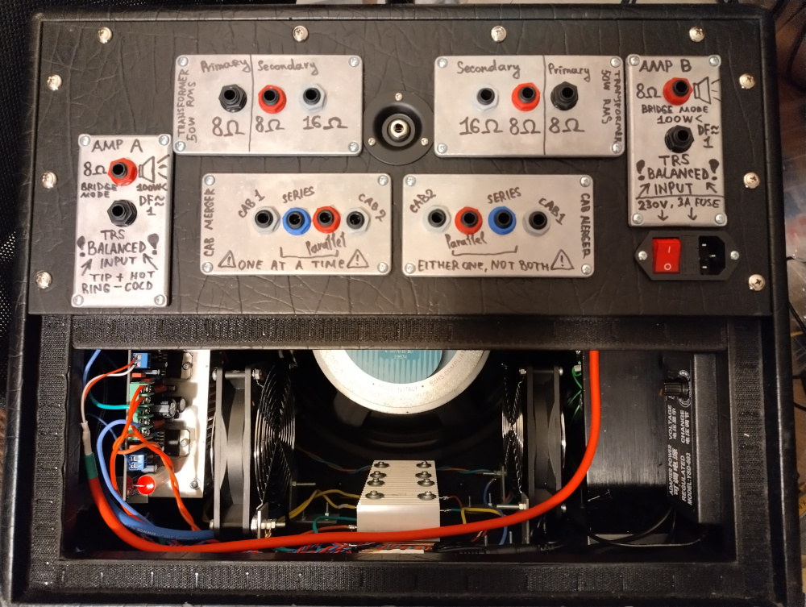
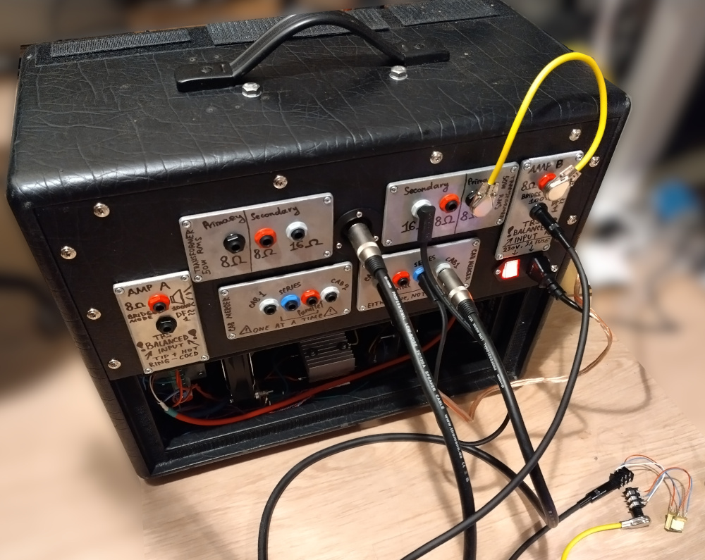
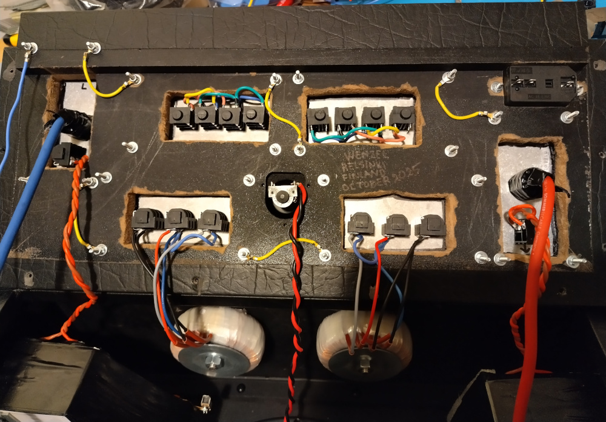
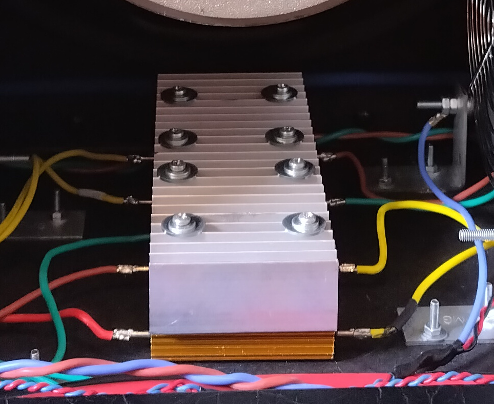
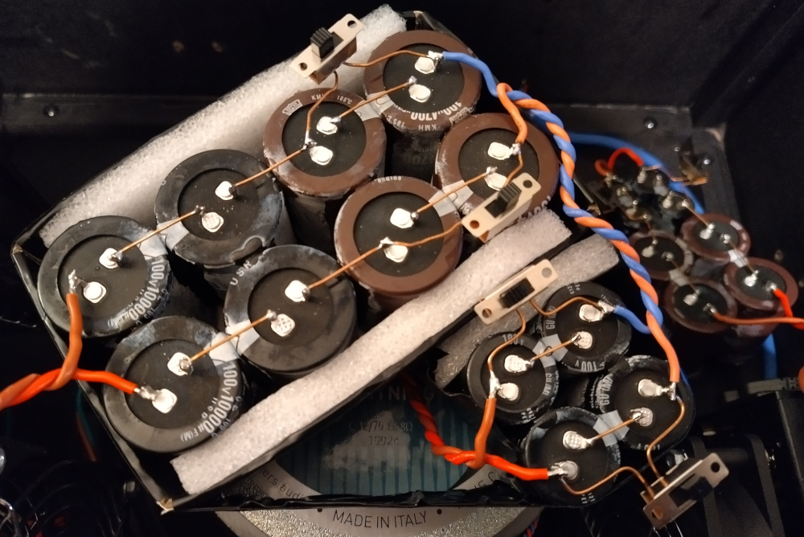
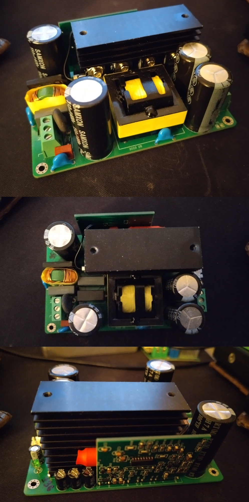
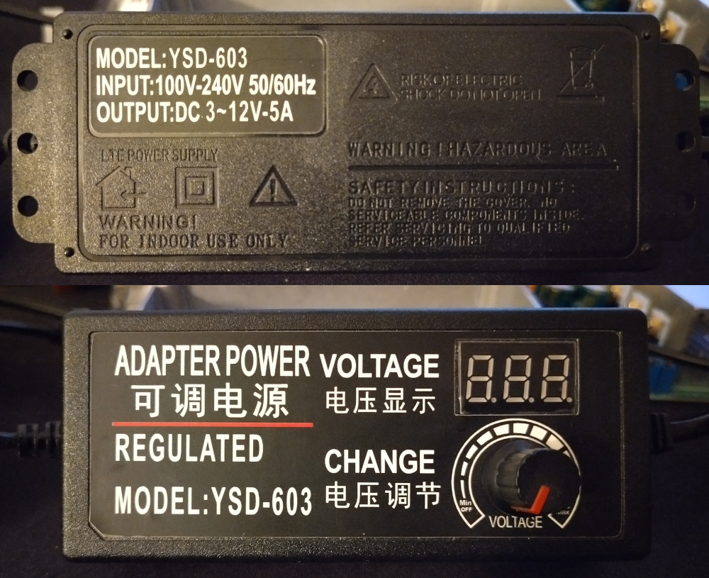

# Wenzel’s Powered Guitar Cabinets

Revision r1
(released in January 2026 but the cabinet was finished in October 2025).

- [PDF schematic render](wenzels-powered-guitar-cabinet-2510-r1.pdf)
- [PNG schematic render](wenzels-powered-guitar-cabinet-2510-r1.png)

## Photos

### The cabinet

### Output stage modifications

Damping factor reduction ballast resistors on a heatsink:

Output capacitors:

Tector.it custom impedance toroid transformer:

### Boards

Switching-mode power supply for the power amplifiers
(this one is for ±36V but it’s very similar looking to ±40V one installed
into the cabinet, same board design, just some different values of few
components):

Power supply for the cooling fans:

TDA7294-based amplifier board:

Discrete BJT amplifier board:

### Utility

Cabinet/load merging jacks wiring:

