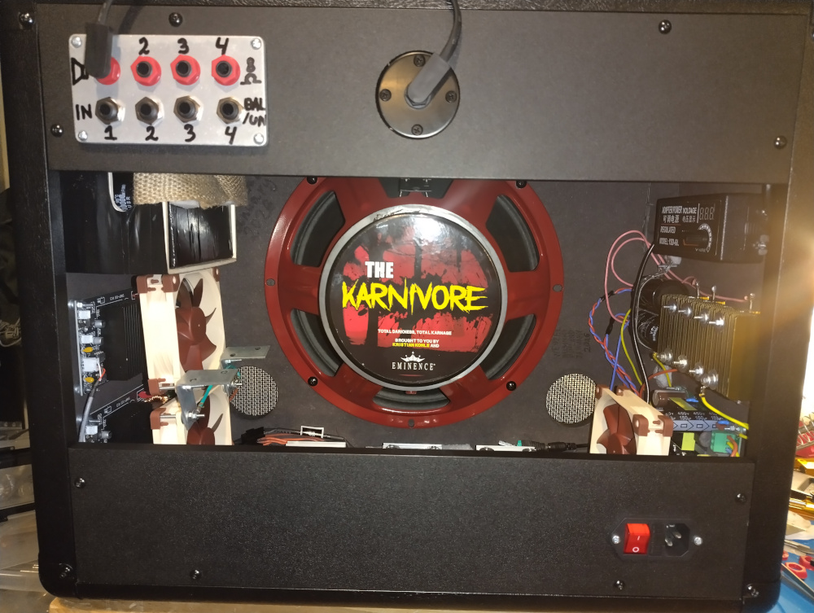
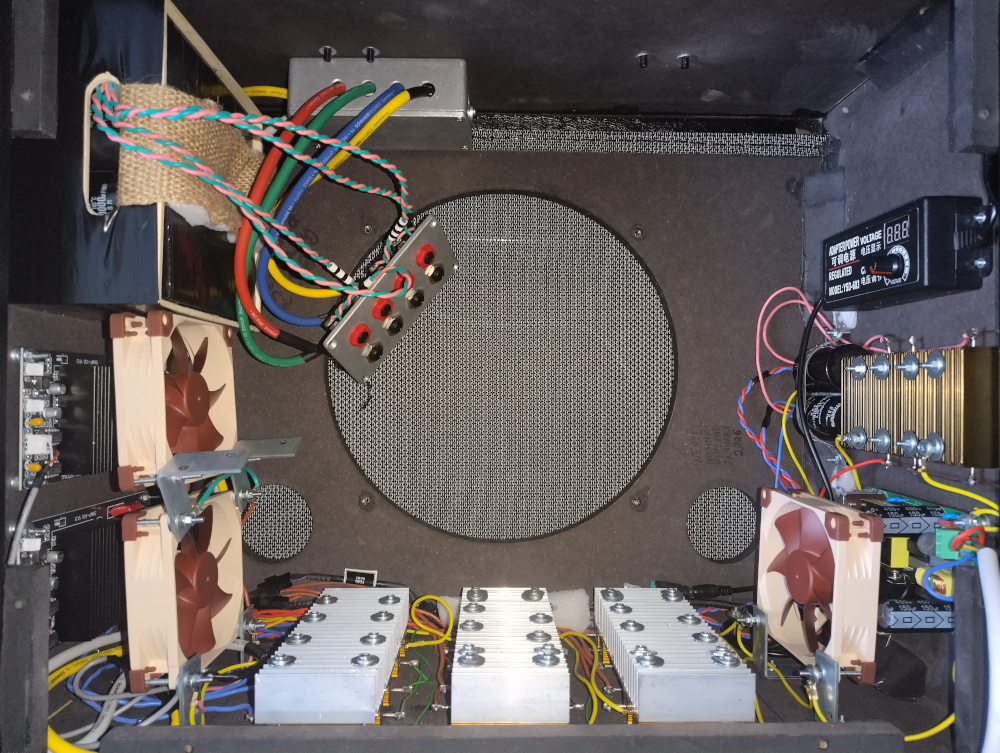
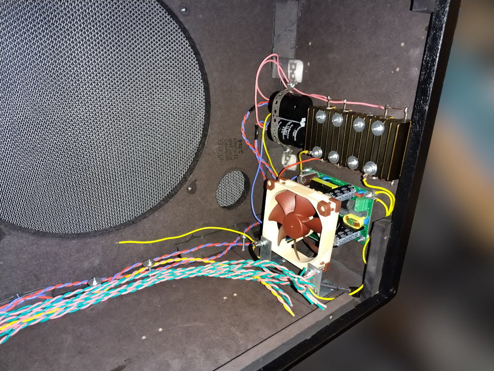
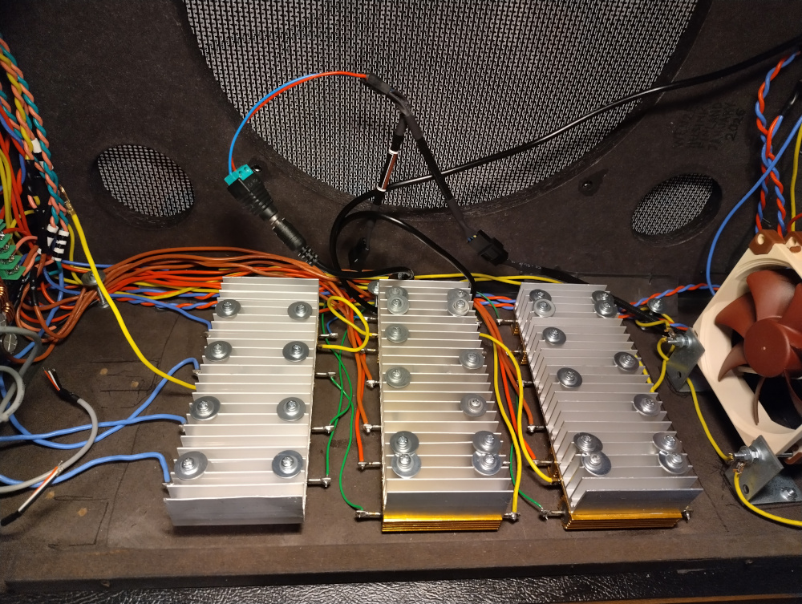
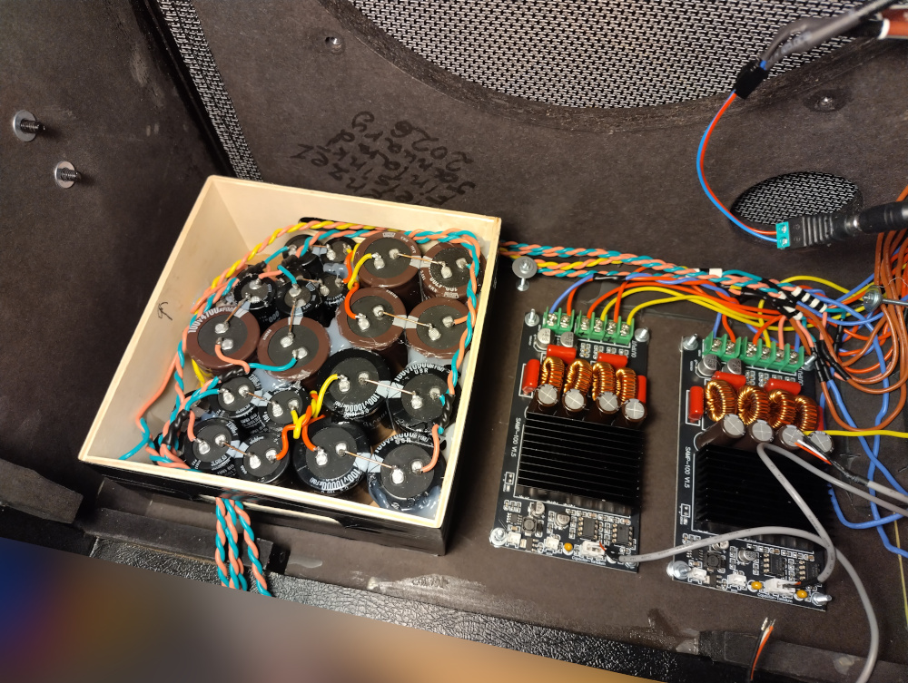
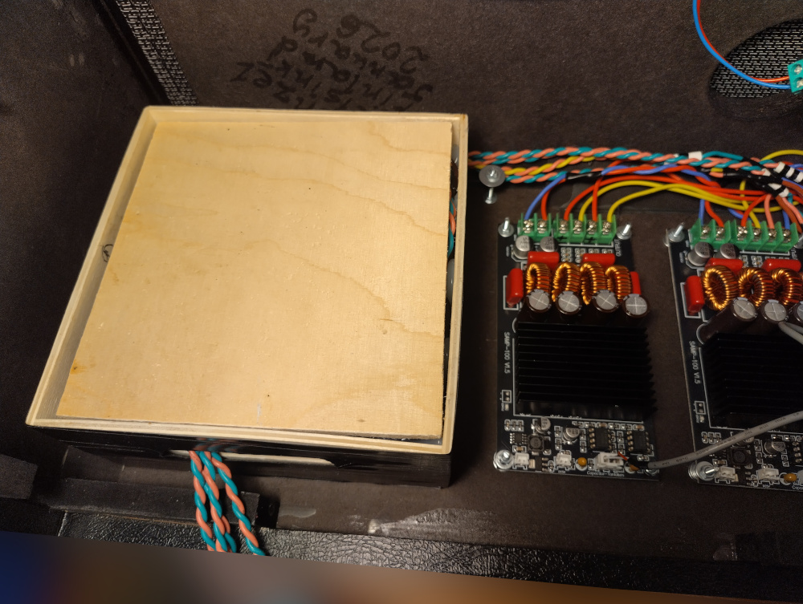

# Wenzel’s Powered Guitar Cabinet 2601

Revision r1 (January 2026).

- [PDF schematic render](wenzels-powered-guitar-cabinet-2601-r1.pdf)
- [PNG schematic render](wenzels-powered-guitar-cabinet-2601-r1.png)

## Photos

### The cabinet

### Power supply

### Output stage modifications

Damping factor reduction ballast resistors heatsinks:

Output capacitors (and amp boards):

