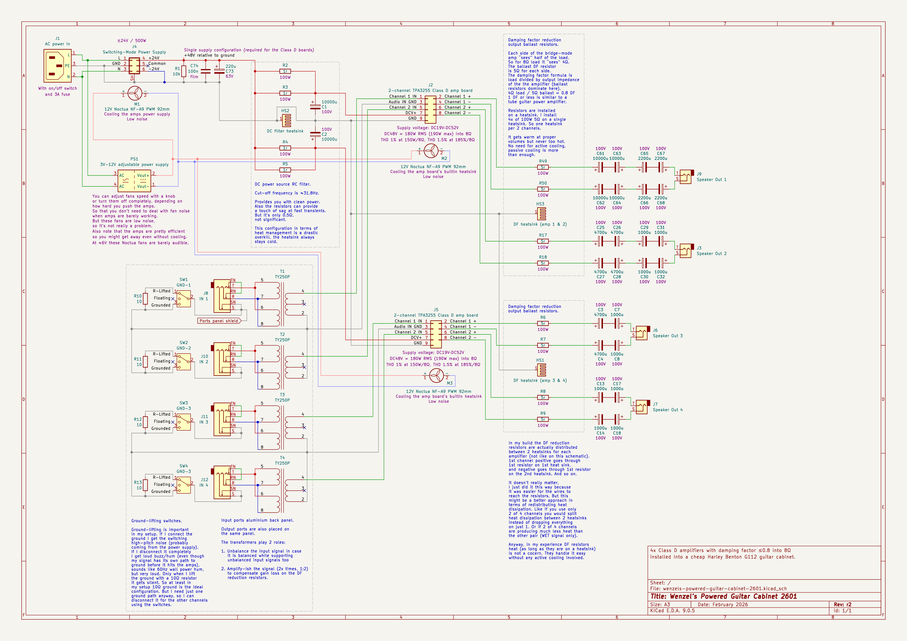
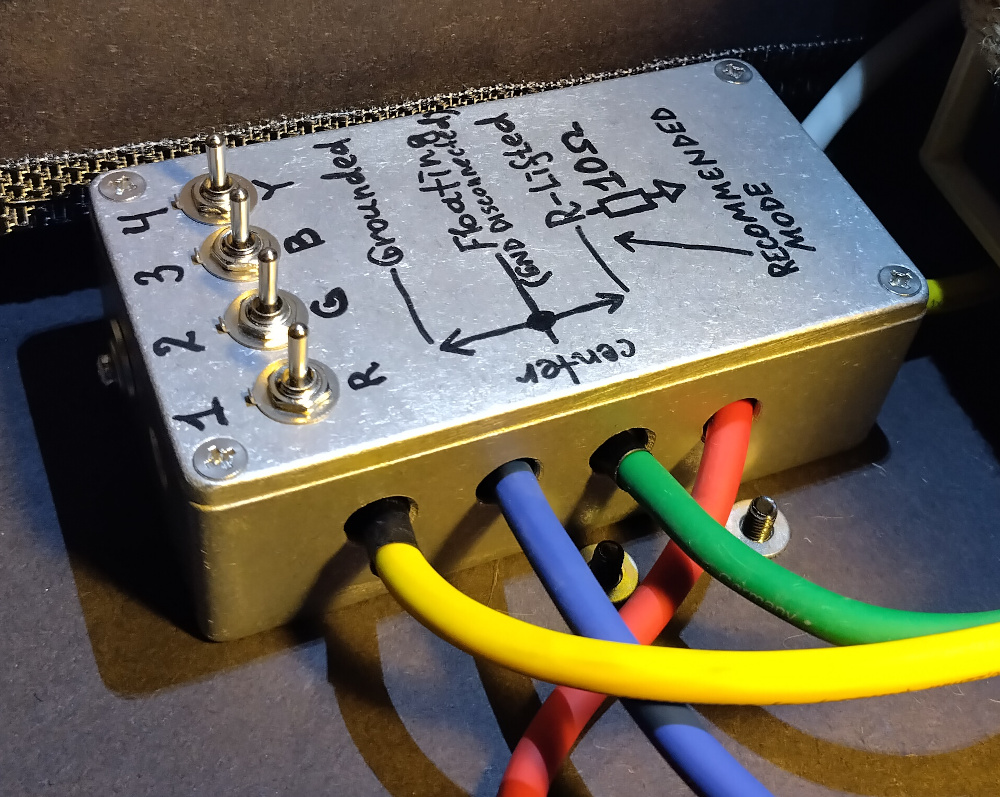
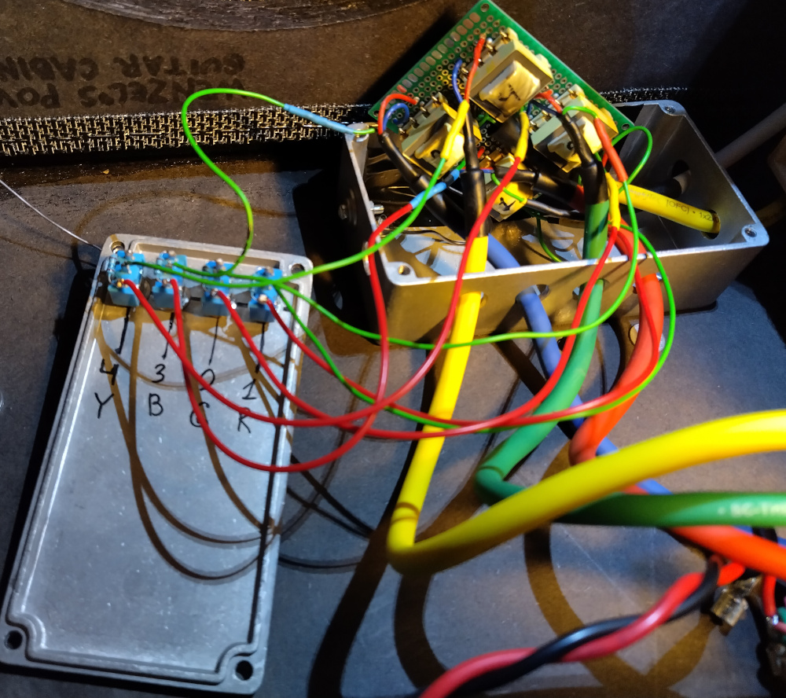
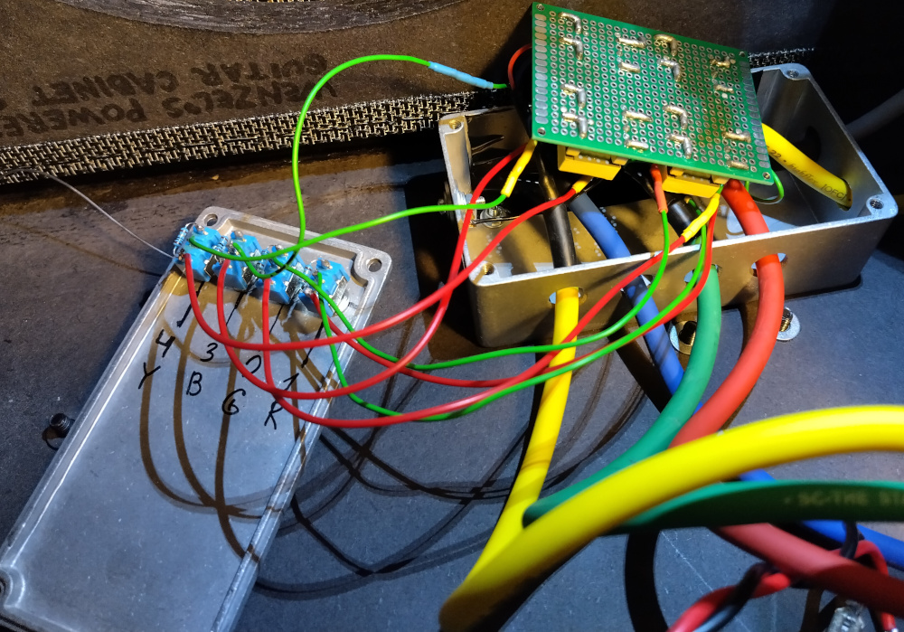
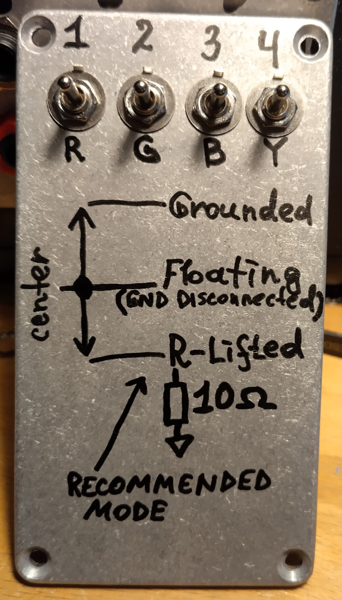
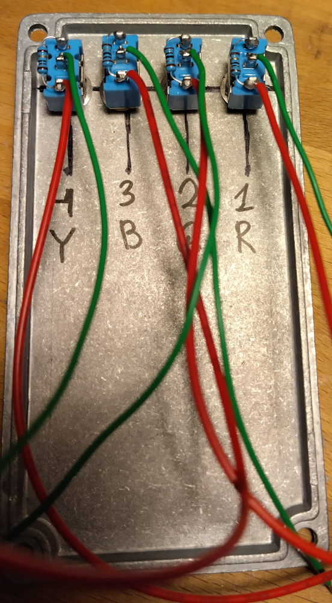
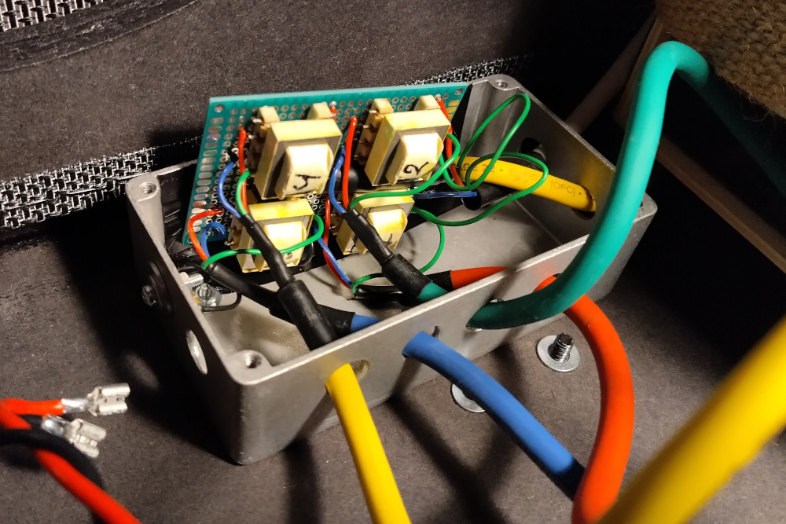
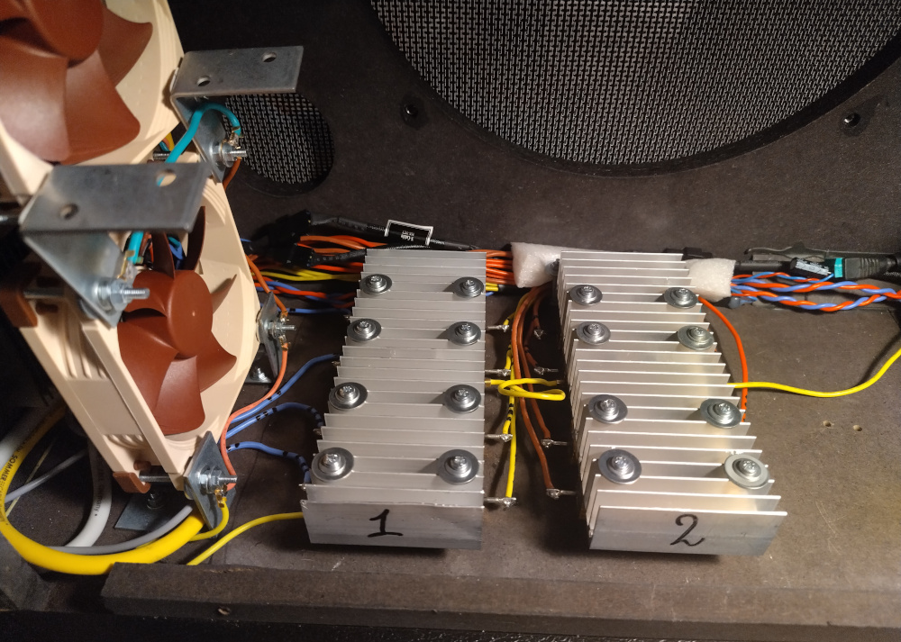

# Wenzel’s Powered Guitar Cabinet 2601

Revision r2 (February 2026).

- [PDF schematic render](wenzels-powered-guitar-cabinet-2601-r2.pdf)
- [PNG schematic render](wenzels-powered-guitar-cabinet-2601-r2.png)

## Difference (changelog) from previous release (revision r1)

This revision fixes a ground-loop issue (high-pitch switching noise from the
power supply coming from the speaker). The main fix for this is to add 10Ω
ground-lifting resistors for the channel inputs. I actually added 4 ON-OFF-ON
switches (for each channel individually) allowing to connect the ground, as
before, disconnect it completely, or connect the input ground to the amplifier
ground through 10Ω resistor. But I’m going to use the 10Ω lift mode only in my
setup, it’s the one that is working for me.

## Photos

### Input ground lifting switches

# Heatsinks optimizations

During this update I optimized the DF reduction resistors heatsinks by using
100W 5Ω resistors instead of combining the resistance of different values (I
didn’t have 5Ω available earlier). This resulted into reducing the amount of DF
heatsinks from 3 to only 2.

