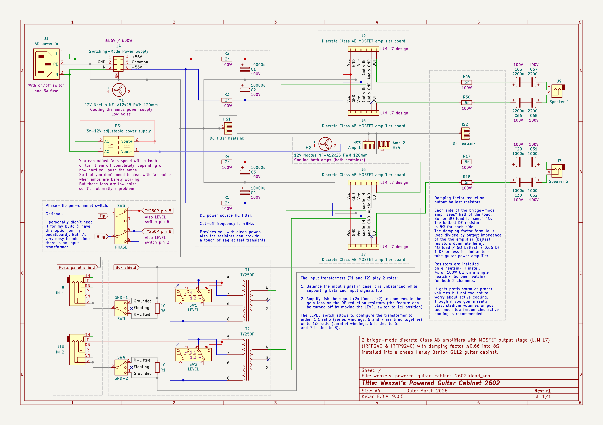
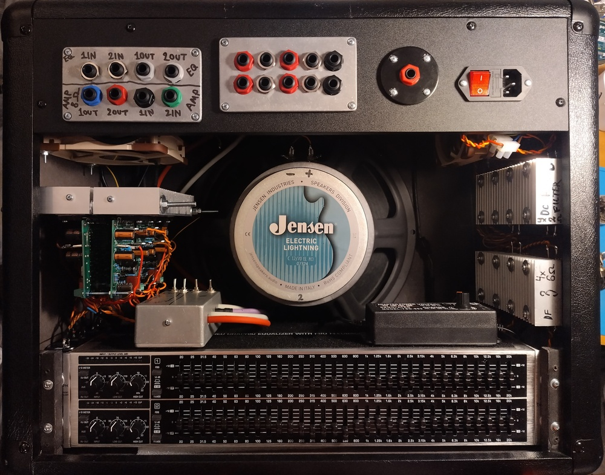
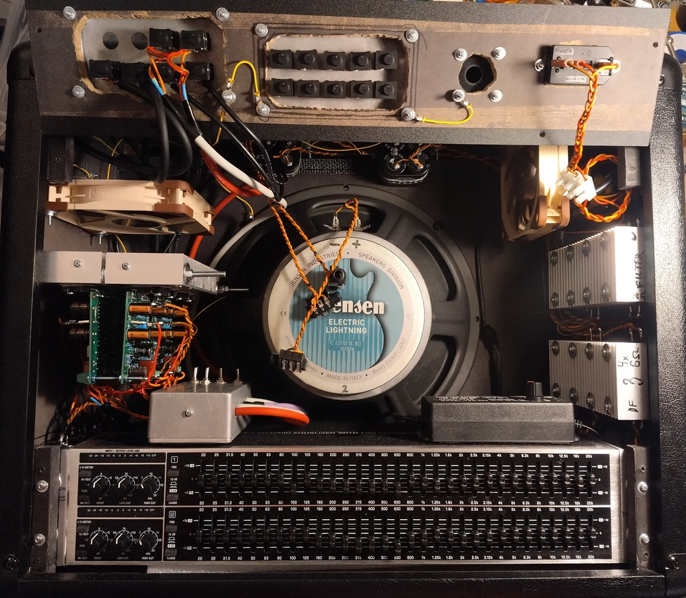
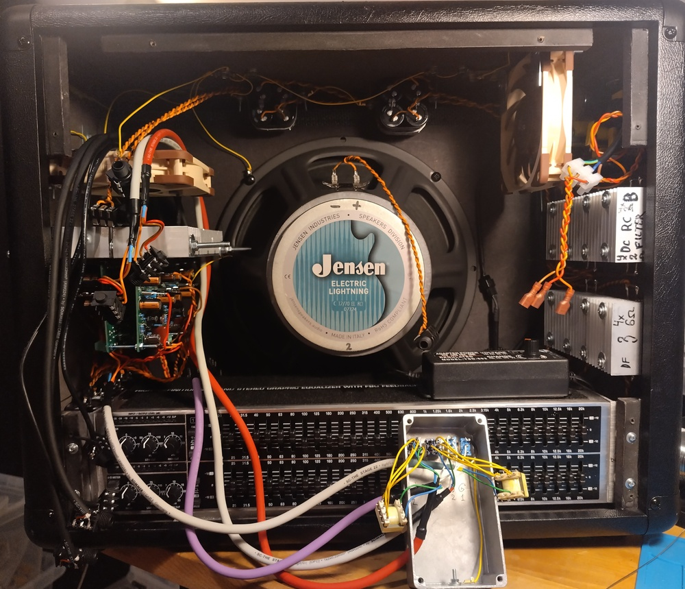
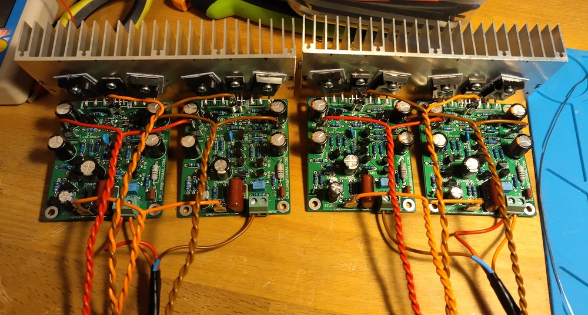
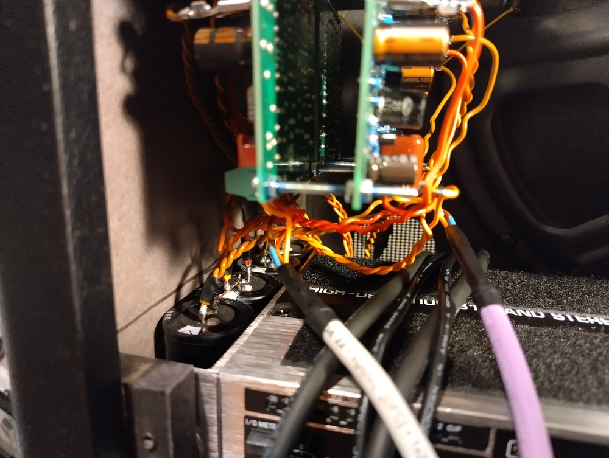
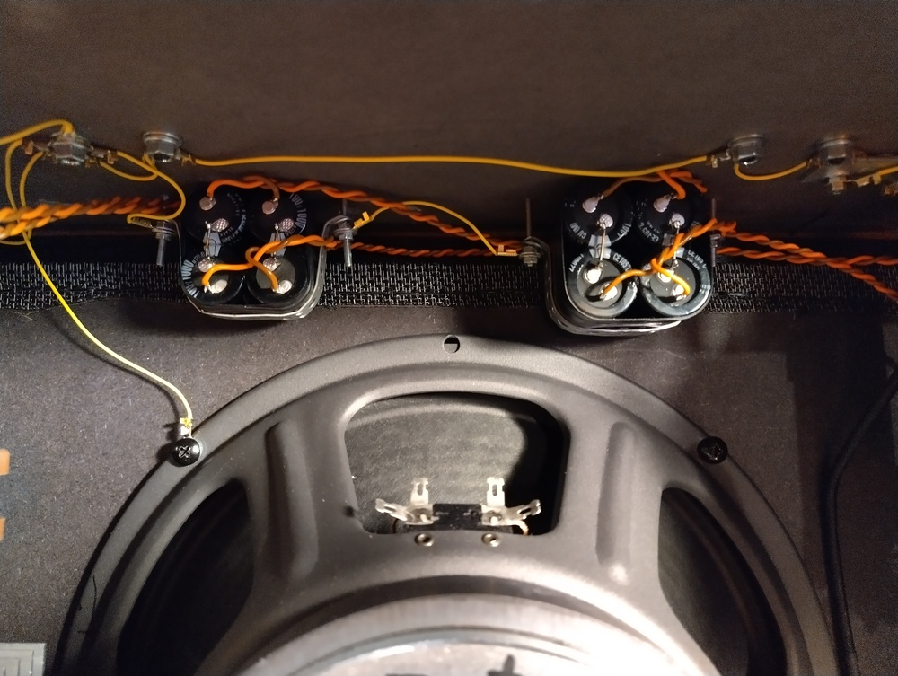
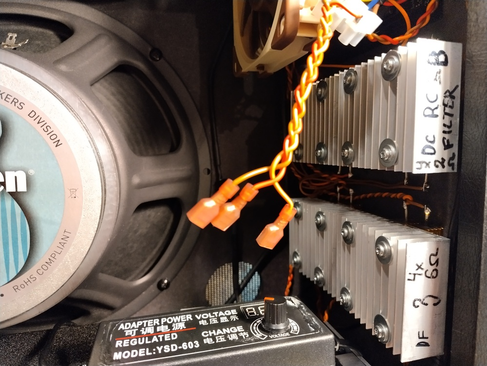
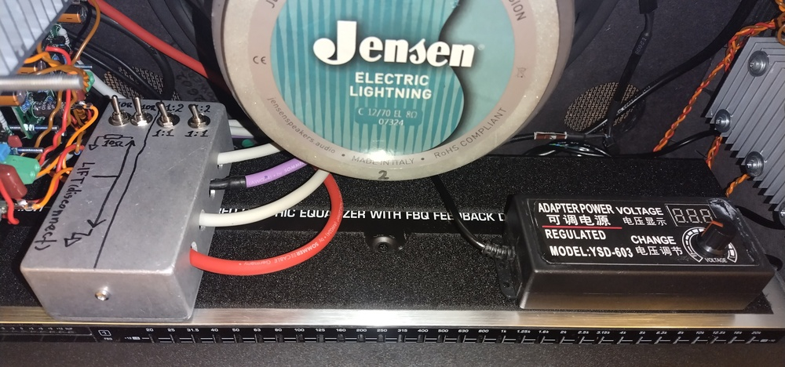
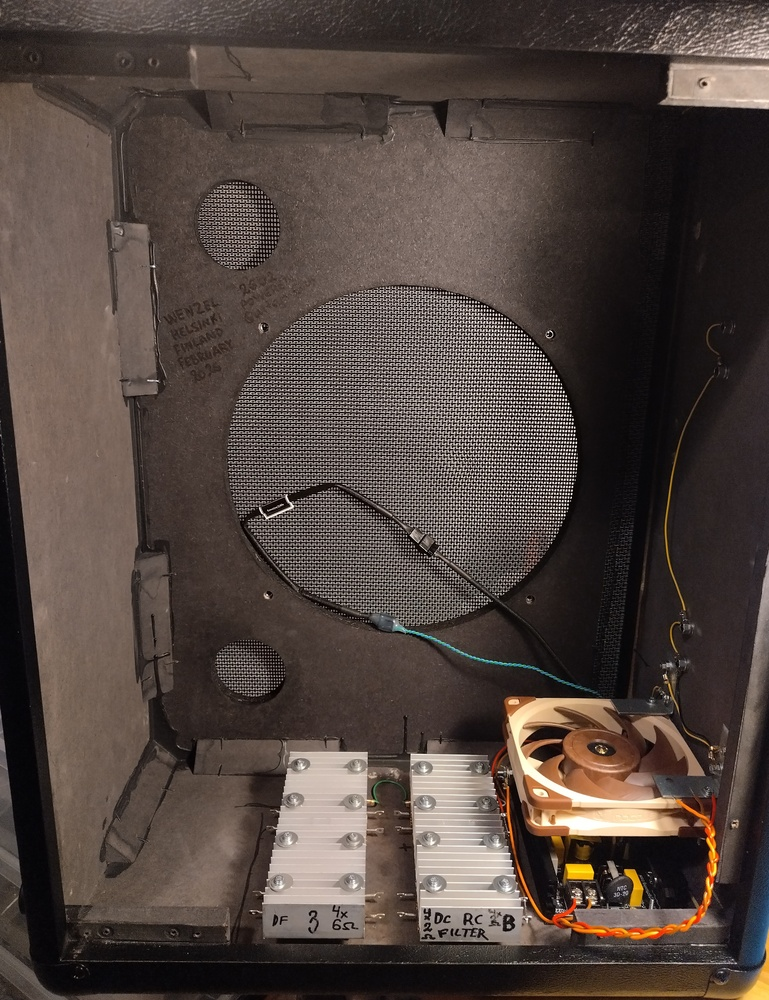

# Wenzel’s Powered Guitar Cabinet 2602

Revision r1 (March 2026).

- [PDF schematic render](wenzels-powered-guitar-cabinet-2602-r1.pdf)
- [PNG schematic render](wenzels-powered-guitar-cabinet-2602-r1.png)

## Photos

### Final assembled cabinet

### Amp boards

### DC filter 10mF capacitors on the side wall of the cabinet

### Output capacitors attached to the cab’s ceiling

### DC RC filtering and damping factor reduction resistors heatsinks

### Input transformers block (with ground lift and 1:1/1:2 boost switches) and fans power supply

### Beginning of the cabinet build

