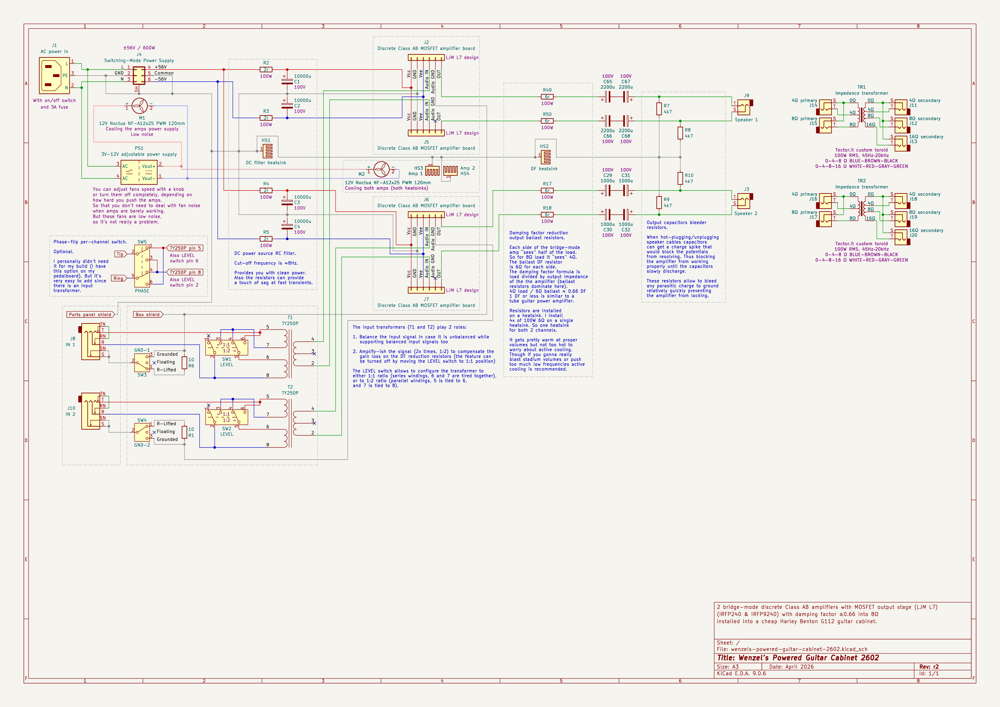
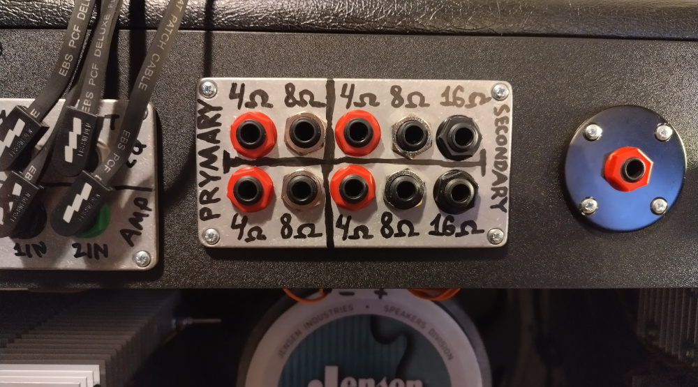
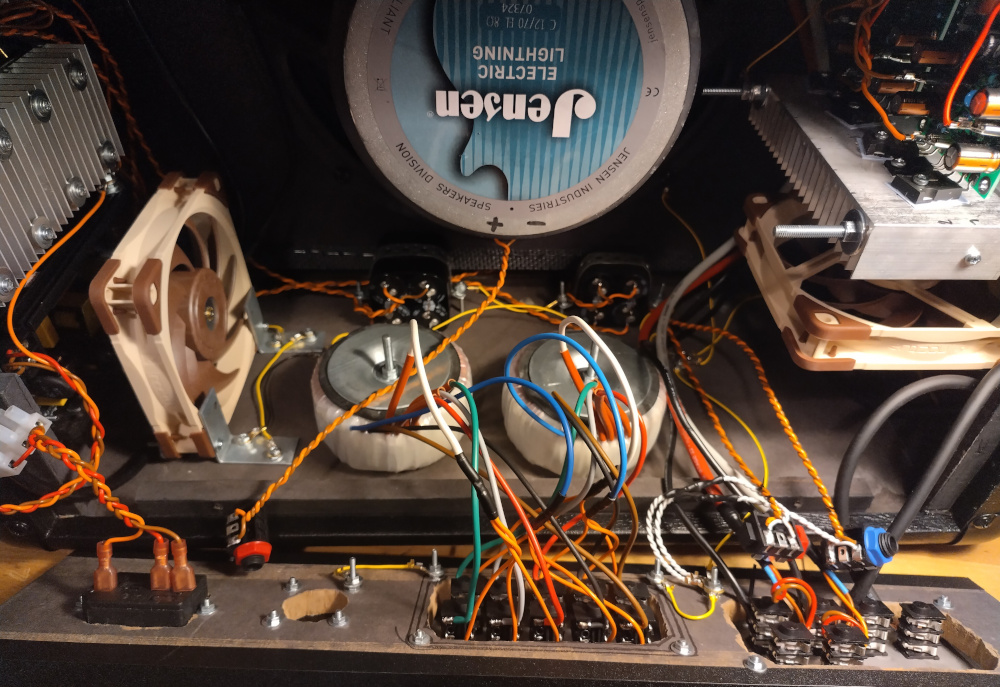
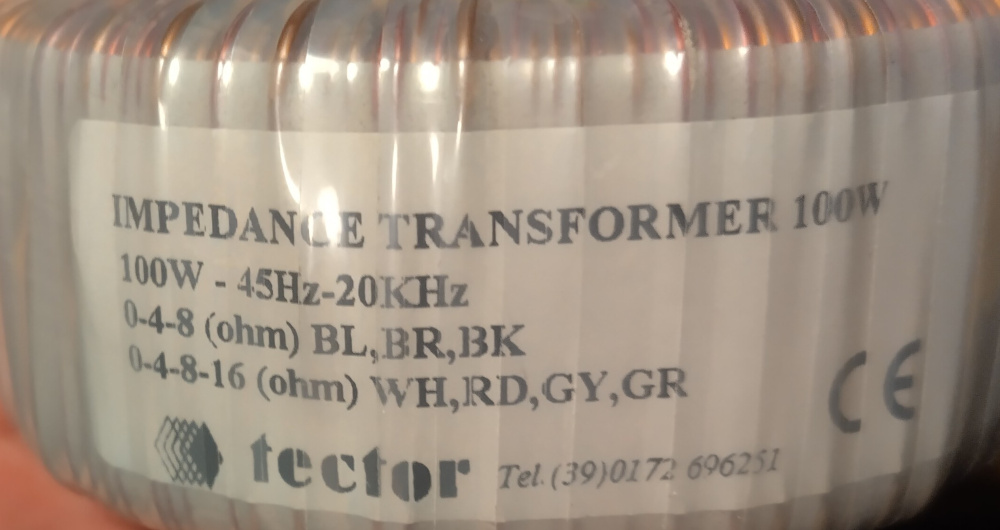
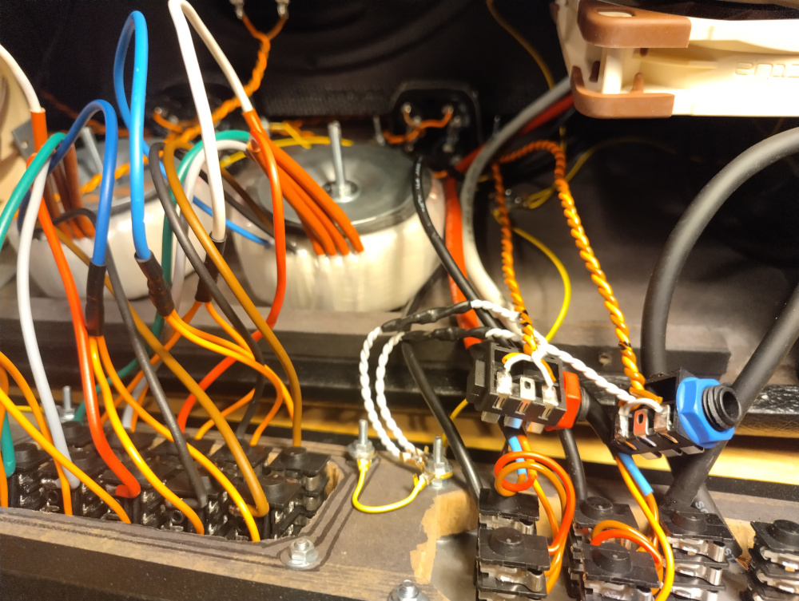

# Wenzel’s Powered Guitar Cabinets

Revision r2 (April 2026).

- [PDF schematic render](wenzels-powered-guitar-cabinet-2602-r2.pdf)
- [PNG schematic render](wenzels-powered-guitar-cabinet-2602-r2.png)

## Difference (changelog) from previous release (revision r1)

Added 2x custom [Tector.it](https://tector.it/en_GB) toroid impedance
transformers rated 100W RMS, 45Hz–20kHz. 4Ω and 8Ω taps on primary (2602
amplifiers are intended to use only 8Ω tap on primary), and 4Ω, 8Ω, and 16Ω on
the secondary. They are allowing to connect whatever load to the secondary and
get 8Ω load for the amplifier on the primary side.

Also added bleeder resistors for the output capacitors. When
hot-plugging/unplugging speaker cables capacitors can get a charge spike that
would block the potentials from resolving. Thus blocking the amplifier from
working properly until the capacitors slowly discharge. These resistors allow to
bleed any parasitic charge to ground relatively quickly preventing the amplifier
from locking.

## Photos

Bleeder resistors (white wires) for the output capacitors:

