# Wenzel’s Powered Guitar Cabinets

Revision r1 (October 2026).

- [PDF schematic render](wenzels-powered-guitar-cabinet-2609-r1.pdf)
- [PNG schematic render](wenzels-powered-guitar-cabinet-2609-r1.png)

## Photos

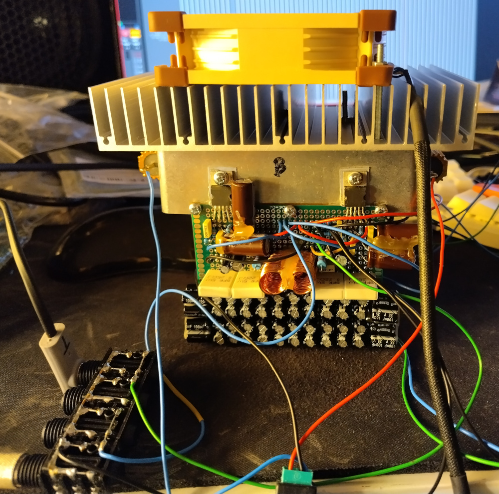

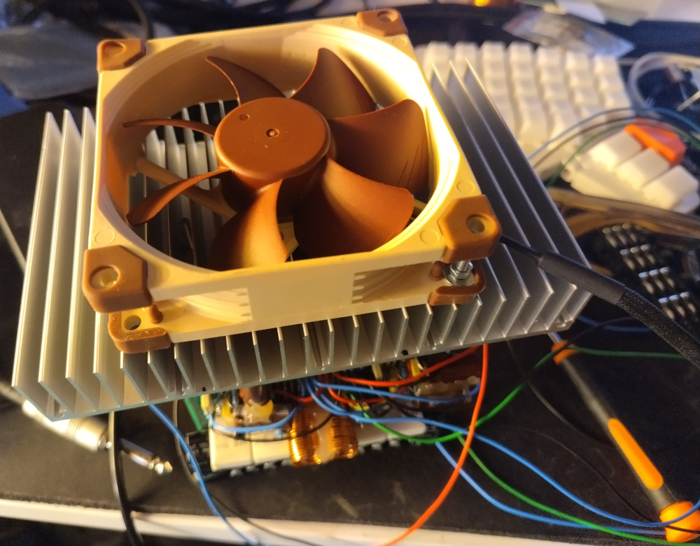

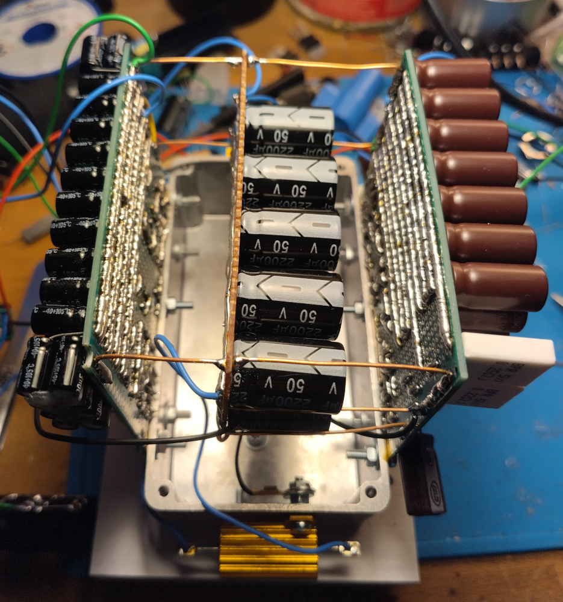

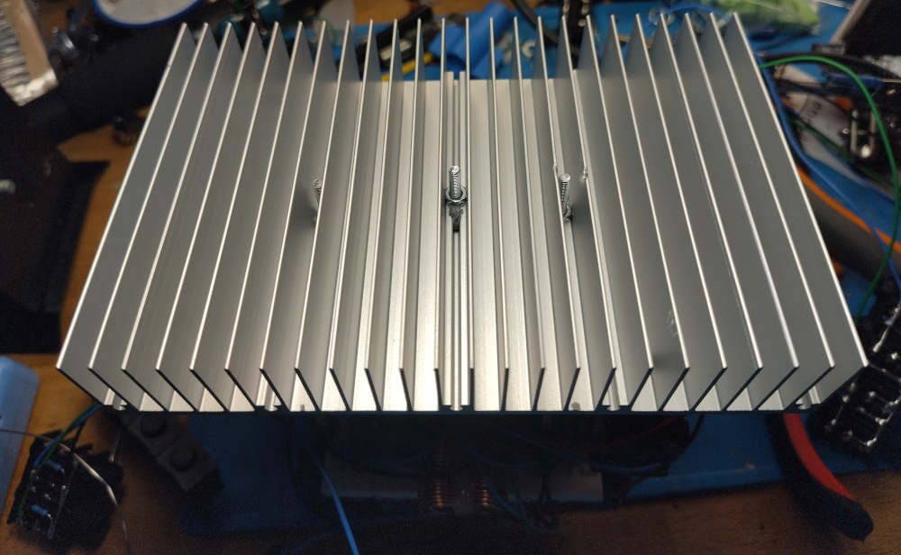

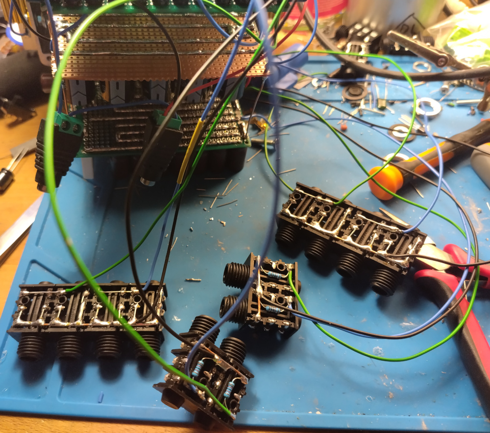

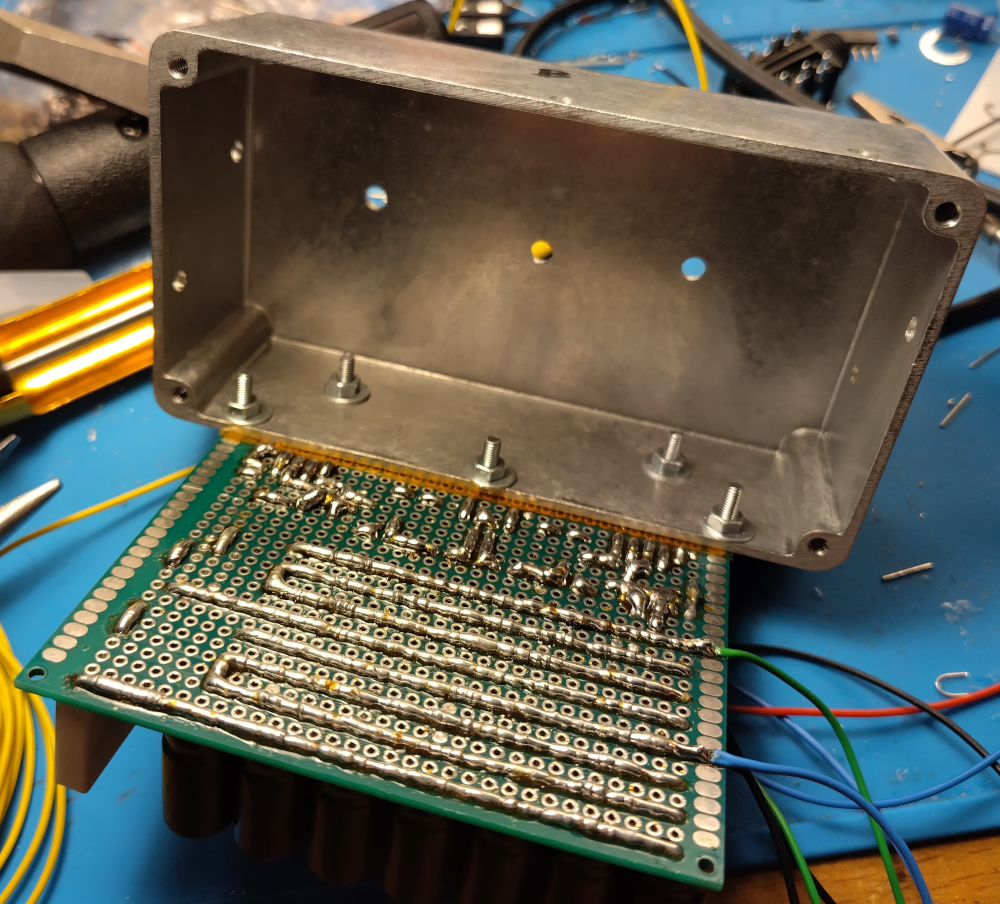

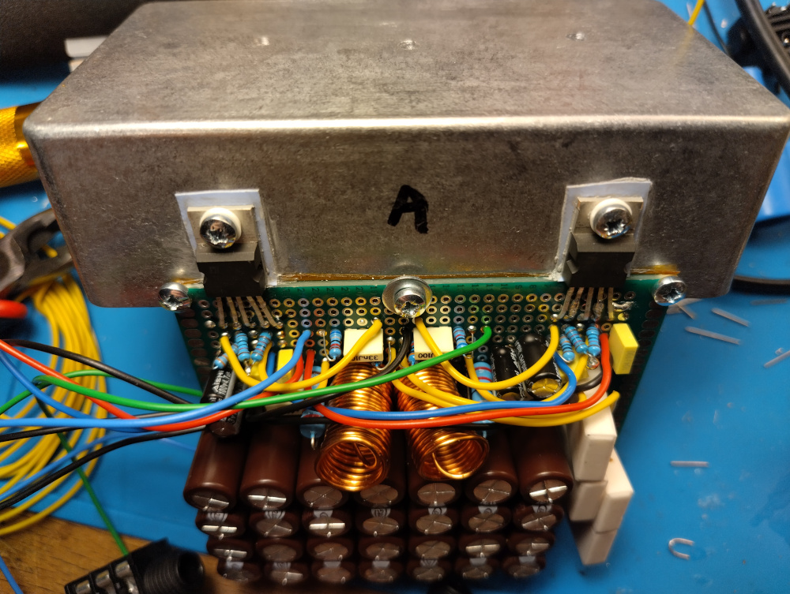

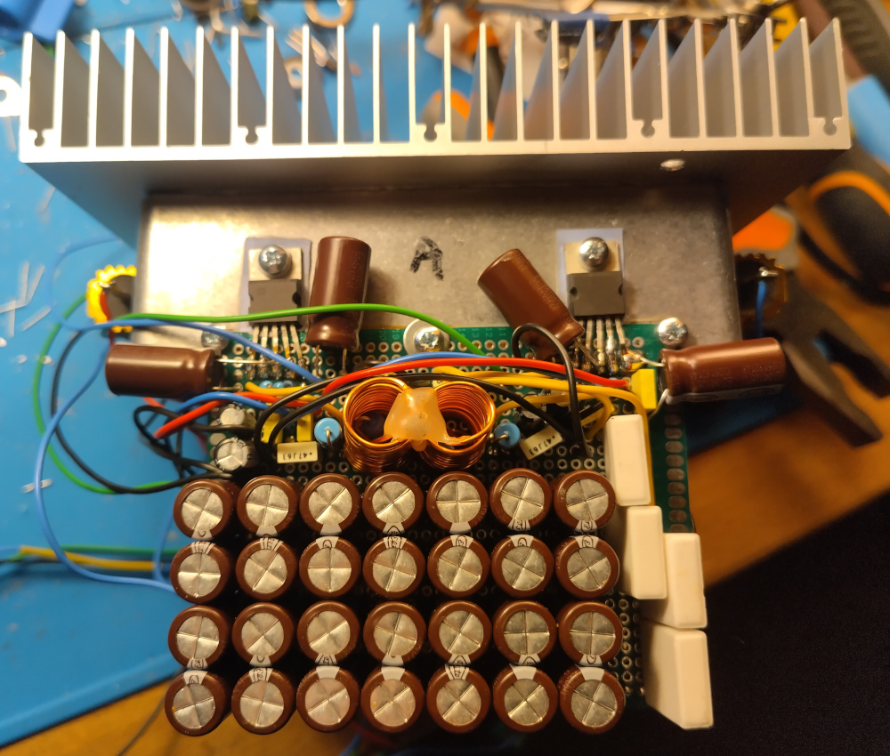

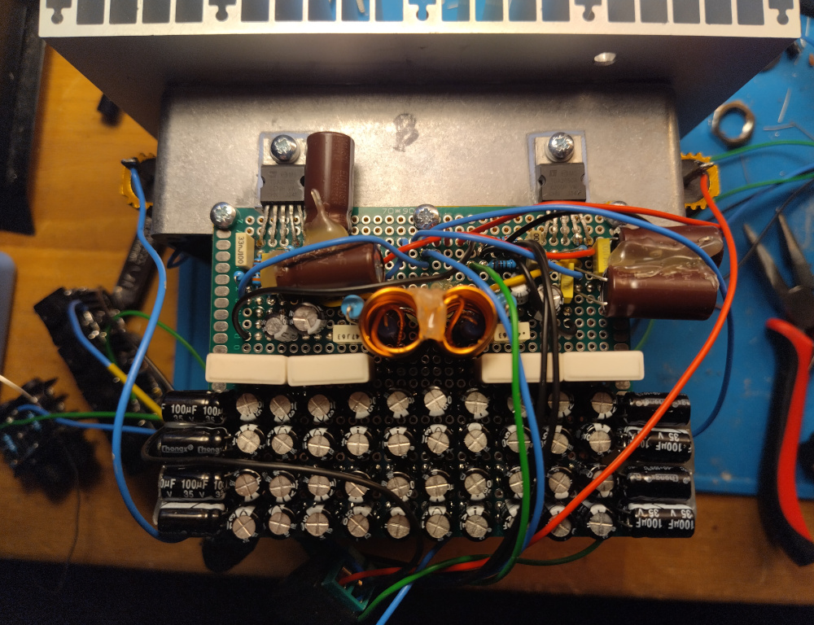

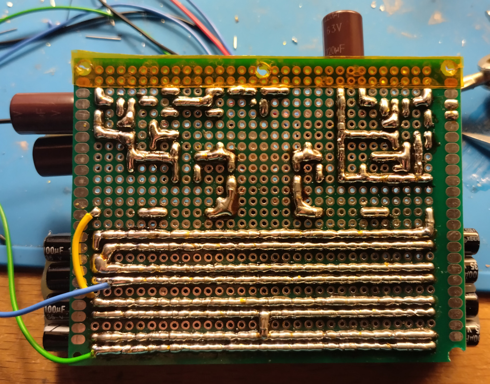

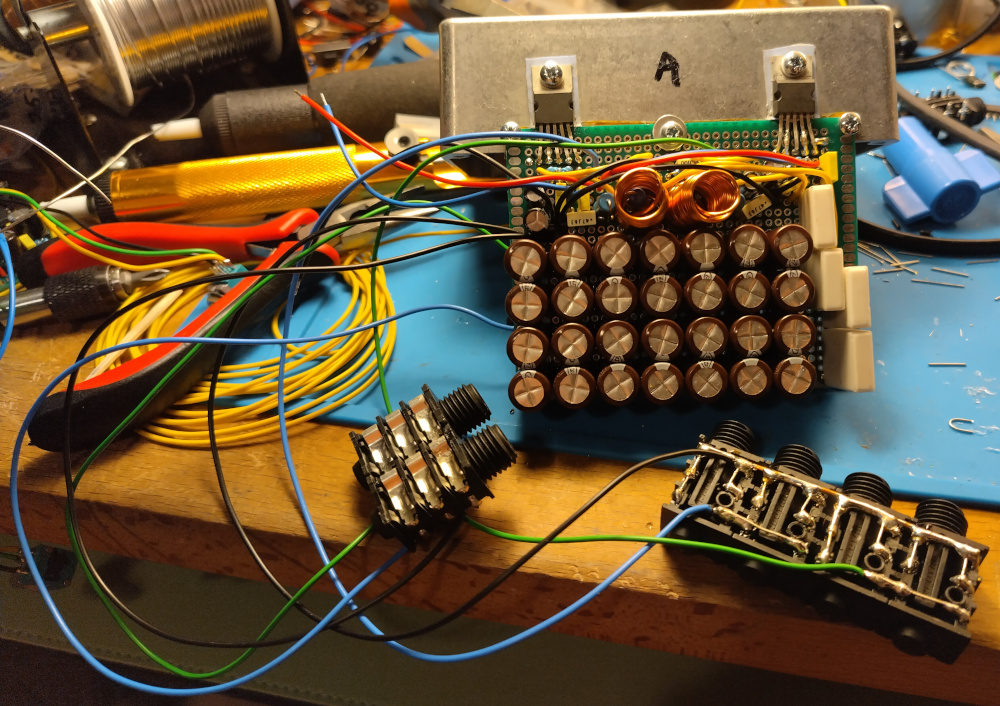
