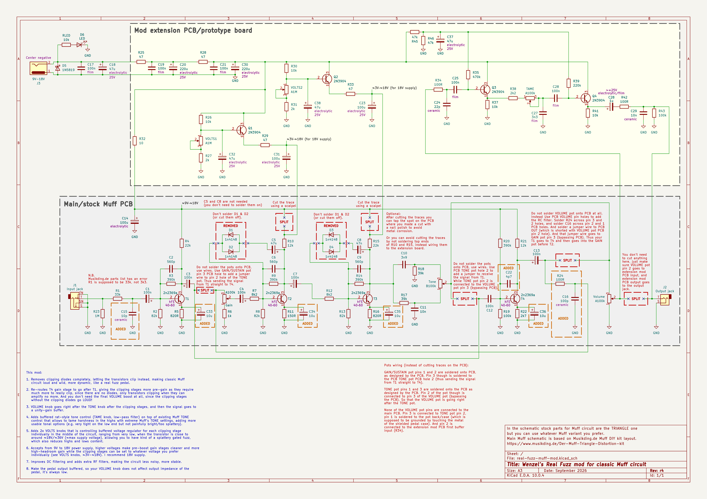
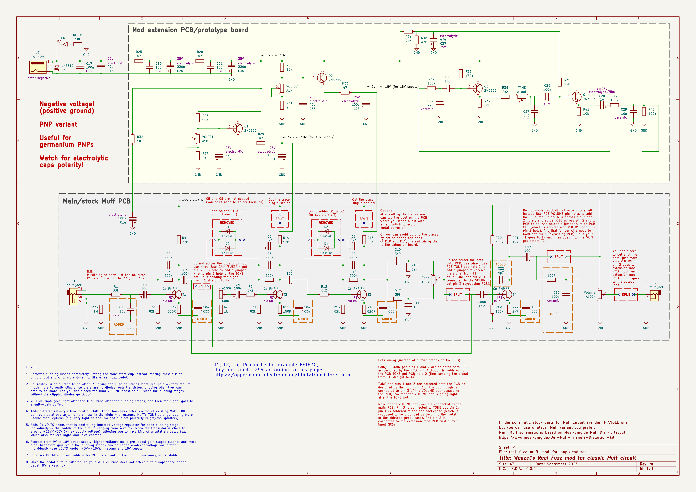

# Wenzel’s Real Fuzz Muff Mod

My own Real Fuzz mod for classic Muff circuit.

Read notes on the schematic for details.

The design supports from 9VDC to 18VDC supply, I find 18V better than 9V.
Though confirm voltage ratings for the Ts transistors you are going to use.
For many germanium transistors 18V can exceed their limits.

**Important note:** it’s important that T1, T2, T3, and T4 are low-hFE (40–60 is
a good reference range). With higher hFE the pedal can get far too gainy, over
the top. I tried 2n3904-s but could not even touch the gain knob, a little more
than minimal and it goes straight into oscillation. Even with 40 hFE Ts you
would get more than enough gain. I selected 2n2369a Korean NPN transistors,
their hFE range from 40 to 120. I recommend you to buy many and select 40–60 hFE
with a transistor tester. Note that there are not that many silicon NPN options
with such low hFE.

**TODO:** Try MP37B (“МП37Б”) Soviet era Germanium NPNs with 40–60 hFE. They can
handle up to 30V so they will work with 18V configuration. But note that it must
be MP37B and not just MP37, the latter are rated only 15V maximum.

## Latest revision schematic

### Regular NPN variant

### PNP positive-ground variant:

## Releases (newest revisions are on the top)

- [r4 2026-09](release-2026-09-r4)
- [r3 2026-08](release-2026-08-r3)
- [r2 2026-03](release-2026-03-r2)
- [r1 2025-10](release-2025-10-r1)
