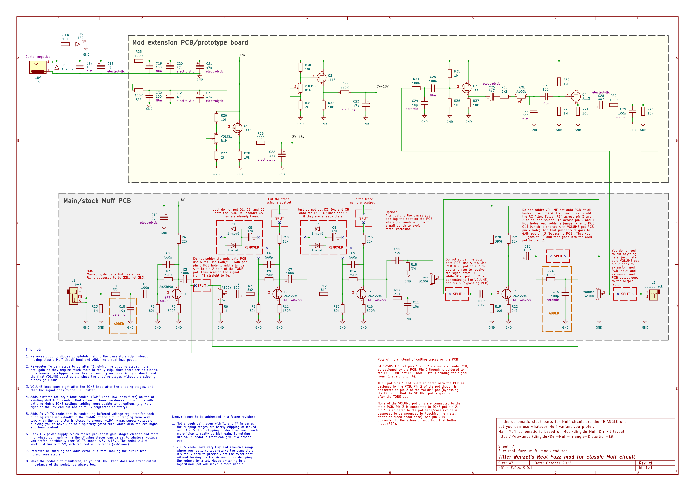

# Wenzel’s Real Fuzz Muff Mod

Revision 1 (October 2025).

In the schematic stock parts for Muff circuit are the TRIANGLE one
but you can use whatever Muff variant you prefer.

Main Muff schematic is based on Musikding.de Muff DIY kit layout.
https://www.musikding.de/Der-Muff-Triangle-Distortion-kit

- [PDF schematic render](wenzels-real-fuzz-muff-mod-r1.pdf)
- [PNG schematic render](wenzels-real-fuzz-muff-mod-r1.png)

## Features of this mod

1. Removes clipping diodes completely, letting the transistors clip instead,
   making classic Muff circuit loud and wild, like a real fuzz pedal.

2. Re-routes T4 gain stage to go after T1, giving the clipping stages more
   pre-gain as they require much more to really clip, since there are no diodes,
   only transistors clipping when they can amplify no more. And you don't need
   the final VOLUME boost at all, since the clipping stages without the clipping
   diodes go LOUD!

3. VOLUME knob goes right after the TONE knob after the clipping stages, and
   then the signal goes to the JFET buffer.

4. Adds buffered rat-style tone control (TAME knob, low-pass filter) on top of
   existing Muff TONE control that allows to tame harshness in the highs with
   extreme Muff's TONE settings, adding more usable tonal options (e.g. very
   tight on the low end but not painfully bright/too splattery).

5. Adds 2x VOLTS knobs that is controlling buffered voltage regulator for each
   clipping stage individually in the middle of the circuit, ranging from very
   low, when the transistor is closed to around ≈18V (≈max supply voltage),
   allowing you to have kind of a splattery gated fuzz, which also reduces highs
   and lows content.

6. Uses 18V power supply, which makes pre-boost gain stages cleaner and more
   high-headroom gain while the clipping stages can be set to whatever voltage
   you prefer individually (see VOLTS knobs, ≈3V-≈18V). The pedal will still
   work just fine with 9V, with reduced VOLTS range (≈9V max).

7. Improves DC filtering and adds extra RF filters, making the circuit less
   noisy, more stable.

8. Make the pedal output buffered, so your VOLUME knob does not affect output
   impedance of the pedal, it's always low.

## Known issues

Known issues to be addressed in a future revision:

1. Not enough gain, even with T1 and T4 in series
   the clipping stages are barely clipping at maxed
   out GAIN. Without clipping diodes they need much
   more juice to really go high gain. Something
   like SD-1 pedal in front can give it a proper
   push.

2. VOLTS knobs have very tiny and sensitive range
   where you really voltage-starve the transistors,
   it’s really hard to precisely set the sweet spot
   without turning the transistors off or dropping
   the volume by a lot. Maybe switching to a
   logarithmic pot will make it more usable.
