# Wenzel’s Real Fuzz Muff Mod

Revision r3 (August 2026).

- [PDF schematic render](real-fuzz-muff-mod-r3.pdf)
- [PNG schematic render](real-fuzz-muff-mod-r3.png)

## Difference (changelog) from previous release (revision r2)

There are several changes and most of them are related to 36V support.

1. Change the RC filtering arrangement (2x series 100Ω/100uF filters)
2. 39V/1.3W reverse-bias Zener diode for over-voltage spikes protection at 36V
3. Replace J113 JFETs to 2n3904 NPNs to handle 36V (J113 is limited to 35V)
4. Change biasing for the unity-gain buffers around the TAME knob so that the
   impedance stays close to what it was but the DC bias has more current since
   NPNs need more (separate VREF divider 47kΩ/47kΩ and 470kΩ bias resistor)
5. R27 and R31 (VOLTS1 and VOLTS2 knobs) are changed from 2kΩ to 1kΩ to allow
   more voltage drop at 36V
6. C29 is changed from 100pF to 10nF for more aggressive RF filtering at output
   (it is still outside of audible range)
7. Optional clipping LEDs were replaced with BS170 MOSFET symmetrical joined
   pairs (source-to-source shorted floating, gates and drains are shorted for
   each individually and used as end terminals)

After testing I decided that 18V is a sweet spot anyway, it sounds best at 18V.

## Photos

Note that I initially tried it with T1, T2, T3, and T4 being 2n3904-s but it was
far too over the top gainy. Moving the GAIN just a bit more than minimum was
sending it straight into oscillation. So I later changed those to 2n2369a with
selected hFE within 40–60 range.

This time I built a “Ram’s Head” Muff variant:
https://www.musikding.de/Der-Muff-Rams-Head-Distortion-kit

In this build I also wired the Muff PCB the way that didn’t require any trace
cutting. I just soldered a wire with a resistor directly to the top holes of R10
and R15 (shorted to T2 and T3 collector) and leaving bottom holes (shorted to
V+) unconnected.

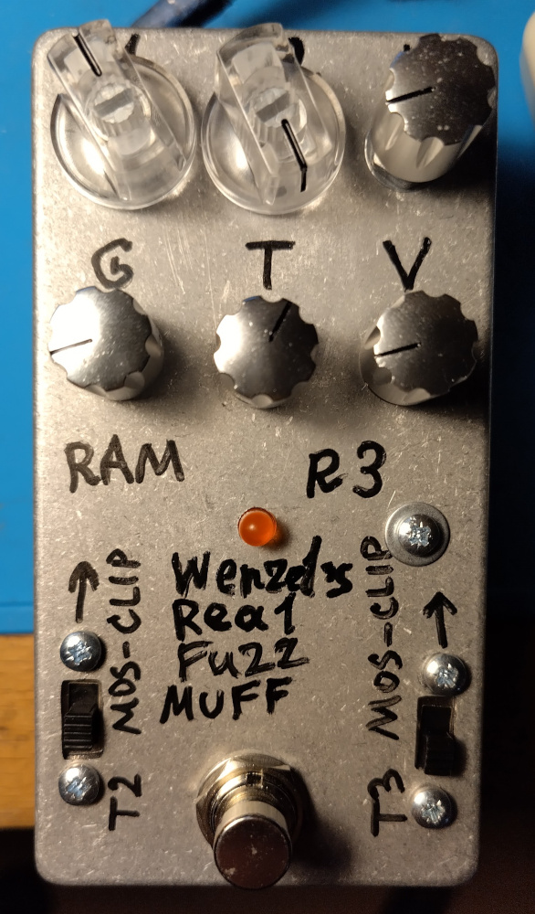

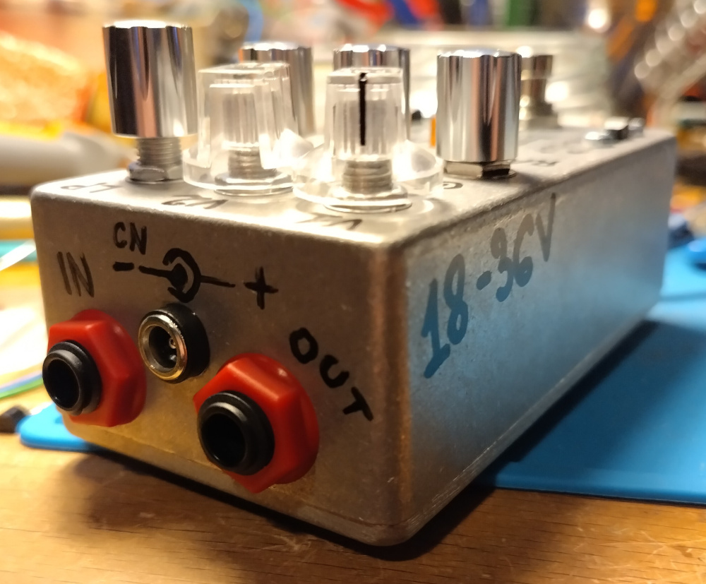

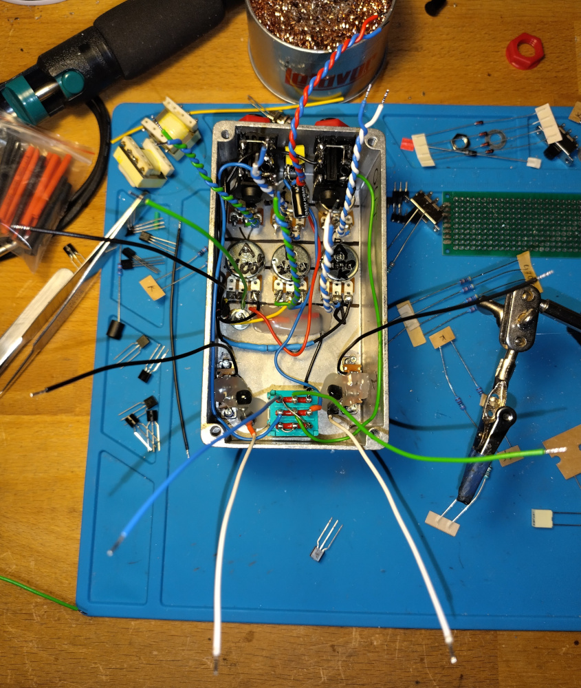

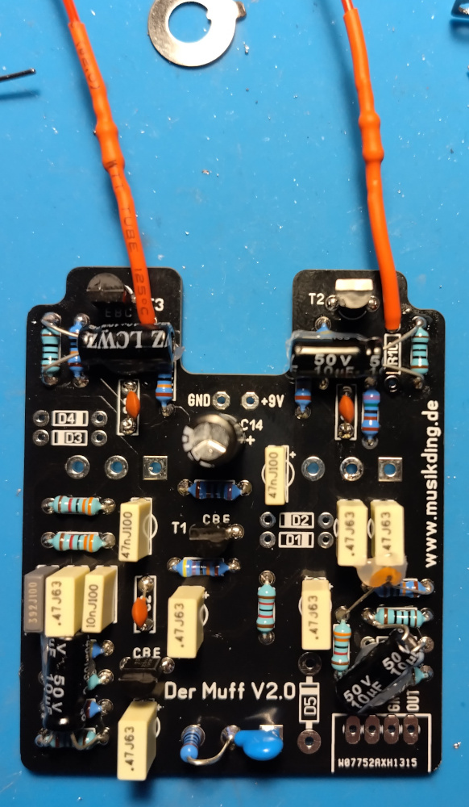

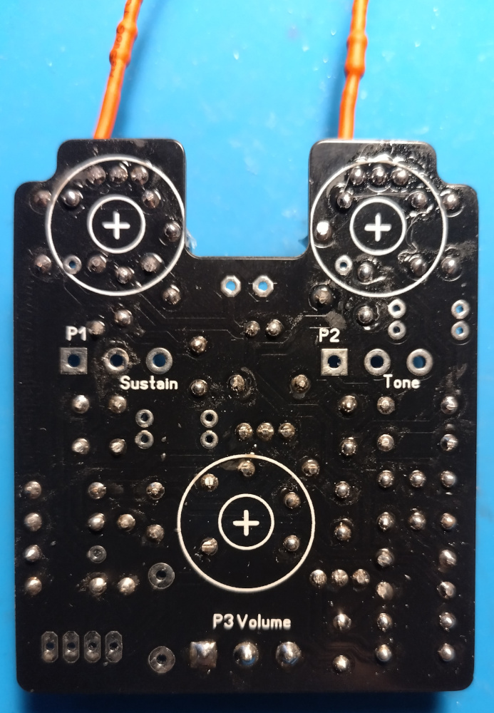

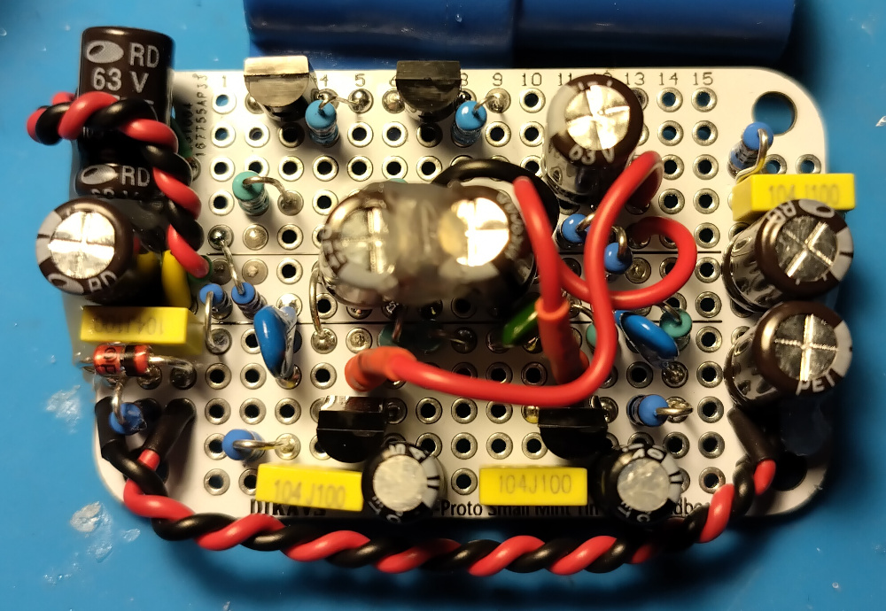

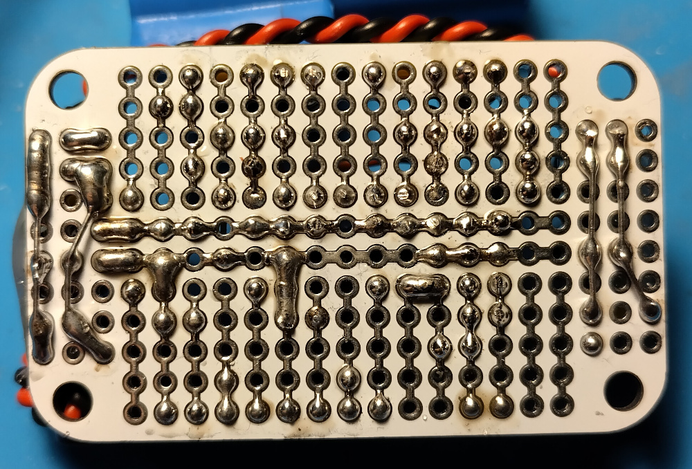

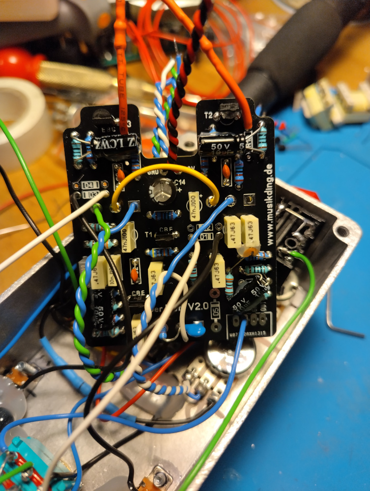

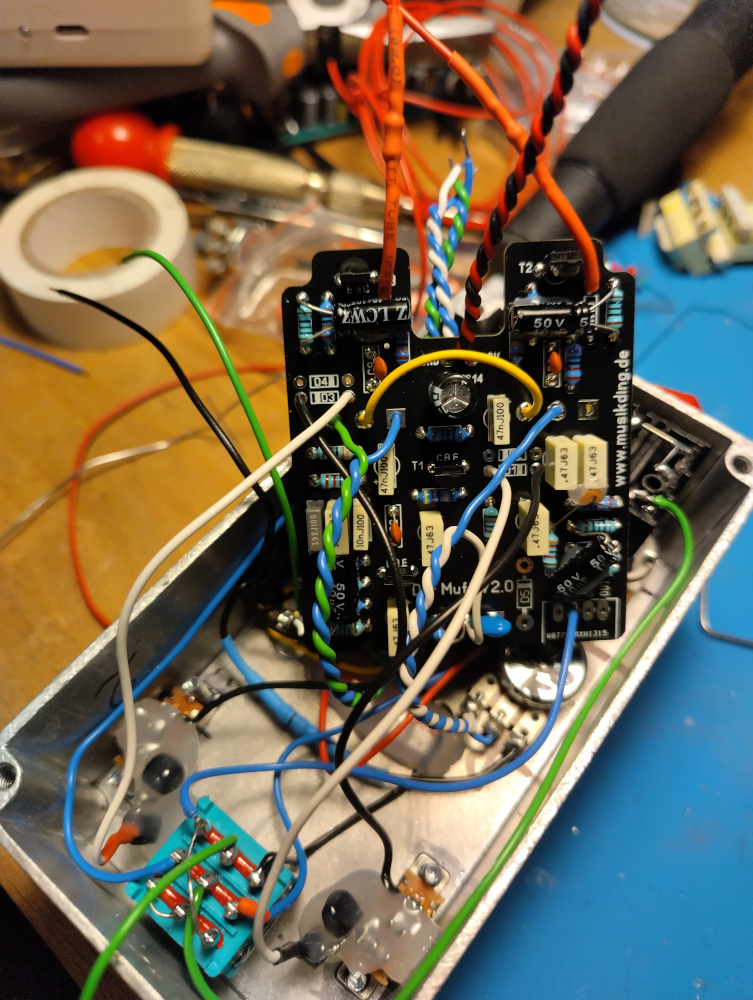

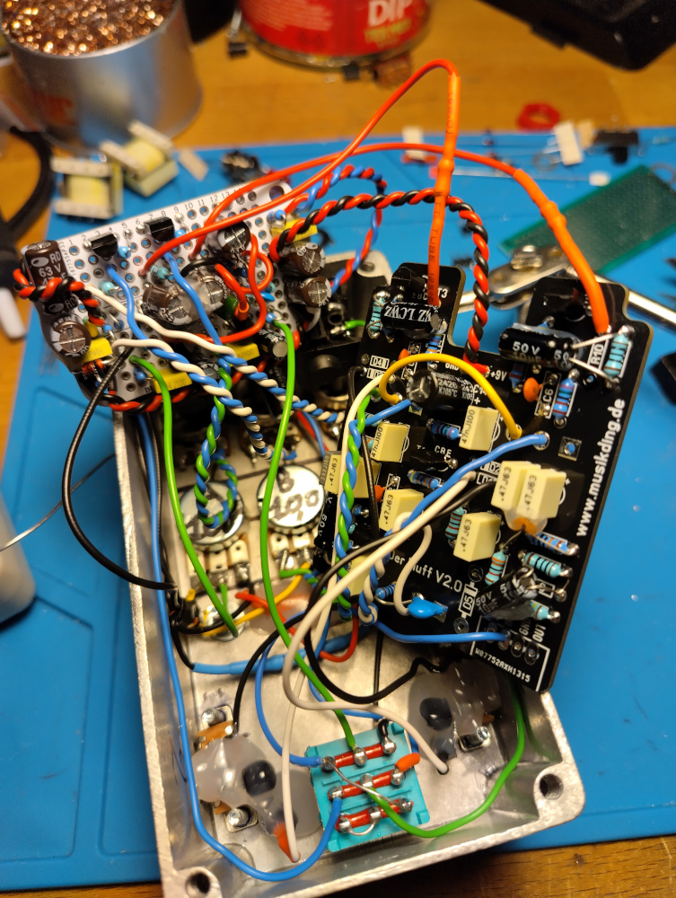

Replaced Ts from 2n3904 to 2n2369a after a test:

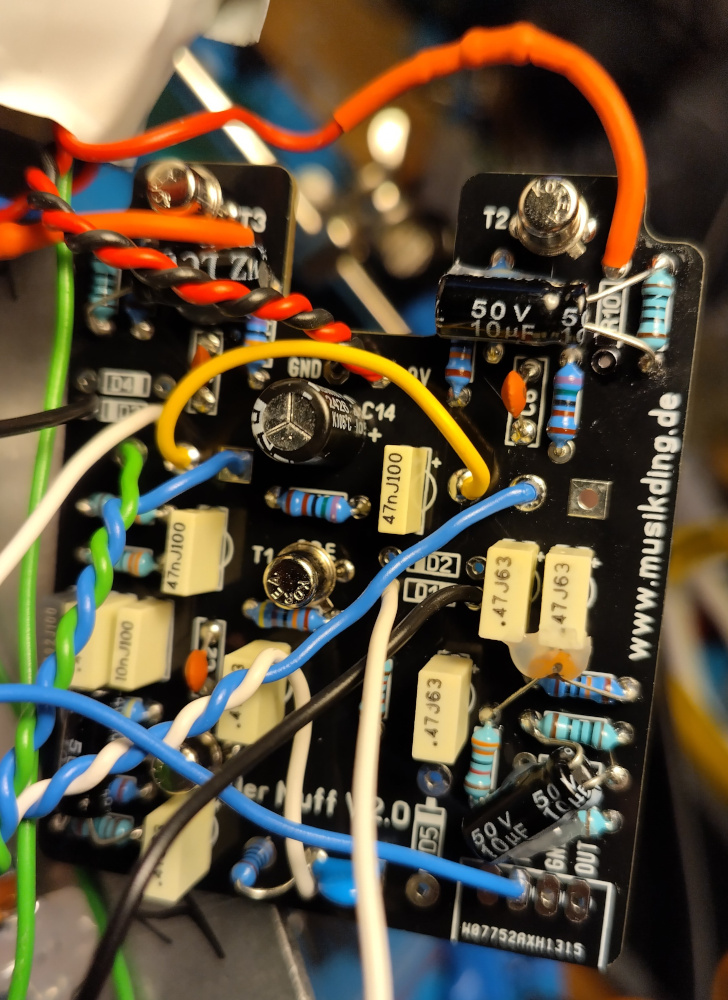
