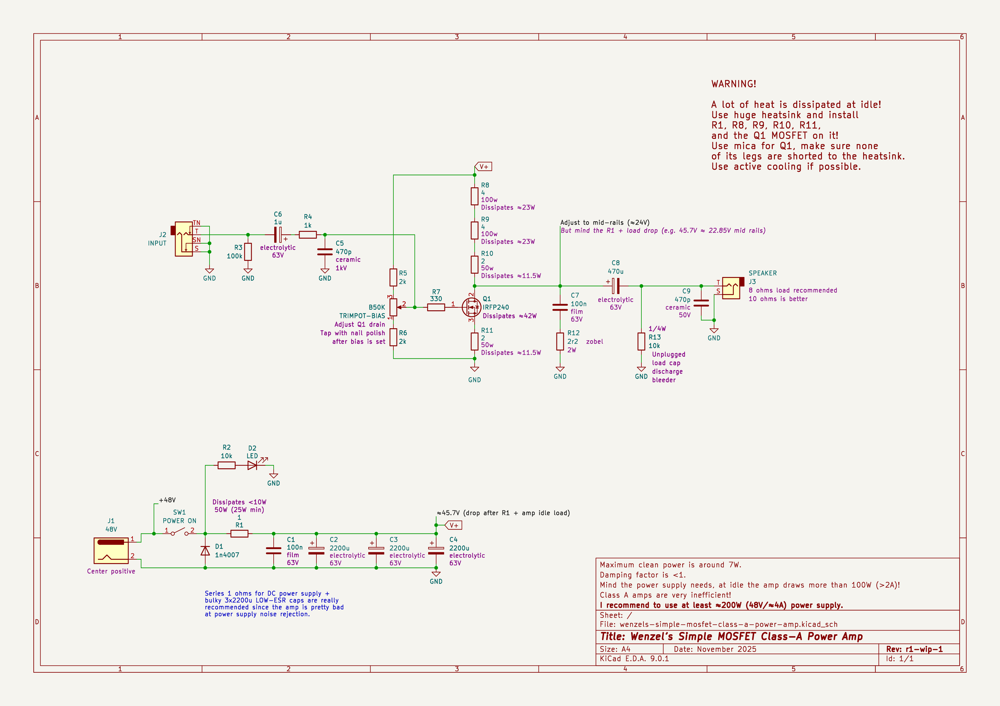

# Wenzel’s Simple MOSFET Class-A Power Amp

**WORK IN PROGRESS…**

Very simple single transistor power amp build.
Very inefficient, intended for guitar amplification.
Very low damping factor (typically desired in a guitar amplifier).

## Schematic preview

## Releases (newest revisions are on the top)

Not released yet…
