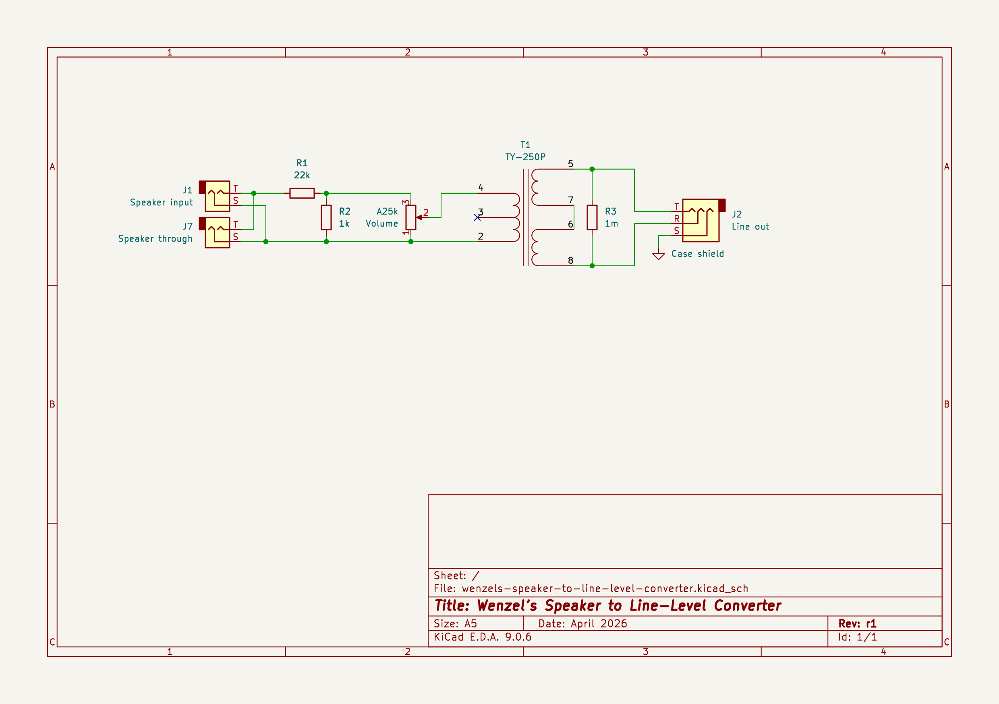

# Wenzel’s Speaker to Line-Level Converter

A simple passive device to convert speaker output of a 100W amplifier to
line-level.

I designed it for my guitar rig to take speaker output of a DRY channel as a
source for a WET-only channel.

**WARNING!** This device is not designed to be a loadbox! Always connect a
proper load in parallel with this device unless you’re 100% your amp is okay
with it.

## Latest revision schematic

## Releases (newest revisions are on the top)

- [r1 2026-04](release-2026-04-r1)
