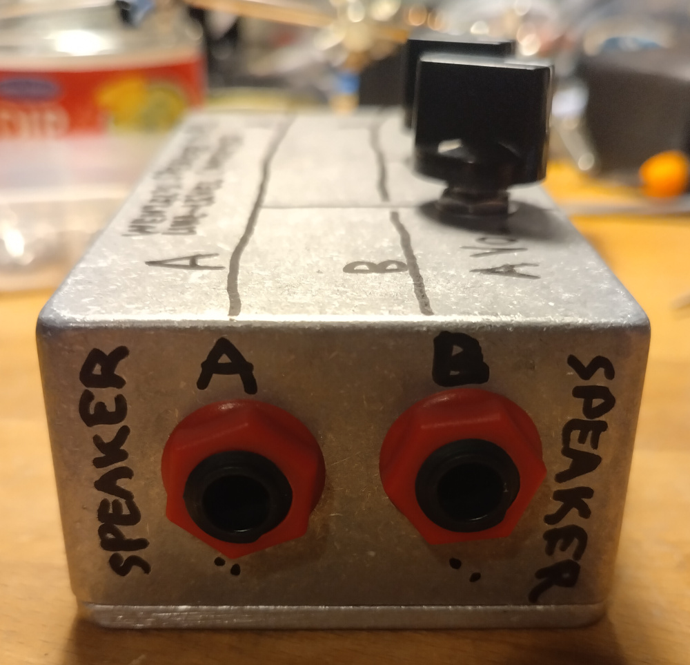
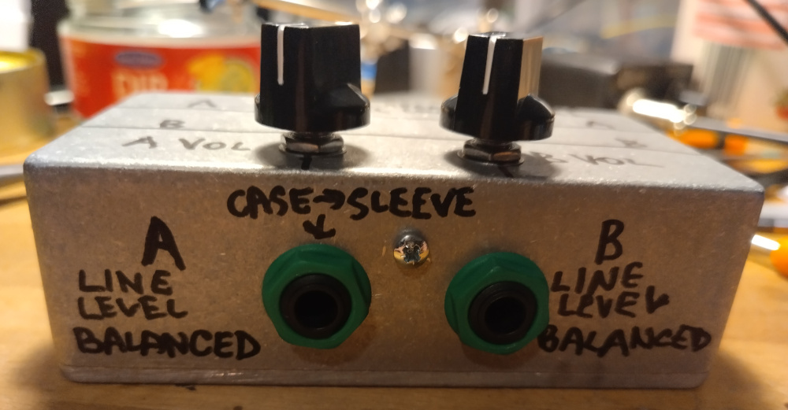
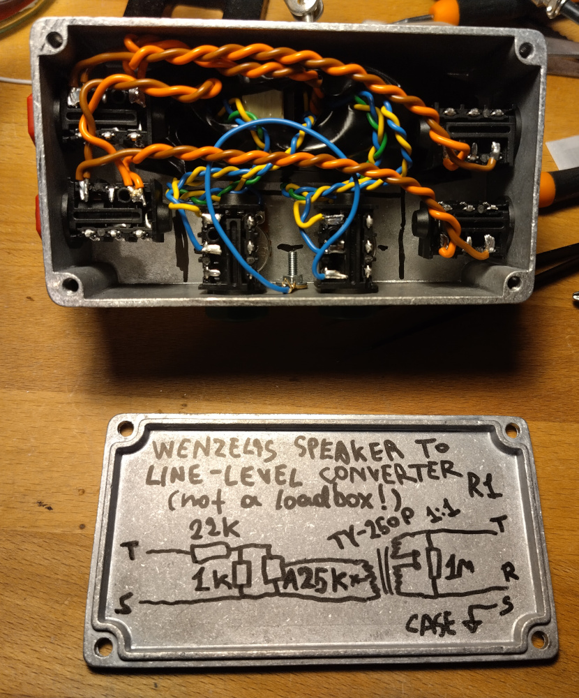
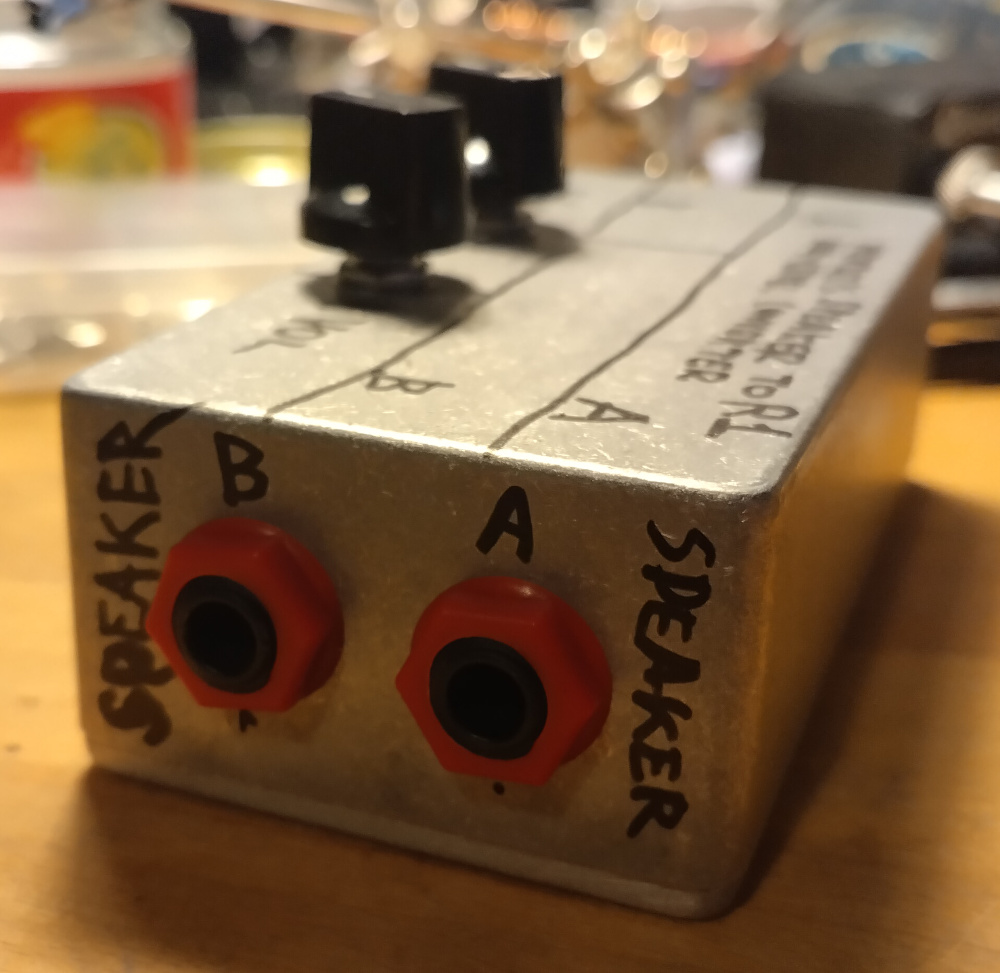
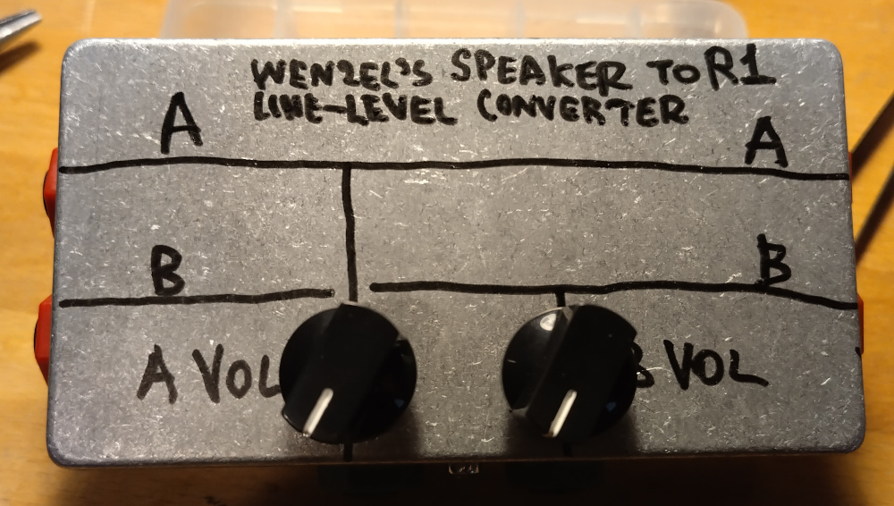
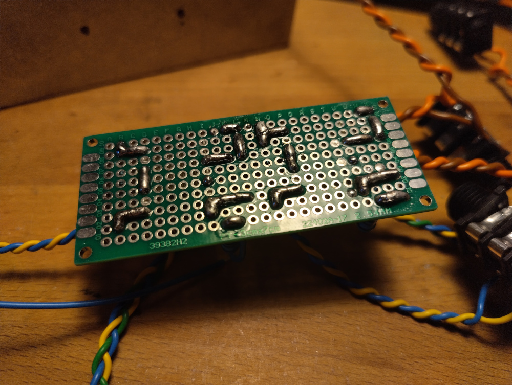
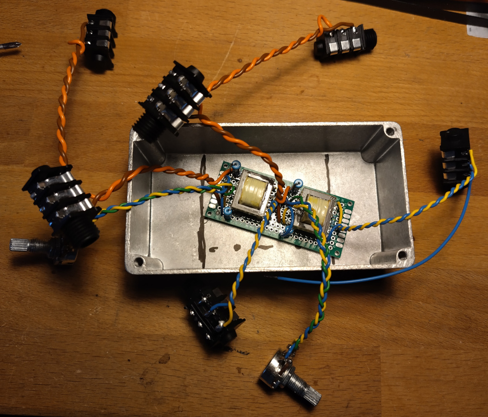
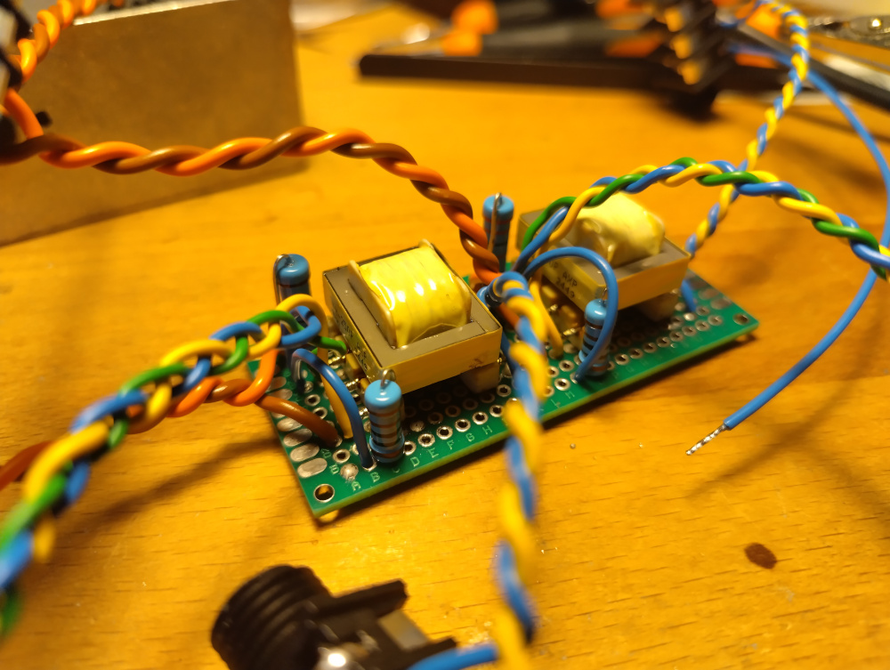

# Wenzel’s Speaker to Line-Level Converter

Revision r1 (April 2026).

- [PDF schematic render](wenzels-speaker-to-line-level-converter-r1.pdf)
- [PNG schematic render](wenzels-speaker-to-line-level-converter-r1.png)

## Photos

Here I made a 2-channel build. I connected only one of the two line-level output
sleeves to the case shield to avoid any possible ground loops when both are
plugged in.

