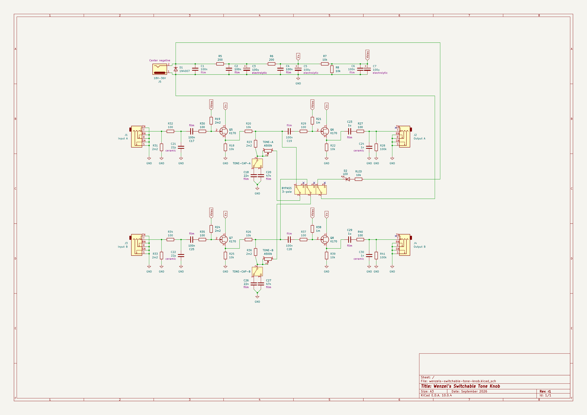

# Wenzel’s Switchable Tone Knob

A simple buffered guitar-style switchable TONE knob. It’s not entirely
simulating guitar TONE knob with passive pickups, it only does a simple RC
treble cut, there is no inductive resonance shifting.

It’s a stereo pedal and the circuit is intended to always be present in the
signal (you can use it as your guitar input buffer, it has conventional ≈1M
input impedance), regular guitar pedal single 3-pole AB switch bypasses the TONE
knob for both channels. Technically TONE knob always stays in the circuit but
when the TONE is bypassed-ish fixed resistance is so big it basically has no
audible effect, but is keeps the tone cap at DC bias so there is little to no
popping when switching.

Output impedance is somewhere between 100Ω and 200Ω.

## Latest revision schematic

## Releases (newest revisions are on the top)

- [r1 2026-09](release-2026-09-r1)
