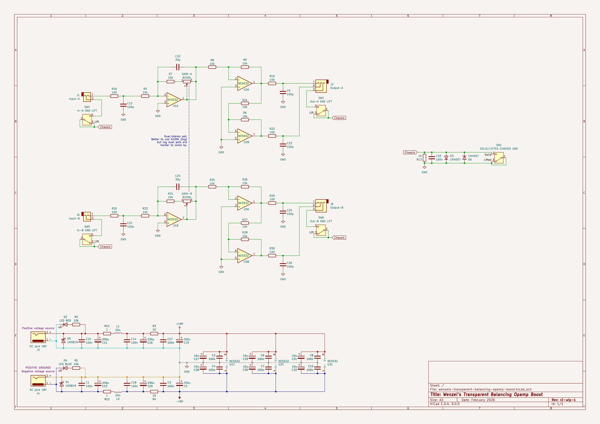
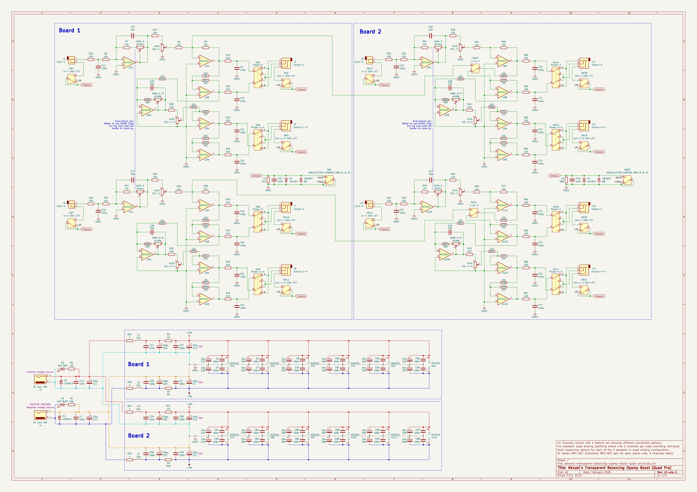

# Wenzel’s Transparent Balancing Opamp Boost

**WIP:** Work in progres…

Very transparent opamp-based (NE5532) **stereo** boost with balancing outputs.
The idea is to have as less as possible going on in the chain so the signal is
as unaffected as possible, only boosted if needed, and balanced.

In order to achieve transparency there are no coupling capacitors in series with
the signal. Which means the opamps need to be biased around 0V, so you would
have to use dual power supply (e.g. 2 isolated outputs from your pedalboard
power supply, **do not try to daisy chain, or you’ll short the supply!**). Also
power supply is intended to range from ±15 to ±18 which gives you total clean
voltage swing headroom close to from around 30V (for ±15) to 36V (for ±18V) by
far more than enough, it would take a lot to make it clip. The power is also
well-filtered to keep the device noise-free.

The original idea for this device came from my guitar pedalboard needs
(my pedalboard is stereo, so I needed at least 2 channels). When I built my
[2510 powered guitar cabinet](../wenzels-powered-guitar-cabinets/README.md#2510)
it was designed with a requirement for the input signal to be balanced (due to
bridge-mode configuration, and a lack of a built-in balancing device).
Also, depending on different factors I often need to just boost the overall
volume pushed out of my pedalboard, linking both channels (this is where the
dual pot helps), so that I won’t mess with the volume balance between channels.
And I wanted a device that would just do that and won’t contribute anything to
the already present tone, so neutrality was a requirement. So now this box is
the final output/gain stage of my pedalboard, sending balanced signal per
channel where both positive and negative are preserving input amplitude, thus
doubling the input gain on the output when the signal is finally unbalanced
(which was also the original idea for the _2510 powered guitar cabinet_ so that
the bridge-mode and balanced pair with preserved buffered amplitude would
compensate the gain loos on the damping factor reduction resistors).

## Requirements

- The input signal for this device must already be low-impedance/buffered.
  This device is **not a buffer**, and has only 10k of input impedance.

- The device is expected to be used in a **controlled environment**, where both
  input and output paths are isolated of any potential DC present with
  transformers or capacitors rated 25V or more.
  Also note that any DC offset in the input signal will be preserved and
  amplified on the output.

## Latest revision schematic

r2-wip-1

### Simple variant

### Quad Pro variant

## Releases (newest revisions are on the top)

TODO
