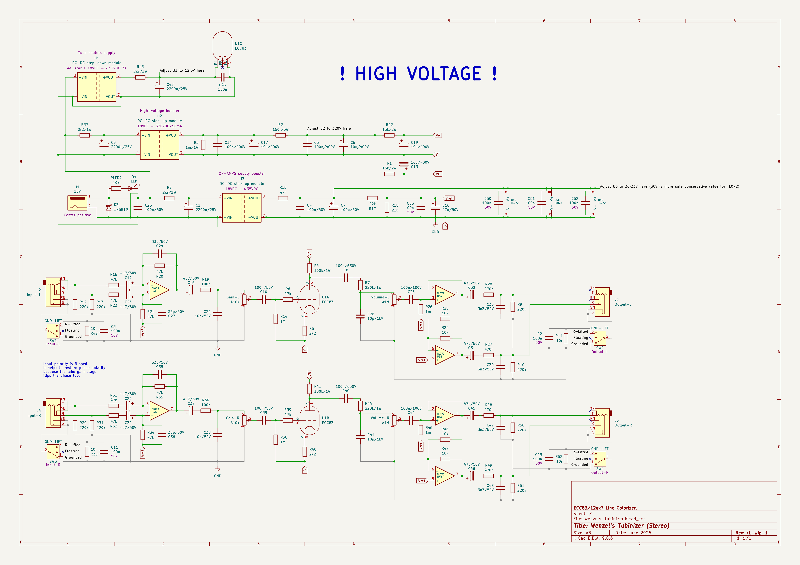

# Wenzel’s Tubinizer

**Work in Progress**.

ECC83/12ax7 Line Colorizer.

**WARNING! High-Voltage!** If you don’t know what you’re doing I strongly
recommend to stay away from building the project yourself. High voltage
can be lethal unless handled properly while following all safety precautions!

Stereo, balanced input, balanced output. Unbalancing and balancing is provided
by the TL* op-amps. There is single full-range tube gain stage in between,
moderate gain, you can still push it into crunch or adjust to keep it clean and
relatively transparent.

I designed this device for my pedalboard needs. I wanted the tube feel and
coloration after all the signal processing, after all the EQ and stuff. And
especially when all the signal in front is solid-state, just to get some of the
tube taste & feel for it. So this unit is intended just to spice the signal a
little but stay relatively transparent.

- Input impedance (the unit expects Low-Z input signal, the input impedance
  mismatch is a compromise to keep unbalancing ratios even, for better noise
  rejection):

  * ≈47k for tip (positive)
  * ≈94k for ring (negative)

- Output impedance is: ≈470Ω (both for each balanced positive and negative).

  It’s a bit high in order to prevent the op-amp struggling to drive only 100Ω
  when ring/negative is shorted to ground in case a TS cable is plugged in
  instead of TRS.

- 3x TL072 op-amps
  * 1x for unbalancing the L & R inputs
  * 2x for balancing L & R outputs

- 1x ECC83/12ax7 tube
- 1x step-down module for tube heaters
- 1x step-up high-voltage module for tube plates
- 1x step-up module for great (at least 30V) op-amps headroom

N.B. Note that you should aim to match all 47k within 0.1% tolerance for each
channel for best balanced signal noise rejection.

## Power requirements

Power source: 18VDC, I would recommend >=500mA.

### Voltage sources required

- 18V for feeding the DC step-down & step-up modules.
- ≈12.6V for the tube heaters.
- ≈320V for the tube plates.
- ≈33V for the TL* op-amps.

With the step-down and step-up modules you only need 18V input.
Then you get 12.6V, 320V, and 33V out of those.

### In my build

- 18V source is feeding one step-down and 2 step-up modules.

- Adjustable DC-DC step-down provides conventional 12.6V for the tube heaters.

- Adjustable DC-DC step-up high-voltage booster provides 320V to feed the tube
  plates.

- Adjustable DC-DC step-up booster provides 33V for the op-amps for very high
  headroom.

## Latest revision schematic

r1-wip-1

## Releases (newest revisions are on the top)

TBD…
