# Wenzel’s Tubinizer

Revision r1 (August 2026).

- [PDF schematic render](wenzels-tubinizer-r1.pdf)
- [PNG schematic render](wenzels-tubinizer-r1.png)

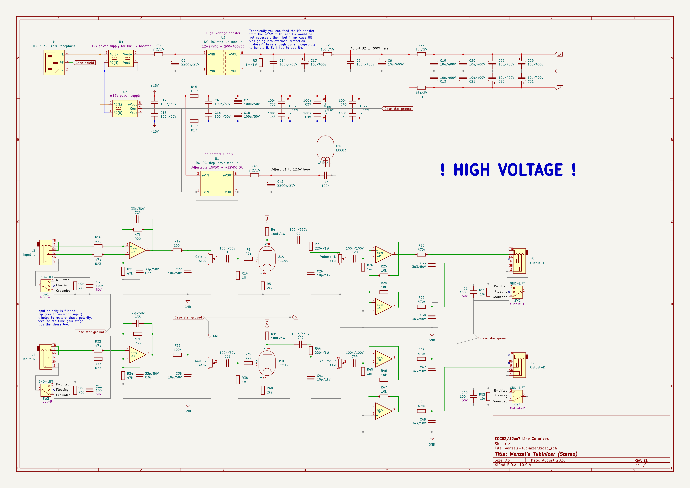

## Photos

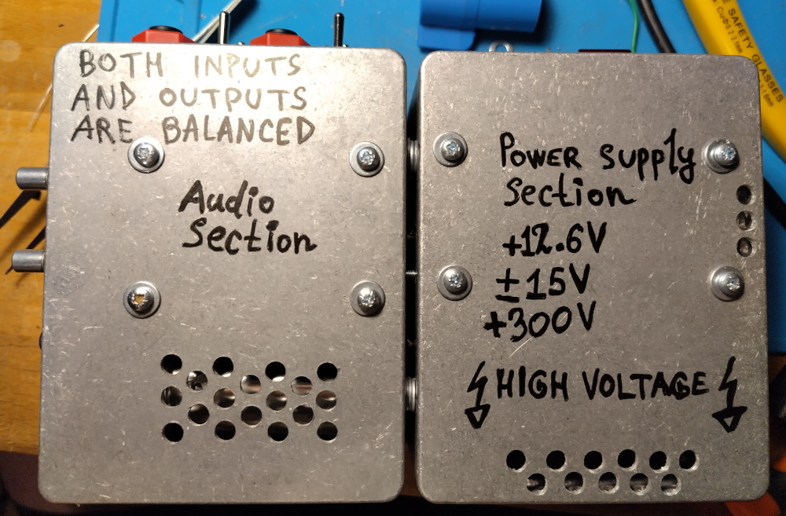

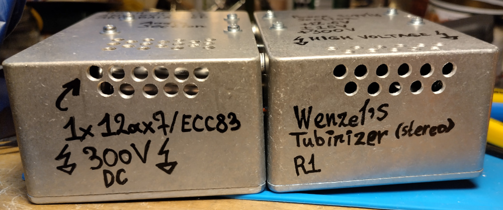

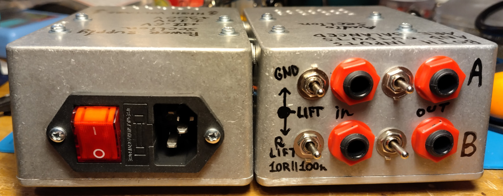

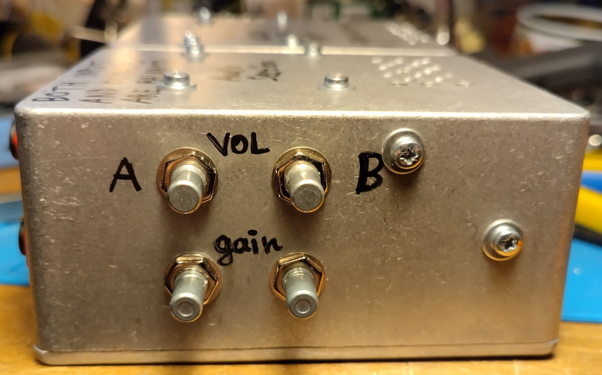

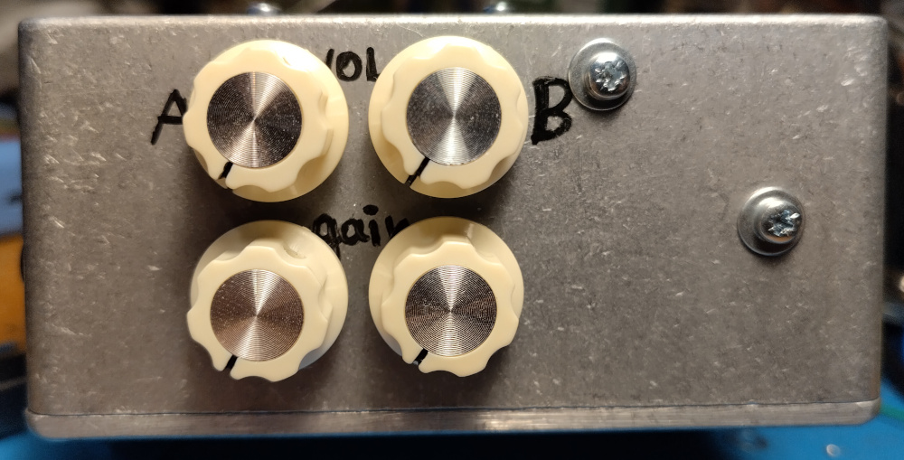

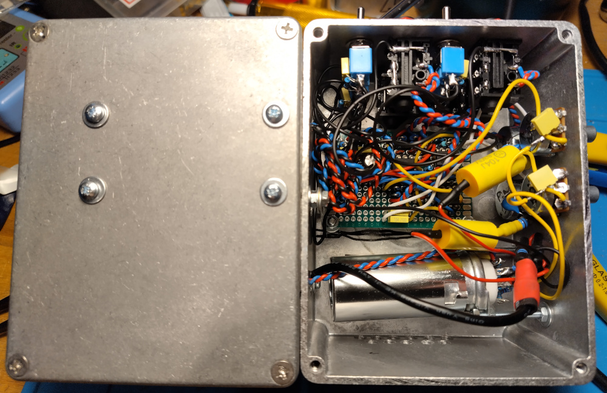

I didn’t take photo of the tube pins, but I put most of the resistors around
the tube on the pins them selves, using center lug as a ground pin.

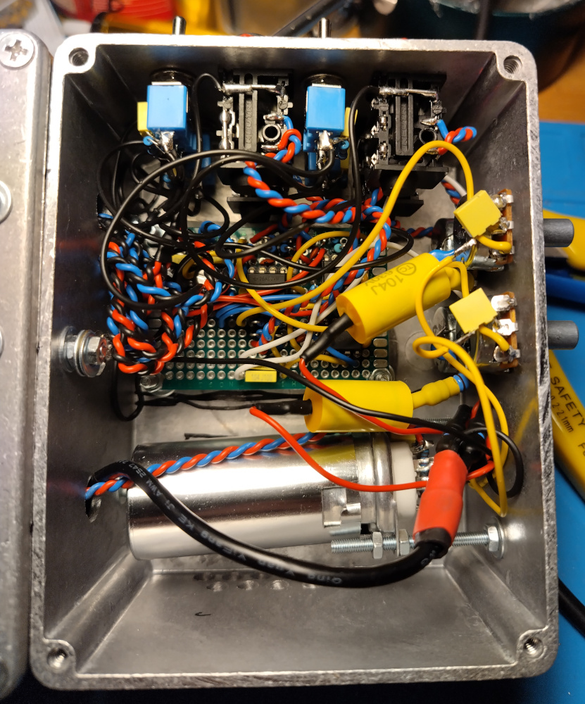

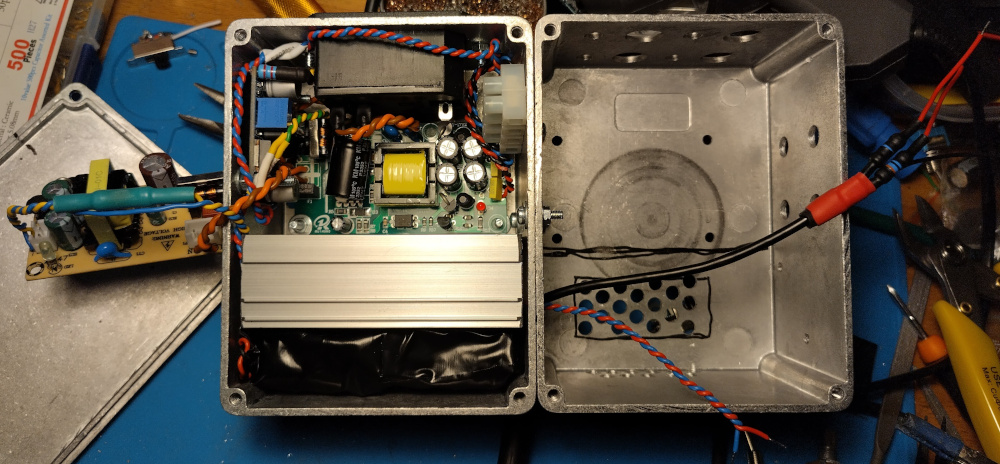

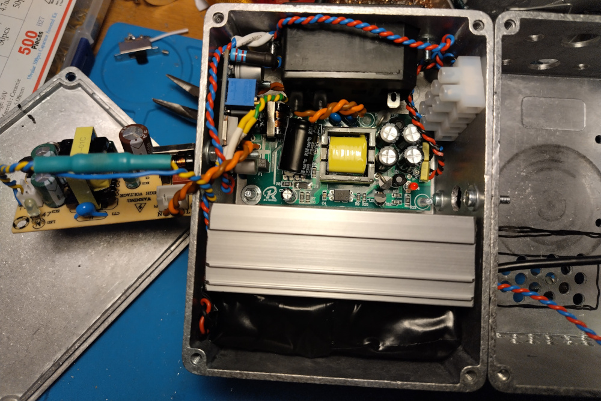

Under the 2 op-amps on the right apart from the filtering 100n caps there is
also 1M biasing resistor hidden connected between pin 3 and ground
(partly showing up on the right).

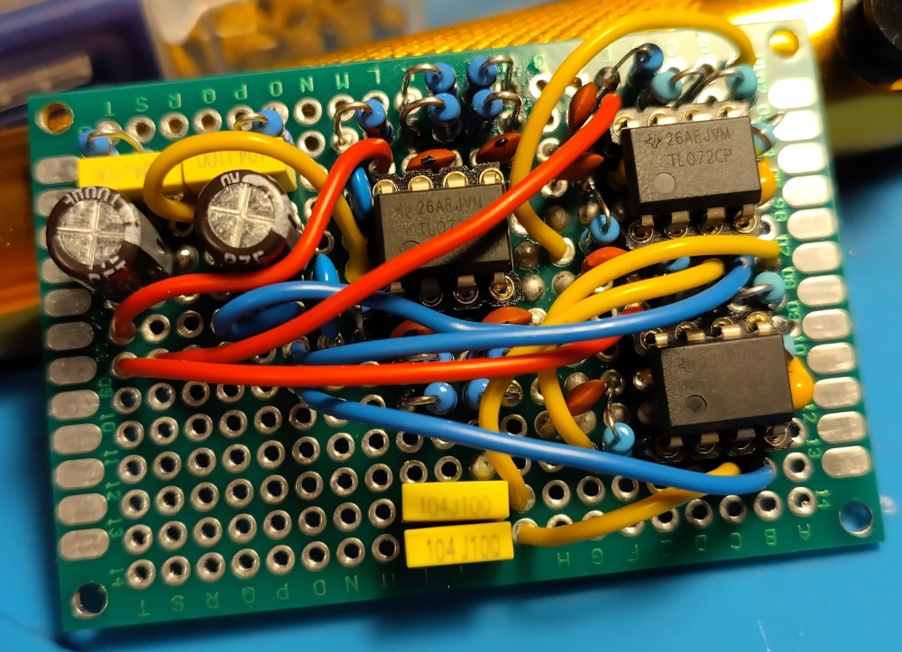

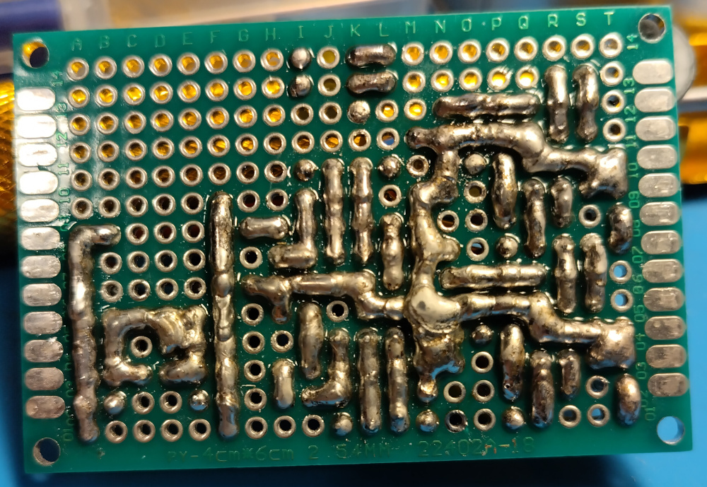
